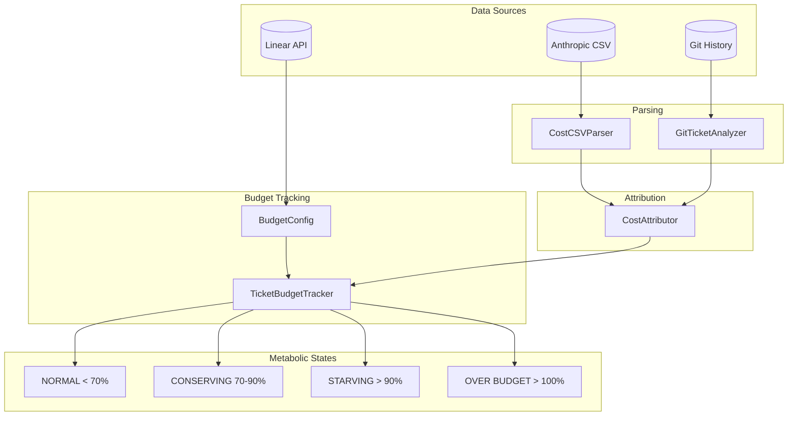
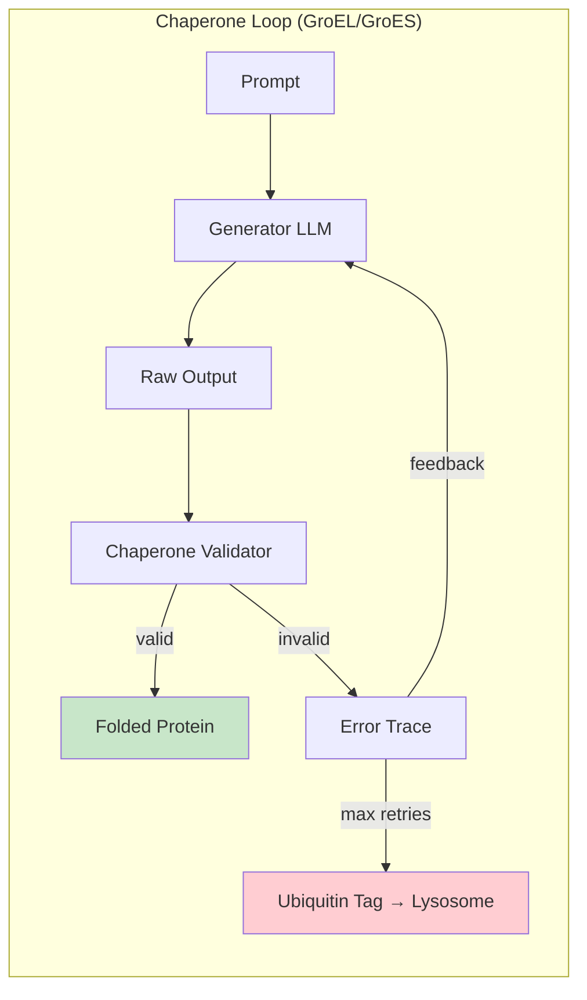
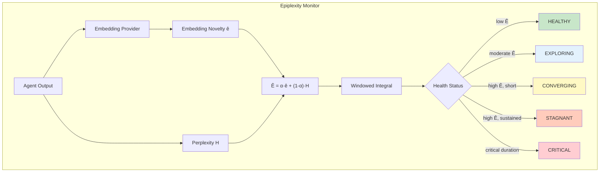
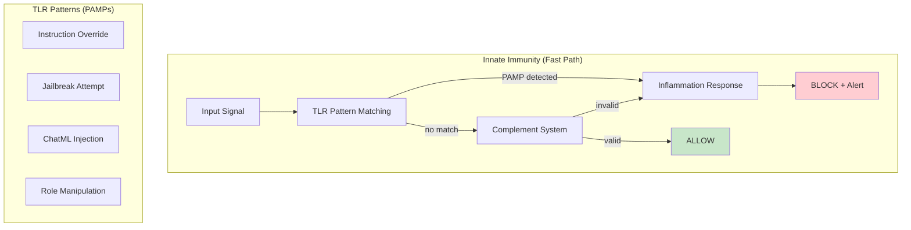
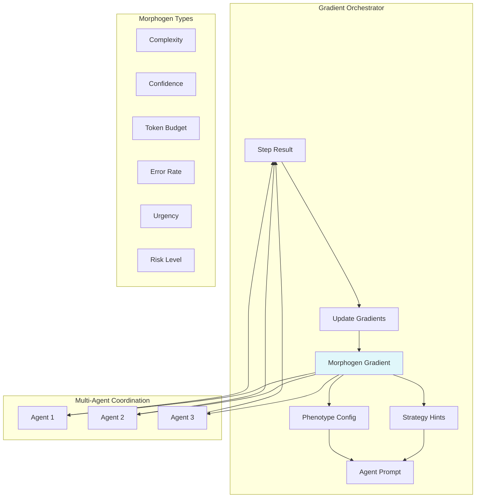

# Wiring Diagrams

These ASCII wiring diagrams reflect the WAgent examples in `examples/`.
Each arrow implies a typed connection with integrity constraints.

## Mermaid Diagrams (Per Example Files)

### Core Wiring

- [Example 17: Typed Wiring](wiring_diagrams/example17_typed_wiring.md)
- [Example 26: Guarded Toolchain](wiring_diagrams/example26_guarded_toolchain.md)

### Resource Allocation

- [Example 27: Resource Allocator](wiring_diagrams/example27_resource_allocator.md)
- [Example 36: Multi-Gemini Resource Allocation](wiring_diagrams/example36_multi_gemini_allocation.md)

### Consensus and Tooling

- [Example 28: Quorum Consensus Gate](wiring_diagrams/example28_quorum_consensus.md)
- [Example 29: Safe Tool Calls](wiring_diagrams/example29_safe_tool_calls.md)

### Composition

- [Example 30: Composed System](wiring_diagrams/example30_composed_system.md)
- [Example 31: Composed Effects](wiring_diagrams/example31_composed_effects.md)

### Execution

- [Example 32: Wiring Diagram Execution](wiring_diagrams/example32_execution.md)
- [Example 33: Wiring Diagram Execution - Failures](wiring_diagrams/example33_execution_failures.md)

### Nucleus + LLM

- [Example 34: Nucleus LLM Integration](wiring_diagrams/example34_nucleus_llm.md)
- [Example 35: Nucleus LLM Execution](wiring_diagrams/example35_nucleus_execution.md)

### Formal Theory

- [Example 37: Metabolic Swarm Budgeting](wiring_diagrams/example37_metabolic_swarm.md)

### Cost Attribution

- [Example 38: Linear Budget Tracking](#example-38-linear-budget-tracking-cost-attribution)

### Health & Healing (v0.10+)

- [Example 39: Chaperone Healing Loop](#example-39-chaperone-healing-loop)
- [Example 40: Epiplexity Monitoring](#example-40-epiplexity-monitoring)

### Surveillance (v0.11+)

- [Example 41: Innate Immunity](#example-41-innate-immunity)
- [Example 42: Morphogen Gradients](#example-42-morphogen-gradients)

## Example 17: Typed Wiring (Integrity + Capabilities)

```
[user] --text(U)--> [membrane] --text(U)--> [chaperone] --json(V)--> [executor] --toolcall(V)--> [sink]
                                                          |                                   ^
                                                          |                                   |
                                                          +--toolcall(V)--> [verifier] --approval(T)
```

## Example 26: Guarded Toolchain

```
[user] --text(U)--> [membrane] --text(U)--> [validator] --text(V)--> [parser] --json(V)--> [planner]
                                                                                                 |
                                                                                                 v
                                                            [serializer] --text(V)--> [policy] --approval(T)
                                                                                                 |
[validator] --text(V)--> [attestor] --text(T)--> [operator_console]                               v
[planner] --json(V)--> [tool_builder] --toolcall(V)--------------------------------------------> [sink]
```

## Example 27: Resource Allocator

```
[nutrient_sensor] --json(U)--> [nutrient_validator] --json(V)---+
[machinery_sensor] --json(U)--> [machinery_validator] --json(V)--+--> [budget_aggregator] --json(T)--> [allocator]
[energy_sensor]   --json(U)--> [energy_validator]   --json(V)---+                          |
                                                                                           +--> [policy] --approval(T)

[allocator] --growth(V)--> [growth_executor] --toolcall(V)--> [growth_sink]
[allocator] --maint(V)-->  [maintenance_executor] --toolcall(V)--> [maintenance_sink]
[allocator] --spec(V)-->   [specialization_executor] --toolcall(V)--> [specialization_sink]

[policy] --approval(T)--> [growth_sink]
[policy] --approval(T)--> [maintenance_sink]
[policy] --approval(T)--> [specialization_sink]
```

## Example 28: Quorum Consensus Gate

```
[user] --text(U)--> [sanitizer] --text(V)--> [voter_a] --vote(V)--+
                                   |--> [voter_b] --vote(V)----+--> [quorum] --approval(T)--> [sink]
                                   |--> [voter_c] --vote(V)----+
                                   |
                                   +--> [tool_builder] --toolcall(V)------------------------> [sink]
```

## Example 29: Safe Tool Calls

```
[user] --text(U)--> [validator] --text(V)--> [planner] --plan(V)--+
                                                                  +--> [tool_builder] --toolcall(V)--> [sink]
                                                                  +--> [policy] --approval(T)--------> [sink]
```

## Example 30: Composed System (Ingress + Execution)

```
Ingress:
[user] --text(U)--> [membrane] --text(U)--> [sanitizer] --text(V)

Execution:
[planner] --plan(V)--> [tool_builder] --toolcall(V)--> [sink]
[planner] --plan(V)--> [policy] --approval(T)--------> [sink]

Composition:
[ingress.sanitizer] --text(V)--> [exec.planner]
```

## Example 31: Composed Effects (Net + Write)

```
Ingress:
[user] --text(U)--> [membrane] --text(U)--> [sanitizer] --text(V)

Execution:
[planner] --plan(V)--> [tool_builder_write] --toolcall(V)--> [write_sink]
[planner] --plan(V)--> [tool_builder_net]   --toolcall(V)--> [net_sink]
[planner] --plan(V)--> [policy] --approval(T)----------------> [write_sink]
[planner] --plan(V)--> [policy] --approval(T)----------------> [net_sink]

Composition:
[ingress.sanitizer] --text(V)--> [exec.planner]
```

## Example 32: Wiring Diagram Execution

```
[user] --text(U)--> [validator] --text(V)--> [planner] --plan(V)--+
                                                                 +--> [tool_builder] --toolcall(V)--> [sink]
                                                                 +--> [policy] --approval(T)--------> [sink]
```

## Example 33: Wiring Diagram Execution - Failures

```
[user] --text(U)--> [validator] --text(V)--> [planner] --plan(V)--+
                                                                 +--> [tool_builder] --toolcall(V)--> [sink]
                                                                 +--> [policy] --approval(T)--------> [sink]
```

## Example 34: Nucleus LLM Integration

```
[user] --text(U)--> [membrane] --text(U)--> [sanitizer] --text(V)--> [prompt_assembler]
[sanitizer] --text(V)--> [context_retriever] --json(V)--> [prompt_assembler]
[genome_policy] --json(T)--> [prompt_assembler]
[tool_registry] --json(T)--> [prompt_assembler]

[prompt_assembler] --text(V)--> [nucleus_llm] --json(U)--> [plan_validator] --json(V)--+
                                                                                      +--> [policy_gate] --approval(T)--> [executor]
                                                                                      +--> [tool_builder] --toolcall(V)--> [executor]
[nucleus_llm] --text(U)--> [response_sanitizer] --text(V)--> [response_merger] <--json(T)-- [executor]

[executor] --json(T)--> [memory_writer] --json(T)--> [episodic_store]
[response_merger] --text(V)--> [outbox]
```

## Example 35: Nucleus LLM Execution

```
[user] --text(U)--> [membrane] --text(U)--> [sanitizer] --text(V)--> [prompt_assembler] --text(V)--> [nucleus_llm]
[sanitizer] --text(V)--> [context_retriever] --json(V)--> [prompt_assembler]
[genome_policy] --json(T)--> [prompt_assembler]
[tool_registry] --json(T)--> [prompt_assembler]

[nucleus_llm] --json(U)--> [plan_validator] --json(V)--+--> [policy_gate] --approval(T)--> [executor]
                                                      +--> [tool_builder] --toolcall(V)--> [executor]
[nucleus_llm] --text(U)--> [response_sanitizer] --text(V)--> [response_merger] <--json(T)-- [executor]
[response_merger] --text(V)--> [outbox]
```

## Example 36: Multi-Gemini Resource Allocation

```
[user] --text(U)--> [membrane] --text(U)--> [sanitizer] --text(V)
[sanitizer] --text(V)--> [budget_allocator]
[sanitizer] --text(V)--> [prompt_fast]
[sanitizer] --text(V)--> [prompt_deep]
[sanitizer] --text(V)--> [prompt_safety]
[resource_monitor] --json(T)--> [budget_allocator]
[budget_allocator] --json(T)--> [prompt_fast] --text(V)--> [nucleus_fast] --json(U)--+
[budget_allocator] --json(T)--> [prompt_deep] --text(V)--> [nucleus_deep] --json(U)--+--> [plan_aggregator] --json(V)--> [policy_gate] --approval(T)--> [response_builder] --text(V)--> [outbox]
[budget_allocator] --json(T)--> [prompt_safety] --text(V)--> [nucleus_safety] --json(U)--+
```

## Example 37: Metabolic Swarm Budgeting (Coalgebraic Resource Constraints)

```
                              [SharedMitochondria]
                                    (ATP Pool)
                                        |
                    +-------------------+-------------------+
                    |                   |                   |
                consume(c)          consume(c)          consume(c)
                    |                   |                   |
                    v                   v                   v
[task] --task(U)--> [worker_1] --+  [worker_2] --+  [worker_3] --+
                         |       |        |       |        |       |
                     result(V)   |    result(V)   |    result(V)   |
                         |       |        |       |        |       |
                         v       v        v       v        v       v
                    [collector] <--------+--------+   [DEAD] (r<c)
                         |
                    candidates(V)
                         |
                         v
                    [verifier] <-- consume(c) -- [SharedMitochondria]
                         |
                    verdict(T)
                         |
                         v
                      [output]

Termination: solved | ischemia | swarm_collapse | verifier_death | entropy_limit
```

Legend: U = UNTRUSTED, V = VALIDATED, T = TRUSTED.

## Example 38: Linear Budget Tracking (Cost Attribution)



```
[csv] --cost(U)--> [csv_parser] --cost(V)--+
                                           +--> [attributor] --ticket_cost(V)--> [tracker] --> [metabolic_state]
[git] --commits(U)--> [git_analyzer] --commits(V)--+                              ^
                                                                                   |
[linear] --estimates(T)------------------------------------------------------------+
```

## Example 39: Chaperone Healing Loop



```
                    +---------------------------+
                    |                           |
                    v                           |
[prompt] --text(U)--> [generator] --json(U)--> [chaperone] --json(V)--> [output]
                           ^                        |
                           |                        |
                           +---error(V)---[healing_feedback]
                                                    |
                                          [max_retries?]--ubiquitin(V)--> [lysosome]

Confidence: 1.0 → 0.85 → 0.70 → ... (decay per retry)
```

## Example 40: Epiplexity Monitoring



```
[agent_output] --text(U)--> [embedding_provider] --embedding(V)--+
                                                                 +--> [epiplexity_calc] --> [health_status]
[agent_output] --text(U)--> [perplexity_calc] --perplexity(V)----+
                                                                         |
                                                    +--------------------+--------------------+
                                                    |                    |                    |
                                               [HEALTHY]            [STAGNANT]           [CRITICAL]
                                               (ê high)             (ê low, H high)      (sustained)
```

## Example 41: Innate Immunity



```
[input] --text(U)--> [tlr_scanner] --+--no_match--> [complement_validators] --valid--> [ALLOW]
                                     |                        |
                                     |                    invalid
                                     |                        |
                                     +--PAMP_detected--> [inflammation] --> [BLOCK]
                                                              |
                                              +---------------+---------------+
                                              |               |               |
                                         [cytokines]    [log_level++]    [rate_limit]
```

## Example 42: Morphogen Gradients



```
                              [GradientOrchestrator]
                                       |
              +------------------------+------------------------+
              |                        |                        |
         [complexity]             [confidence]              [budget]
              |                        |                        |
              v                        v                        v
[agent_1] <--hints-- [gradient] --hints--> [agent_2] <--hints-- [agent_3]
    |                     ^                     |                    |
    |                     |                     |                    |
    +-----step_result-----+-----step_result-----+----step_result-----+

Coordination without central control: agents read local gradient concentrations
```
