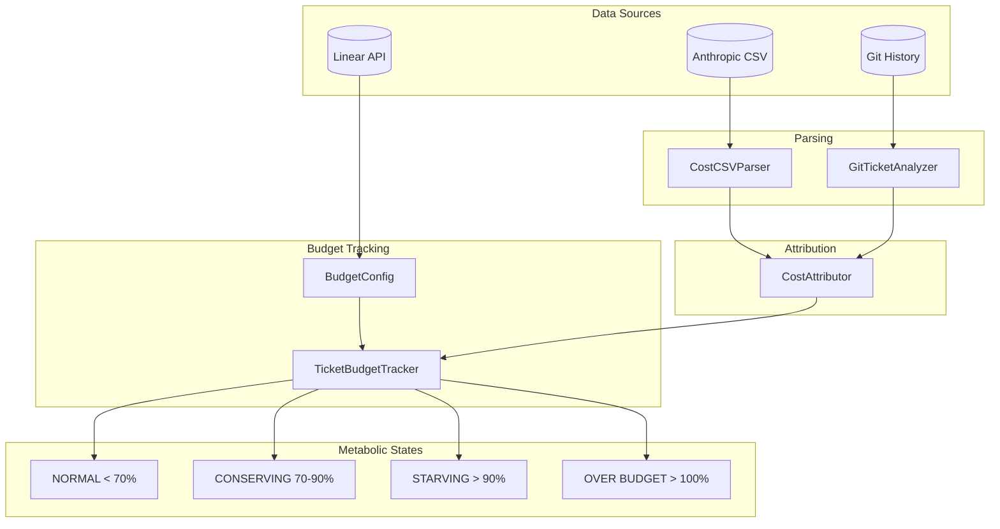
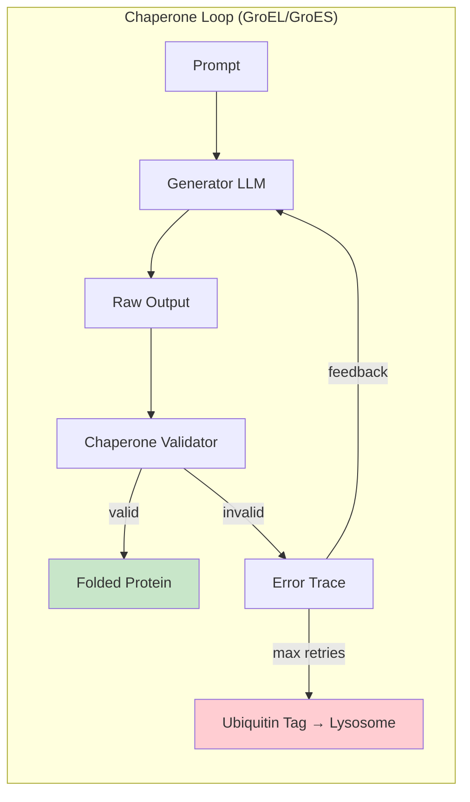
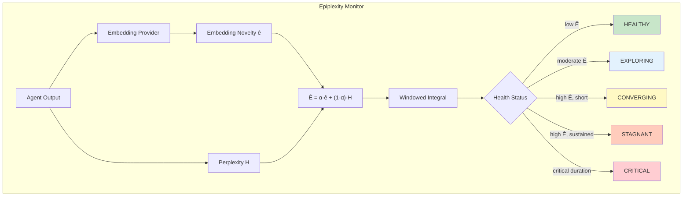
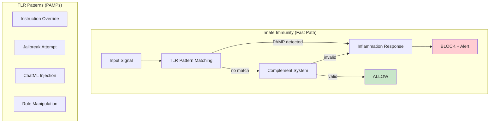
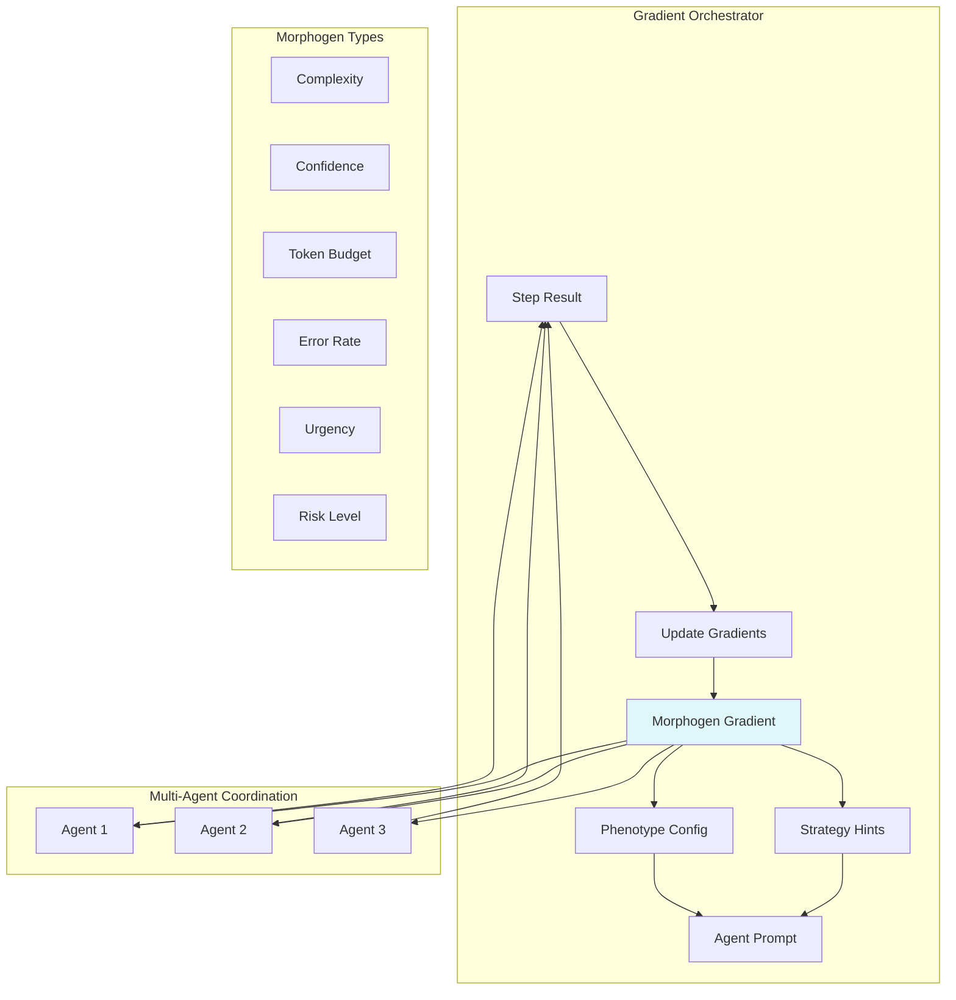

# Wiring Diagrams

These ASCII wiring diagrams reflect the WAgent examples in `examples/`.
Each arrow implies a typed connection with integrity constraints.

## Mermaid Diagrams (Per Example Files)

### Core Wiring

- [Example 17: Typed Wiring](wiring_diagrams/example17_typed_wiring.md)
- [Example 26: Guarded Toolchain](wiring_diagrams/example26_guarded_toolchain.md)

### Resource Allocation

- [Example 27: Resource Allocator](wiring_diagrams/example27_resource_allocator.md)
- [Example 36: Multi-Gemini Resource Allocation](wiring_diagrams/example36_multi_gemini_allocation.md)

### Consensus and Tooling

- [Example 28: Quorum Consensus Gate](wiring_diagrams/example28_quorum_consensus.md)
- [Example 29: Safe Tool Calls](wiring_diagrams/example29_safe_tool_calls.md)

### Composition

- [Example 30: Composed System](wiring_diagrams/example30_composed_system.md)
- [Example 31: Composed Effects](wiring_diagrams/example31_composed_effects.md)

### Execution

- [Example 32: Wiring Diagram Execution](wiring_diagrams/example32_execution.md)
- [Example 33: Wiring Diagram Execution - Failures](wiring_diagrams/example33_execution_failures.md)

### Nucleus + LLM

- [Example 34: Nucleus LLM Integration](wiring_diagrams/example34_nucleus_llm.md)
- [Example 35: Nucleus LLM Execution](wiring_diagrams/example35_nucleus_execution.md)

### Formal Theory

- [Example 37: Metabolic Swarm Budgeting](wiring_diagrams/example37_metabolic_swarm.md)

### Cost Attribution

- [Example 38: Linear Budget Tracking](wiring_diagrams/example38_linear_budget_tracking.md)

### Health & Healing (v0.10+)

- [Example 39: Chaperone Healing Loop](wiring_diagrams/example39_chaperone_healing_loop.md)
- [Example 40: Regenerative Swarm](wiring_diagrams/example40_regenerative_swarm.md)
- [Example 41: Autophagy Context Pruning](wiring_diagrams/example41_autophagy_context_pruning.md)
- [Example 42: Epiplexity Monitoring](wiring_diagrams/example42_epiplexity_monitoring.md)

### Surveillance (v0.11+)

- [Example 43: Innate Immunity](wiring_diagrams/example43_innate_immunity.md)
- [Example 44: Morphogen Gradients](wiring_diagrams/example44_morphogen_gradients.md)

### Practical Applications (v0.11+)

- [Example 45: Code Review Pipeline](wiring_diagrams/example45_code_review.md)
- [Example 46: Codebase Q&A](wiring_diagrams/example46_codebase_qa.md)
- [Example 47: Enhanced Cost Attribution](wiring_diagrams/example47_cost_attribution.md)

### Orchestration Patterns (v0.11+)

- [Example 48: Oscillator-Scheduled Maintenance](wiring_diagrams/example48_scheduled_maintenance.md)
- [Example 49: Immunity Healing Router](wiring_diagrams/example49_immunity_healing_router.md)
- [Example 50: Morphogen-Guided Swarm](wiring_diagrams/example50_morphogen_guided_swarm.md)
- [Example 51: Epiplexity Healing Cascade](wiring_diagrams/example51_epiplexity_healing_cascade.md)
- [Example 52: Morphogen Cascade with Quorum](wiring_diagrams/example52_morphogen_cascade_quorum.md)
- [Example 53: LLM Epigenetic Repair Memory](wiring_diagrams/example53_epigenetic_repair_memory.md)
- [Example 54: LLM Swarm with Graceful Cleanup](wiring_diagrams/example54_swarm_graceful_cleanup.md)
- [Example 55: Adaptive Multi-Agent Orchestrator](wiring_diagrams/example55_multi_agent_orchestrator.md)

### Multicellular + State (v0.13–v0.15)

- [Example 56: Metabolic Epigenetic Coupling](wiring_diagrams/example56_metabolic_epigenetic_coupling.md)
- [Example 57: Cell Type Specialization](wiring_diagrams/example57_cell_type_specialization.md)
- [Example 58: Tissue Architecture](wiring_diagrams/example58_tissue_architecture.md)
- [Example 59: Plasmid Registry](wiring_diagrams/example59_plasmid_registry.md)
- [Example 60: Denaturation Layers](wiring_diagrams/example60_denaturation_layers.md)

### Formal Theory (v0.14–v0.15)

- [Example 61: Coalgebraic State Machines](wiring_diagrams/example61_coalgebraic_state_machines.md)
- [Example 62: Morphogen Diffusion](wiring_diagrams/example62_morphogen_diffusion.md)
- [Example 63: Optic-Based Wiring](wiring_diagrams/example63_optic_based_wiring.md)
- [Example 64: Diagram Optimization](wiring_diagrams/example64_diagram_optimization.md)

### Provider + Topology (v0.16–v0.17)

- [Example 65: OpenAI-Compatible (LM Studio)](wiring_diagrams/example65_openai_compatible_lmstudio.md)
- [Example 66: Epistemic Topology](wiring_diagrams/example66_epistemic_topology.md)

### Pattern-First API (v0.18)

- [Example 67: Pattern-First API](wiring_diagrams/example67_pattern_first_api.md)
- [Example 68: Skill Organism Runtime](wiring_diagrams/example68_skill_organism_runtime.md)

### Temporal Epistemics (v0.19–v0.20)

- [Example 69: Bi-Temporal Memory](wiring_diagrams/example69_bitemporal_memory.md)
- [Example 70: Bi-Temporal Compliance Audit](wiring_diagrams/example70_bitemporal_compliance_audit.md)
- [Example 71: Bi-Temporal Skill Organism](wiring_diagrams/example71_bitemporal_skill_organism.md)

### Adaptive Structure (v0.21)

- [Example 72: Pattern Repository](wiring_diagrams/example72_pattern_repository.md)
- [Example 73: Watcher Component](wiring_diagrams/example73_watcher_component.md)
- [Example 74: Adaptive Assembly](wiring_diagrams/example74_adaptive_assembly.md)
- [Example 75: Experience-Driven Watcher](wiring_diagrams/example75_experience_driven_watcher.md)

### Cognitive Architecture (v0.22)

- [Example 76: Cognitive Modes](wiring_diagrams/example76_cognitive_modes.md)
- [Example 77: Sleep Consolidation](wiring_diagrams/example77_sleep_consolidation.md)
- [Example 78: Social Learning](wiring_diagrams/example78_social_learning.md)
- [Example 79: Curiosity-Driven Exploration](wiring_diagrams/example79_curiosity_driven_exploration.md)

### Developmental Staging (v0.23)

- [Example 80: Developmental Staging](wiring_diagrams/example80_developmental_staging.md)
- [Example 81: Critical Periods](wiring_diagrams/example81_critical_periods.md)

### Ergonomics + CLI (v0.23.2–v0.23.3)

- [Example 82: Managed Organism](wiring_diagrams/example82_managed_organism.md)
- [Example 83: CLI Stage Handler](wiring_diagrams/example83_cli_stage_handler.md)
- [Example 84: CLI Organism](wiring_diagrams/example84_cli_organism.md)
- [Example 85: Claude Code Pipeline](wiring_diagrams/example85_claude_code_pipeline.md)

## Example 17: Typed Wiring (Integrity + Capabilities)

```
[user] --text(U)--> [membrane] --text(U)--> [chaperone] --json(V)--> [executor] --toolcall(V)--> [sink]
                                                          |                                   ^
                                                          |                                   |
                                                          +--toolcall(V)--> [verifier] --approval(T)
```

## Example 26: Guarded Toolchain

```
[user] --text(U)--> [membrane] --text(U)--> [validator] --text(V)--> [parser] --json(V)--> [planner]
                                                                                                 |
                                                                                                 v
                                                            [serializer] --text(V)--> [policy] --approval(T)
                                                                                                 |
[validator] --text(V)--> [attestor] --text(T)--> [operator_console]                               v
[planner] --json(V)--> [tool_builder] --toolcall(V)--------------------------------------------> [sink]
```

## Example 27: Resource Allocator

```
[nutrient_sensor] --json(U)--> [nutrient_validator] --json(V)---+
[machinery_sensor] --json(U)--> [machinery_validator] --json(V)--+--> [budget_aggregator] --json(T)--> [allocator]
[energy_sensor]   --json(U)--> [energy_validator]   --json(V)---+                          |
                                                                                           +--> [policy] --approval(T)

[allocator] --growth(V)--> [growth_executor] --toolcall(V)--> [growth_sink]
[allocator] --maint(V)-->  [maintenance_executor] --toolcall(V)--> [maintenance_sink]
[allocator] --spec(V)-->   [specialization_executor] --toolcall(V)--> [specialization_sink]

[policy] --approval(T)--> [growth_sink]
[policy] --approval(T)--> [maintenance_sink]
[policy] --approval(T)--> [specialization_sink]
```

## Example 28: Quorum Consensus Gate

```
[user] --text(U)--> [sanitizer] --text(V)--> [voter_a] --vote(V)--+
                                   |--> [voter_b] --vote(V)----+--> [quorum] --approval(T)--> [sink]
                                   |--> [voter_c] --vote(V)----+
                                   |
                                   +--> [tool_builder] --toolcall(V)------------------------> [sink]
```

## Example 29: Safe Tool Calls

```
[user] --text(U)--> [validator] --text(V)--> [planner] --plan(V)--+
                                                                  +--> [tool_builder] --toolcall(V)--> [sink]
                                                                  +--> [policy] --approval(T)--------> [sink]
```

## Example 30: Composed System (Ingress + Execution)

```
Ingress:
[user] --text(U)--> [membrane] --text(U)--> [sanitizer] --text(V)

Execution:
[planner] --plan(V)--> [tool_builder] --toolcall(V)--> [sink]
[planner] --plan(V)--> [policy] --approval(T)--------> [sink]

Composition:
[ingress.sanitizer] --text(V)--> [exec.planner]
```

## Example 31: Composed Effects (Net + Write)

```
Ingress:
[user] --text(U)--> [membrane] --text(U)--> [sanitizer] --text(V)

Execution:
[planner] --plan(V)--> [tool_builder_write] --toolcall(V)--> [write_sink]
[planner] --plan(V)--> [tool_builder_net]   --toolcall(V)--> [net_sink]
[planner] --plan(V)--> [policy] --approval(T)----------------> [write_sink]
[planner] --plan(V)--> [policy] --approval(T)----------------> [net_sink]

Composition:
[ingress.sanitizer] --text(V)--> [exec.planner]
```

## Example 32: Wiring Diagram Execution

```
[user] --text(U)--> [validator] --text(V)--> [planner] --plan(V)--+
                                                                 +--> [tool_builder] --toolcall(V)--> [sink]
                                                                 +--> [policy] --approval(T)--------> [sink]
```

## Example 33: Wiring Diagram Execution - Failures

```
[user] --text(U)--> [validator] --text(V)--> [planner] --plan(V)--+
                                                                 +--> [tool_builder] --toolcall(V)--> [sink]
                                                                 +--> [policy] --approval(T)--------> [sink]
```

## Example 34: Nucleus LLM Integration

```
[user] --text(U)--> [membrane] --text(U)--> [sanitizer] --text(V)--> [prompt_assembler]
[sanitizer] --text(V)--> [context_retriever] --json(V)--> [prompt_assembler]
[genome_policy] --json(T)--> [prompt_assembler]
[tool_registry] --json(T)--> [prompt_assembler]

[prompt_assembler] --text(V)--> [nucleus_llm] --json(U)--> [plan_validator] --json(V)--+
                                                                                      +--> [policy_gate] --approval(T)--> [executor]
                                                                                      +--> [tool_builder] --toolcall(V)--> [executor]
[nucleus_llm] --text(U)--> [response_sanitizer] --text(V)--> [response_merger] <--json(T)-- [executor]

[executor] --json(T)--> [memory_writer] --json(T)--> [episodic_store]
[response_merger] --text(V)--> [outbox]
```

## Example 35: Nucleus LLM Execution

```
[user] --text(U)--> [membrane] --text(U)--> [sanitizer] --text(V)--> [prompt_assembler] --text(V)--> [nucleus_llm]
[sanitizer] --text(V)--> [context_retriever] --json(V)--> [prompt_assembler]
[genome_policy] --json(T)--> [prompt_assembler]
[tool_registry] --json(T)--> [prompt_assembler]

[nucleus_llm] --json(U)--> [plan_validator] --json(V)--+--> [policy_gate] --approval(T)--> [executor]
                                                      +--> [tool_builder] --toolcall(V)--> [executor]
[nucleus_llm] --text(U)--> [response_sanitizer] --text(V)--> [response_merger] <--json(T)-- [executor]
[response_merger] --text(V)--> [outbox]
```

## Example 36: Multi-Gemini Resource Allocation

```
[user] --text(U)--> [membrane] --text(U)--> [sanitizer] --text(V)
[sanitizer] --text(V)--> [budget_allocator]
[sanitizer] --text(V)--> [prompt_fast]
[sanitizer] --text(V)--> [prompt_deep]
[sanitizer] --text(V)--> [prompt_safety]
[resource_monitor] --json(T)--> [budget_allocator]
[budget_allocator] --json(T)--> [prompt_fast] --text(V)--> [nucleus_fast] --json(U)--+
[budget_allocator] --json(T)--> [prompt_deep] --text(V)--> [nucleus_deep] --json(U)--+--> [plan_aggregator] --json(V)--> [policy_gate] --approval(T)--> [response_builder] --text(V)--> [outbox]
[budget_allocator] --json(T)--> [prompt_safety] --text(V)--> [nucleus_safety] --json(U)--+
```

## Example 37: Metabolic Swarm Budgeting (Coalgebraic Resource Constraints)

```
                              [SharedMitochondria]
                                    (ATP Pool)
                                        |
                    +-------------------+-------------------+
                    |                   |                   |
                consume(c)          consume(c)          consume(c)
                    |                   |                   |
                    v                   v                   v
[task] --task(U)--> [worker_1] --+  [worker_2] --+  [worker_3] --+
                         |       |        |       |        |       |
                     result(V)   |    result(V)   |    result(V)   |
                         |       |        |       |        |       |
                         v       v        v       v        v       v
                    [collector] <--------+--------+   [DEAD] (r<c)
                         |
                    candidates(V)
                         |
                         v
                    [verifier] <-- consume(c) -- [SharedMitochondria]
                         |
                    verdict(T)
                         |
                         v
                      [output]

Termination: solved | ischemia | swarm_collapse | verifier_death | entropy_limit
```

Legend: U = UNTRUSTED, V = VALIDATED, T = TRUSTED.

## Example 38: Linear Budget Tracking (Cost Attribution)


```mermaid
flowchart TB
    subgraph inputs["Data Sources"]
        CSV[("Anthropic CSV")]
        GIT[("Git History")]
        LINEAR[("Linear API")]
    end

    subgraph parsing["Parsing"]
        CSV --> CSVParser["CostCSVParser"]
        GIT --> GitAnalyzer["GitTicketAnalyzer"]
    end

    subgraph attribution["Attribution"]
        CSVParser --> Attributor["CostAttributor"]
        GitAnalyzer --> Attributor
    end

    subgraph budgeting["Budget Tracking"]
        LINEAR --> BudgetConfig
        BudgetConfig --> Tracker["TicketBudgetTracker"]
        Attributor --> Tracker
    end

    subgraph states["Metabolic States"]
        Tracker --> Normal["NORMAL < 70%"]
        Tracker --> Conserving["CONSERVING 70-90%"]
        Tracker --> Starving["STARVING > 90%"]
        Tracker --> Over["OVER BUDGET > 100%"]
    end
```

```
[csv] --cost(U)--> [csv_parser] --cost(V)--+
                                           +--> [attributor] --ticket_cost(V)--> [tracker] --> [metabolic_state]
[git] --commits(U)--> [git_analyzer] --commits(V)--+                              ^
                                                                                   |
[linear] --estimates(T)------------------------------------------------------------+
```

## Example 39: Chaperone Healing Loop


```mermaid
flowchart LR
    subgraph ChaperoneLoop["Chaperone Loop (GroEL/GroES)"]
        prompt[Prompt] --> generator[Generator LLM]
        generator --> raw[Raw Output]
        raw --> chaperone[Chaperone Validator]
        chaperone -->|valid| output[Folded Protein]
        chaperone -->|invalid| error[Error Trace]
        error -->|feedback| generator
        error -->|max retries| ubiquitin[Ubiquitin Tag → Lysosome]
    end

    style output fill:#c8e6c9
    style ubiquitin fill:#ffcdd2
```

```
                    +---------------------------+
                    |                           |
                    v                           |
[prompt] --text(U)--> [generator] --json(U)--> [chaperone] --json(V)--> [output]
                           ^                        |
                           |                        |
                           +---error(V)---[healing_feedback]
                                                    |
                                          [max_retries?]--ubiquitin(V)--> [lysosome]

Confidence: 1.0 → 0.85 → 0.70 → ... (decay per retry)
```

## Example 42: Epiplexity Monitoring


```mermaid
flowchart TB
    subgraph Monitor["Epiplexity Monitor"]
        input[Agent Output] --> embed[Embedding Provider]
        embed --> novelty[Embedding Novelty ê]
        input --> perplexity[Perplexity H]
        novelty --> combine["Ê = α·ê + (1-α)·H"]
        perplexity --> combine
        combine --> window[Windowed Integral]
        window --> status{Health Status}
        status -->|low Ê| healthy[HEALTHY]
        status -->|moderate Ê| exploring[EXPLORING]
        status -->|high Ê, short| converging[CONVERGING]
        status -->|high Ê, sustained| stagnant[STAGNANT]
        status -->|critical duration| critical[CRITICAL]
    end

    style healthy fill:#c8e6c9
    style exploring fill:#e3f2fd
    style converging fill:#fff9c4
    style stagnant fill:#ffccbc
    style critical fill:#ffcdd2
```

```
[agent_output] --text(U)--> [embedding_provider] --embedding(V)--+
                                                                 +--> [epiplexity_calc] --> [health_status]
[agent_output] --text(U)--> [perplexity_calc] --perplexity(V)----+
                                                                         |
                                                    +--------------------+--------------------+
                                                    |                    |                    |
                                               [HEALTHY]            [STAGNANT]           [CRITICAL]
                                               (ê high)             (ê low, H high)      (sustained)
```

## Example 43: Innate Immunity


```mermaid
flowchart TB
    subgraph InnateImmunity["Innate Immunity (Fast Path)"]
        input[Input Signal] --> tlr[TLR Pattern Matching]
        tlr -->|no match| complement[Complement System]
        tlr -->|PAMP detected| inflammation[Inflammation Response]
        complement -->|valid| allow[ALLOW]
        complement -->|invalid| inflammation
        inflammation --> block[BLOCK + Alert]
    end

    subgraph TLR["TLR Patterns (PAMPs)"]
        pamp1[Instruction Override]
        pamp2[Jailbreak Attempt]
        pamp3[ChatML Injection]
        pamp4[Role Manipulation]
    end

    style allow fill:#c8e6c9
    style block fill:#ffcdd2
```

```
[input] --text(U)--> [tlr_scanner] --+--no_match--> [complement_validators] --valid--> [ALLOW]
                                     |                        |
                                     |                    invalid
                                     |                        |
                                     +--PAMP_detected--> [inflammation] --> [BLOCK]
                                                              |
                                              +---------------+---------------+
                                              |               |               |
                                         [cytokines]    [log_level++]    [rate_limit]
```

## Example 44: Morphogen Gradients


```mermaid
flowchart TB
    subgraph Orchestrator["Gradient Orchestrator"]
        step[Step Result] --> update[Update Gradients]
        update --> gradient[Morphogen Gradient]
        gradient --> hints[Strategy Hints]
        gradient --> phenotype[Phenotype Config]
        hints --> agent[Agent Prompt]
        phenotype --> agent
    end

    subgraph Gradient["Morphogen Types"]
        complexity[Complexity]
        confidence[Confidence]
        budget[Token Budget]
        error_rate[Error Rate]
        urgency[Urgency]
        risk[Risk Level]
    end

    subgraph Coordination["Multi-Agent Coordination"]
        gradient --> agent1[Agent 1]
        gradient --> agent2[Agent 2]
        gradient --> agent3[Agent 3]
        agent1 --> step
        agent2 --> step
        agent3 --> step
    end

    style gradient fill:#e0f7fa
```

```
                              [GradientOrchestrator]
                                       |
              +------------------------+------------------------+
              |                        |                        |
         [complexity]             [confidence]              [budget]
              |                        |                        |
              v                        v                        v
[agent_1] <--hints-- [gradient] --hints--> [agent_2] <--hints-- [agent_3]
    |                     ^                     |                    |
    |                     |                     |                    |
    +-----step_result-----+-----step_result-----+----step_result-----+

Coordination without central control: agents read local gradient concentrations
```

## Example 68: Skill Organism Runtime (v0.18)

```
[task] --text--> [intake]     --dict--> [router]      --text--> [planner]
                 (handler)              (fast_nucleus)           (deep_nucleus)
                 deterministic          mode="fixed"             mode="fuzzy"
                     |                      |                        |
                     +------shared_state----+------shared_state------+
                     |                      |                        |
                     +-----[TelemetryProbe]----stage_result----------+
```

## Example 71: Bi-Temporal Skill Organism (v0.20)

```
                          [BiTemporalMemory]
                               (substrate)
                                   ^  |
                          write    |  | read (SubstrateView)
                                   |  v
[task] --> [research]  --> [strategist]       --> [evaluator]  --> [adversary]
           fact_extractor    read_query="acct:42"  fact_extractor   fact_extractor
                             emit_output_fact       (assert)         (op="correct")
               |                |                |                |
               +----shared_state (ephemeral)-----+----topology---+
               |                                                  |
               +-------------- three-layer context ---------------+
                    topology | ephemeral | bi-temporal
```

## Example 73: Watcher Component (v0.21)

```
                    [EpiplexityMonitor]  [ATP_Store]  [ImmuneSystem]
                         (epistemic)     (somatic)    (species)
                              |              |             |
                              v              v             v
[stage] --result--> [WatcherComponent] --signals--> [_decide_intervention]
                          |                                |
                     on_stage_result                  priority chain:
                          |                          1. convergence → HALT
                          v                          2. immune → HALT
                    shared_state                     3. critical epiplexity → ESCALATE
                    ["_watcher_intervention"]         4. stagnant + fast → ESCALATE
                          |                          5. curiosity + fast → ESCALATE
                          v                          6. FAILURE → RETRY
                    [organism.run() loop]             7. experience pool → recommend
                    RETRY | ESCALATE | HALT
```

## Example 74: Adaptive Assembly (v0.21.1)

```
[task] --fingerprint--> [PatternLibrary]
                             |
                        top_templates_for()
                             |
                             v
                      [assemble_pattern()]
                             |
              +--------------+--------------+
              |              |              |
         skill_organism  reviewer_gate  specialist_swarm
              |
              v
[AdaptiveSkillOrganism] --run()--> [SkillRunResult]
         |                              |
    record_run()                   record_experience()
         |                              |
         v                              v
   [PatternLibrary]              [ExperiencePool]
   (scoring feedback)            (intervention memory)
```

## Example 77: Sleep Consolidation (v0.22)

```
[PatternLibrary] --records--> [SleepConsolidation]
[EpisodicMemory] ----------->         |
[HistoneStore]   ----------->    5-step cycle:
[AutophagyDaemon] --------->     1. prune (autophagy)
[BiTemporalMemory] -------->     2. replay (WORKING → EPISODIC)
                                 3. compress (→ new templates)
                                 4. counterfactual (diff corrections)
                                 5. promote (ACETYLATION → METHYLATION)
                                      |
                                      v
                              [ConsolidationResult]
```

## Example 78: Social Learning (v0.22.1)

```
[Organism A]                                    [Organism B]
     |                                               |
export_templates()                          import_from_peer()
     |                                               |
     v                                               v
[PeerExchange] --------templates+records-------> [TrustRegistry]
  (peer_id="A")                                  trust_score("A")
                                                      |
                                                effective_score = sr × trust
                                                      |
                                             adopt if > threshold
                                                      |
                                                      v
                                              record_adoption_outcome()
                                                      |
                                               trust ↑ on success
                                               trust ↓ on failure
```

## Example 80: Developmental Staging (v0.23)

```
                    [Telomere]
                   max_operations=100
                        |
                   consumed fraction
                        |
                        v
              [DevelopmentController]
                        |
         +--------------+--------------+
         |              |              |
    EMBRYONIC      JUVENILE       ADOLESCENT      MATURE
    (<10%)         (10-35%)       (35-70%)        (>70%)
    plasticity=1.0  0.75           0.50            0.25
         |
    [CriticalPeriod]
    opens_at → closes_at
    (permanently shut)
         |
    [Plasmid.min_stage]
    tool acquisition gated
    by developmental stage
```

## Example 82: Managed Organism (v0.23.2)

```
managed_organism(task, library, stages, substrate, telomere, organism_id, ...)
         |
         +--→ [PatternLibrary] → adaptive_skill_organism()  ──┐
         |         or                                          |
         +--→ [stages] → skill_organism()  ───────────────────┤
                                                               |
         +--→ [WatcherComponent] ──────────────────────────────+──→ [ManagedOrganism]
         +--→ [TelemetryProbe]  ───────────────────────────────┤        |
         +--→ [DevelopmentController] ─────────────────────────┤    .run()
         +--→ [SocialLearning] ────────────────────────────────┤    .consolidate()
         +--→ [BiTemporalMemory] ──────────────────────────────┘    .export_templates()
                                                                    .scaffold()
              one function call → full stack                        .status()
```

## Example 85: Claude Code Pipeline (v0.23.3)

```
[task] --stdin--> [claude --print]     [claude --print]            [claude --print]
                  (plan stage)        (implement stage)            (review stage)
                  system: "planner"   system: "developer"          system: "reviewer"
                       |                   |                             |
                       +---context chain: chained_claude() builds prompt from prior outputs---+
                       |   (note: use sanitize_task=False to preserve code/plan context)      |
                       |                             |                             |
                  [cli_handler]                [cli_handler]                 [cli_handler]
                  input_mode="stdin"            input_mode="stdin"           input_mode="stdin"
                  timeout=120s                  timeout=120s                 timeout=120s
                       |                             |                             |
                       +----------[WatcherComponent]----------+
                       |          convergence monitoring       |
                       +----------[BiTemporalMemory]----------+
                                  substrate attached (no auto-recording)

                  _action_type="EXECUTE" on success
                  _action_type="FAILURE" on non-zero returncode → watcher RETRY
```

## Example 56: Metabolic-Epigenetic Coupling (v0.13)

```
[ATP_Store(100)] ---state---> [MetabolicAccessPolicy(cost=5)]
       |                                  |
       v                                  v
  MetabolicState                    [HistoneStore]
       |                            /    |    \      \
  NORMAL ──────> Access(WEAK)   ──>  P   A    M(S)   M(P)     (4 markers)
  CONSERVING ──> Access(STRONG) ──>           M(S)   M(P)     (2 markers)
  STARVING ───> Access(PERM)   ──>                   M(P)     (1 marker)

Marker Types: P=PHOSPHORYLATION, A=ACETYLATION, M=METHYLATION
Strengths:    (S)=STRONG, (P)=PERMANENT
```

## Example 57: Cell Type Specialization (v0.13)

```
                         [Genome] (8 genes, shared by all)
                              |
            +-----------------+-----------------+
            |                 |                 |
   [ExpressionProfile]  [ExpressionProfile]  [ExpressionProfile]
     Classifier            Researcher           Validator
   class: OVER           research: OVER       verify: OVER
   code: SILENCED        reasoning: OVER      code: SILENCED
            |                 |                 |
            v                 v                 v
   [DifferentiatedCell]  [DifferentiatedCell]  [DifferentiatedCell]
     temp=0.5              temp=0.9              temp=0.3
     tokens=4096           tokens=8192           tokens=4096
     caps={NET}            caps={NET,READ_FS}    caps={}

Genome unchanged after differentiation — same DNA, different phenotypes
```

## Example 58: Tissue Architecture (v0.13)

```
                              [Shared Genome]
                      /            |              \
                     v             v               v
  [ClassificationTissue]   [ResearchTissue]    [ValidationTissue]
  Boundary: {NET}          Boundary: {NET,FS}  Boundary: {} (isolated)
  ┌─────────────────┐      ┌──────────────────┐ ┌─────────────────┐
  │ [classifier]    │      │ [researcher_1]   │ │ [validator_1]   │
  │   ↓             │      │ [researcher_2]   │ │   ↓             │
  │ label (V/JSON)  │      │   ↓              │ │ verdict (V/JSON)│
  └────────┬────────┘      │ findings (V/JSON)│ └─────────────────┘
           │               └────────┬─────────┘          ▲
           └───── label → query ────┘                    │
                                    └── findings → draft ─┘

  Organism-level WiringDiagram: Classification → Research → Validation
```

## Example 59: Plasmid Registry (v0.14)

```
[PlasmidRegistry]
  ├─ reverse     (text, utility)   caps: none
  ├─ word_count  (text, analysis)  caps: none
  └─ fetch_url   (network, io)     caps: {NET}
        │
        v
[Mitochondria] caps={READ_FS}
  ├── acquire("reverse")    ──> SUCCESS (no caps required)
  ├── acquire("fetch_url")  ──> BLOCKED (needs NET, has READ_FS)
  ├── release("reverse")    ──> tools shrink
  └── acquire("reverse")    ──> re-acquisition OK
```

## Example 60: Denaturation Layers (v0.14)

```
[Injection Payload]
  │  "Normal text" + <|im_start|>system... + ```python...``` + [INST]...
  │
  ├──> [StripMarkupFilter] ──> ChatML removed, code blocks removed
  ├──> [SummarizeFilter(100)] ──> Truncated to 100 chars
  ├──> [NormalizeFilter] ──> All lowercase, collapsed whitespace
  └──> [ChainFilter: Strip → Normalize → Summarize(200)] ──> fully denatured

Wire-Level:
  [agent_a] ──response(V)──> [ChainFilter] ──> [agent_b] input(V)  ← safe
  [agent_a] ──response(V)──> [agent_b] input(V)  ← DANGEROUS: injection passes
```

## Example 61: Coalgebraic State Machines (v0.14)

```
FunctionalCoalgebra:
  readout: S → O        (observe current state)
  update:  S × I → S    (evolve state on input)

Parallel Composition (A || B):
  input i ──> A.readout(s_a) ──> out_a ──┐
  input i ──> B.readout(s_b) ──> out_b ──┤──> (out_a, out_b)

Sequential Composition (A >> B):
  input i ──> A.update + readout ──> intermediate ──> B.update + readout ──> final

Bisimulation: Machine(0, counter) vs Machine(10, counter) → NOT EQUIVALENT
```

## Example 62: Morphogen Diffusion (v0.15)

```
Linear Chain with Source at A:
  [A]====[B]====[C]====[D]====[E]
   ↑
  Source(COMPLEXITY, rate=0.5)

  After 50 steps:
  A=HIGH ──> B=HIGH ──> C=MEDIUM ──> D=LOW ──> E=LOW

Star Topology:
           [N]
            |
  [W] ── [center] ── [E]
            |
           [S]
   Source(URGENCY) at center → Equal diffusion to all arms

Diffusion cycle: emit(sources) → diffuse(edges) → decay(rate) → clamp([0,1])
```

## Example 63: Optic-Based Wiring (v0.15)

```
LensOptic: constitutive — always passes data through
PrismOptic: conditional — routes by DataType
TraversalOptic: maps over collection elements

  [Router] ──out(V/JSON)──> [PrismOptic(JSON)]  ──> [JSONHandler]  ✓
                         ──> [PrismOptic(ERROR)] ──> [ErrorHandler] ✗ blocked

ComposedOptic: [PrismOptic(JSON)] → [TraversalOptic(x*10)]
  transmit([1,2,3]) = [10, 20, 30]

Optic + DenatureFilter on same wire:
  [Source] ──> SummarizeFilter(20) ──> TraversalOptic(upper) ──> [Sink]
```

## Example 64: Diagram Optimization (v0.15)

```
Before:
  [Parser] ──┬──> [Validator]  (ATP=10)  ──valid──┐
  ATP=5      ├──> [Enricher]   (ATP=30) ──enriched──┤──> [Output]
             ├──> [Logger]     (ATP=2)  ──logged──┘
             └──> [ErrorSink]  (DEAD WIRE: ERROR prism on JSON)

After:
  Dead wire eliminated, parallel groups identified
  NORMAL:   Parser → [Validator || Enricher || Logger] → Output
  STARVING: Parser → [Validator] → Output (non-essential skipped)
```

## Example 65: OpenAI-Compatible Provider (v0.16)

```
[OpenAI-Compatible Server]         [OpenAICompatibleProvider]
  LM Studio / Ollama / vLLM            base_url: localhost:1234/v1
         │                              model: qwen/qwen3.5-35b-a3b
         │                                    │
         │                    ┌───────────────┼───────────────┐
         │                    │               │               │
         │              [Direct Path]   [Nucleus Path]        │
         │              provider.complete() nucleus.transcribe()│
         │                    │               │               │
         ├──────────── ProviderResponse  NucleusResponse      │
         │              content           + energy tracking   │
         └────────────────────────────────────────────────────┘
```

## Example 66: Epistemic Topology (v0.17)

```
Independent:  [Summarizer]   [Translator]   [Formatter]     (full parallel)
Sequential:   [Ingestor] --raw(V)--> [Parser] --parsed(V)--> [Validator] --valid(V)--> [Writer]
Centralized:  [Worker1] --out(V)--+
              [Worker2] --out(V)--+--> [Aggregator]
              [Worker3] --out(V)--+
Diamond:      [Dispatcher] --PrismOptic----> [Analyzer]  --+
                           --DenatureFilter-> [Enricher] --+--> [Synthesizer]

Analysis: ObservationProfiles → EpistemicPartition → TopologyClassification → Theorems 1-4
```

## Example 67: Pattern-First API (v0.18)

```
1. advise_topology:
   TaskShape + tool_count + subtask_count + error_tolerance → TopologyAdvice

2. reviewer_gate:
   [Prompt] --> [Executor(U)] --> candidate --> [Reviewer(V)] --> allowed/rejected

3. specialist_swarm:
   [Task(U)] --+--> [Legal(V)]    --+
               +--> [Security(V)] --+--> [Aggregator(T)] --> SwarmResult
               +--> [Finance(V)]  --+
```

## Example 69: Bi-Temporal Memory (v0.19)

```
Valid Time (world):   day1 -------- day3 -------- day5
                       |                            |
                  risk = "medium"           correction to "high"

Record Time (system): day2 -------- day4 -------- day6
                       |                            |
                  system ingests              system records
                  "medium"                    correction "high"

Belief Matrix:
                    record_at=day2    record_at=day6
  valid_at=day2:     ["medium"]       ["high"]   (after correction)
```

## Example 70: Bi-Temporal Compliance Audit (v0.20)

```
World-time:  day1: risk=42  day2: liquidity=A  day3: reg_category=standard
Record-time: day5: ingest   day6: ingest       day7: ingest
             day8: APPROVAL (all known)        day10: CORRECTION risk=78

  belief(v=day4, r=day8):   risk=42, liquidity=A, category=standard
  belief(v=day4, r=day11):  risk=78, liquidity=A, category=standard
  diff(day8 → day11):       [NEW risk=78 from manual_review]
  history(risk):            [closed] 42 → [active] 78 (supersedes)
```

## Example 72: Pattern Repository (v0.21)

```
PatternLibrary
  ├── register_template(PatternTemplate)
  │     ├── Sequential Review Pipeline (reviewer_gate)
  │     ├── Research Swarm (specialist_swarm)
  │     └── Enterprise Review Organism (skill_organism)
  │
  ├── TaskFingerprint(shape, tools, subtasks, roles)
  │     → top_templates_for(fingerprint) → ranked list
  │
  └── record_run(PatternRunRecord) → updates success rates → re-rank
```

## Example 75: Experience-Driven Watcher (v0.21)

```
Experience Pool:
  [ESCALATE, router, epistemic, success=true]
  [RETRY, router, epistemic, success=false]
       |
  retrieve_similar_experiences(stage=router, signal=epistemic)
       |
  recommend_intervention() → ESCALATE (better success rate)

  [Task(U)] --> [intake(V)] --> [router(V)] --> [planner(V)] --> Output(T)
                    |                |               |
              WatcherComponent (experience-enriched)
```

## Example 76: Cognitive Modes (v0.22)

```
[Task(U)] --> [intake: OBSERVATIONAL/SystemA] --> [classifier: OBSERVATIONAL/SystemA]
                                                        |
                                                        v
                                              [planner: ACTION_ORIENTED/SystemB] --> Output(T)

  WatcherComponent: observational=2, action_oriented=1, balance_ratio=0.67
```

## Example 79: Curiosity-Driven Exploration (v0.22)

```
[Task(U)] --> [intake(V)] --> [classifier: fast] --> [analyst: deep] --> Output(T)
                                     |
                               WatcherComponent
                               └─ EpiplexityMonitor: status=EXPLORING
                                  curiosity > threshold + model=fast
                                  → ESCALATE to deep model
```

## Example 81: Critical Periods (v0.23)

```
TEACHER (MATURE, 80 ticks)
  └─ scaffold_learner(learner)
         ├─ "basic"     → ADOPTED (no min_stage)
         └─ "advanced"  → FILTERED (requires adolescent+)

LEARNER (starts EMBRYONIC)
  ├─ CriticalPeriod("rapid_adoption", EMBRYONIC → JUVENILE)
  │     EMBRYONIC: OPEN  ← free adoption
  │     JUVENILE+: CLOSED ← permanently shut
  └─ PatternLibrary: receives templates via scaffolding
```

## Example 83: CLI Stage Handler (v0.23.3)

```
=== Basic Stages ===
  "hello world" --stdin--> [echo] cli_handler → stdout
  "hello world" --stdin--> [wc -w] cli_handler → count
  (each stage receives the original task, not prior stage output)

=== Failure Detection ===
  "test" --> [echo] → OK --> [false] → FAILURE (exit 1)
                                          |
                               halt_on_block=True → pipeline stops

=== JSON Parsing ===
  [python3 -c ...] cli_handler(parse_output=json.loads) → {'status': 'ok', 'count': 42}
```

## Example 84: CLI Organism (v0.23.3)

```
cli_organism(commands={"generate": "echo", "transform": "tr a-z A-Z", "count": "wc -c"})
  │
  ├── [generate]  echo           → receives original task via stdin
  ├── [transform] tr a-z A-Z     → receives original task via stdin (independent)
  ├── [count]     wc -c          → receives original task via stdin (independent)
  │   (note: stages are independent, not piped — each gets the original task)
  │
  ├── [WatcherComponent]         → total_stages_observed: 3
  └── [BiTemporalMemory]         → substrate attached (no auto-recording)
```
