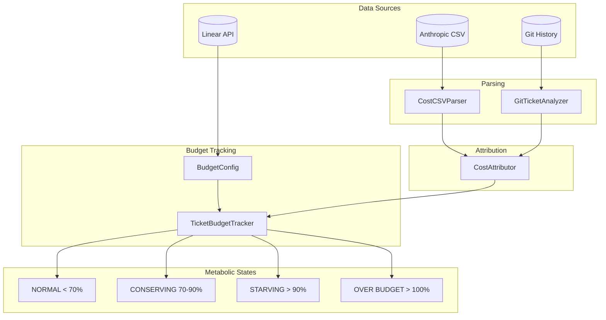
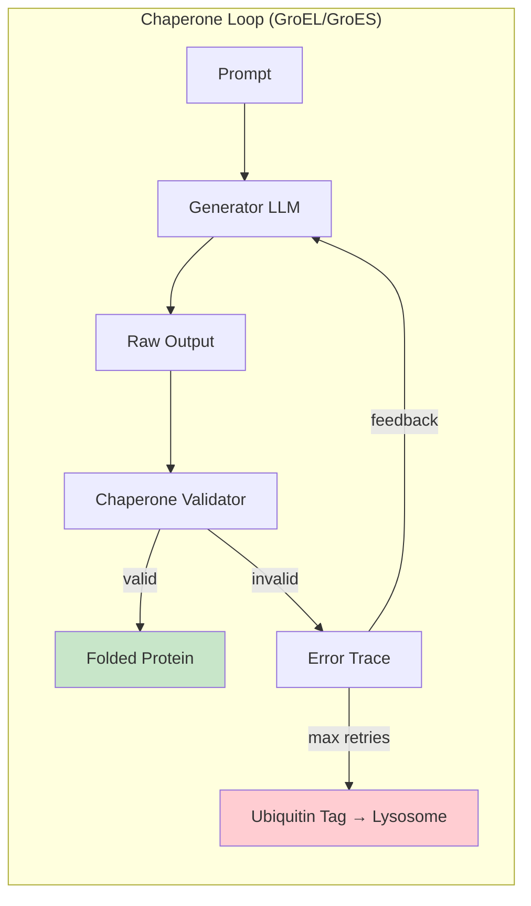
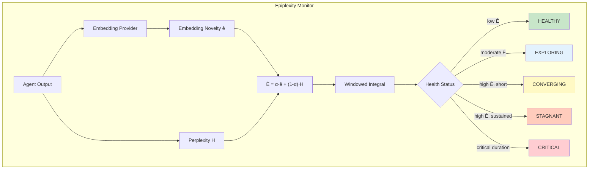
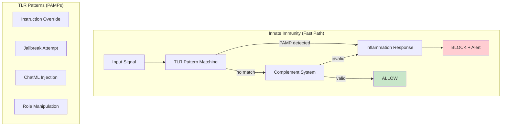
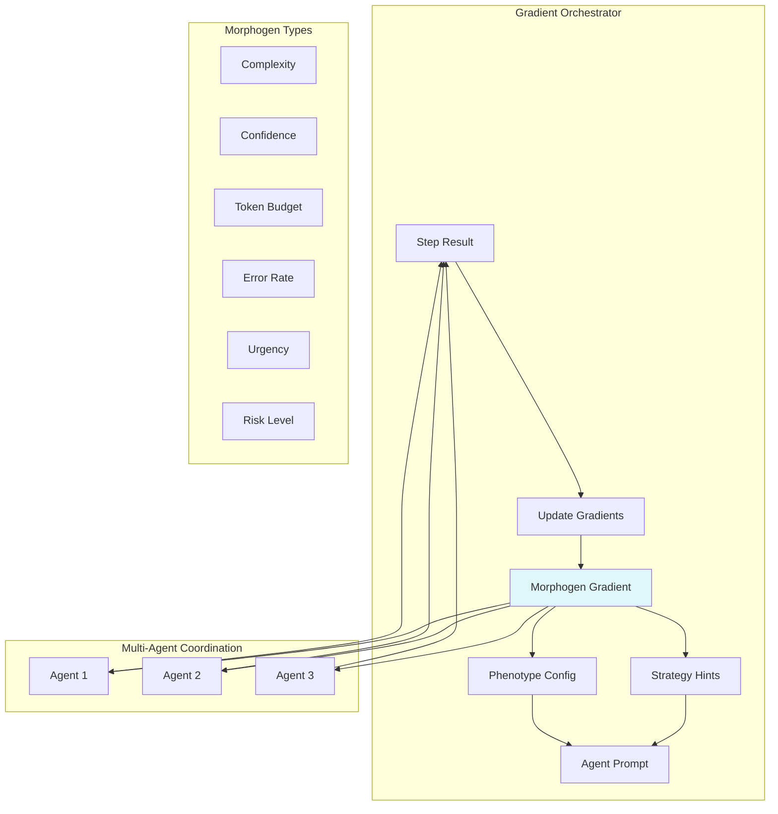

# Wiring Diagrams

These ASCII wiring diagrams reflect the WAgent examples in `examples/`.
Each arrow implies a typed connection with integrity constraints.

## Mermaid Diagrams (Per Example Files)

### Core Wiring

- [Example 17: Typed Wiring](wiring_diagrams/example17_typed_wiring.md)
- [Example 26: Guarded Toolchain](wiring_diagrams/example26_guarded_toolchain.md)

### Resource Allocation

- [Example 27: Resource Allocator](wiring_diagrams/example27_resource_allocator.md)
- [Example 36: Multi-Gemini Resource Allocation](wiring_diagrams/example36_multi_gemini_allocation.md)

### Consensus and Tooling

- [Example 28: Quorum Consensus Gate](wiring_diagrams/example28_quorum_consensus.md)
- [Example 29: Safe Tool Calls](wiring_diagrams/example29_safe_tool_calls.md)

### Composition

- [Example 30: Composed System](wiring_diagrams/example30_composed_system.md)
- [Example 31: Composed Effects](wiring_diagrams/example31_composed_effects.md)

### Execution

- [Example 32: Wiring Diagram Execution](wiring_diagrams/example32_execution.md)
- [Example 33: Wiring Diagram Execution - Failures](wiring_diagrams/example33_execution_failures.md)

### Nucleus + LLM

- [Example 34: Nucleus LLM Integration](wiring_diagrams/example34_nucleus_llm.md)
- [Example 35: Nucleus LLM Execution](wiring_diagrams/example35_nucleus_execution.md)

### Formal Theory

- [Example 37: Metabolic Swarm Budgeting](wiring_diagrams/example37_metabolic_swarm.md)

### Cost Attribution

- [Example 38: Linear Budget Tracking](wiring_diagrams/example38_linear_budget_tracking.md)

### Health & Healing (v0.10+)

- [Example 39: Chaperone Healing Loop](wiring_diagrams/example39_chaperone_healing_loop.md)
- [Example 40: Regenerative Swarm](wiring_diagrams/example40_regenerative_swarm.md)
- [Example 41: Autophagy Context Pruning](wiring_diagrams/example41_autophagy_context_pruning.md)
- [Example 42: Epiplexity Monitoring](wiring_diagrams/example42_epiplexity_monitoring.md)

### Surveillance (v0.11+)

- [Example 43: Innate Immunity](wiring_diagrams/example43_innate_immunity.md)
- [Example 44: Morphogen Gradients](wiring_diagrams/example44_morphogen_gradients.md)

### Practical Applications (v0.11+)

- [Example 45: Code Review Pipeline](wiring_diagrams/example45_code_review.md)
- [Example 46: Codebase Q&A](wiring_diagrams/example46_codebase_qa.md)
- [Example 47: Enhanced Cost Attribution](wiring_diagrams/example47_cost_attribution.md)

### Orchestration Patterns (v0.11+)

- [Example 48: Oscillator-Scheduled Maintenance](wiring_diagrams/example48_scheduled_maintenance.md)
- [Example 49: Immunity Healing Router](wiring_diagrams/example49_immunity_healing_router.md)
- [Example 50: Morphogen-Guided Swarm](wiring_diagrams/example50_morphogen_guided_swarm.md)
- [Example 51: Epiplexity Healing Cascade](wiring_diagrams/example51_epiplexity_healing_cascade.md)
- [Example 52: Morphogen Cascade with Quorum](wiring_diagrams/example52_morphogen_cascade_quorum.md)
- [Example 53: LLM Epigenetic Repair Memory](wiring_diagrams/example53_epigenetic_repair_memory.md)
- [Example 54: LLM Swarm with Graceful Cleanup](wiring_diagrams/example54_swarm_graceful_cleanup.md)
- [Example 55: Adaptive Multi-Agent Orchestrator](wiring_diagrams/example55_multi_agent_orchestrator.md)

### Multicellular + State (v0.13–v0.15)

- Example 56: Metabolic Epigenetic Coupling
- Example 57: Cell Type Specialization
- Example 58: Tissue Architecture
- Example 59: Plasmid Registry
- Example 60: Denaturation Layers

### Formal Theory (v0.14–v0.15)

- Example 61: Coalgebraic State Machines
- Example 62: Morphogen Diffusion
- Example 63: Optic-Based Wiring
- Example 64: Diagram Optimization

### Provider + Topology (v0.16–v0.17)

- Example 65: OpenAI-Compatible (LM Studio)
- Example 66: Epistemic Topology

### Pattern-First API (v0.18)

- Example 67: Pattern-First API
- Example 68: Skill Organism Runtime

### Temporal Epistemics (v0.19–v0.20)

- Example 69: Bi-Temporal Memory
- Example 70: Bi-Temporal Compliance Audit
- Example 71: Bi-Temporal Skill Organism

### Adaptive Structure (v0.21)

- Example 72: Pattern Repository
- Example 73: Watcher Component
- Example 74: Adaptive Assembly
- Example 75: Experience-Driven Watcher

### Cognitive Architecture (v0.22)

- Example 76: Cognitive Modes
- Example 77: Sleep Consolidation
- Example 78: Social Learning
- Example 79: Curiosity-Driven Exploration

### Developmental Staging (v0.23)

- Example 80: Developmental Staging
- Example 81: Critical Periods

### Ergonomics + CLI (v0.23.2–v0.23.3)

- Example 82: Managed Organism
- Example 83: CLI Stage Handler
- Example 84: CLI Organism
- Example 85: Claude Code Pipeline

## Example 17: Typed Wiring (Integrity + Capabilities)

```
[user] --text(U)--> [membrane] --text(U)--> [chaperone] --json(V)--> [executor] --toolcall(V)--> [sink]
                                                          |                                   ^
                                                          |                                   |
                                                          +--toolcall(V)--> [verifier] --approval(T)
```

## Example 26: Guarded Toolchain

```
[user] --text(U)--> [membrane] --text(U)--> [validator] --text(V)--> [parser] --json(V)--> [planner]
                                                                                                 |
                                                                                                 v
                                                            [serializer] --text(V)--> [policy] --approval(T)
                                                                                                 |
[validator] --text(V)--> [attestor] --text(T)--> [operator_console]                               v
[planner] --json(V)--> [tool_builder] --toolcall(V)--------------------------------------------> [sink]
```

## Example 27: Resource Allocator

```
[nutrient_sensor] --json(U)--> [nutrient_validator] --json(V)---+
[machinery_sensor] --json(U)--> [machinery_validator] --json(V)--+--> [budget_aggregator] --json(T)--> [allocator]
[energy_sensor]   --json(U)--> [energy_validator]   --json(V)---+                          |
                                                                                           +--> [policy] --approval(T)

[allocator] --growth(V)--> [growth_executor] --toolcall(V)--> [growth_sink]
[allocator] --maint(V)-->  [maintenance_executor] --toolcall(V)--> [maintenance_sink]
[allocator] --spec(V)-->   [specialization_executor] --toolcall(V)--> [specialization_sink]

[policy] --approval(T)--> [growth_sink]
[policy] --approval(T)--> [maintenance_sink]
[policy] --approval(T)--> [specialization_sink]
```

## Example 28: Quorum Consensus Gate

```
[user] --text(U)--> [sanitizer] --text(V)--> [voter_a] --vote(V)--+
                                   |--> [voter_b] --vote(V)----+--> [quorum] --approval(T)--> [sink]
                                   |--> [voter_c] --vote(V)----+
                                   |
                                   +--> [tool_builder] --toolcall(V)------------------------> [sink]
```

## Example 29: Safe Tool Calls

```
[user] --text(U)--> [validator] --text(V)--> [planner] --plan(V)--+
                                                                  +--> [tool_builder] --toolcall(V)--> [sink]
                                                                  +--> [policy] --approval(T)--------> [sink]
```

## Example 30: Composed System (Ingress + Execution)

```
Ingress:
[user] --text(U)--> [membrane] --text(U)--> [sanitizer] --text(V)

Execution:
[planner] --plan(V)--> [tool_builder] --toolcall(V)--> [sink]
[planner] --plan(V)--> [policy] --approval(T)--------> [sink]

Composition:
[ingress.sanitizer] --text(V)--> [exec.planner]
```

## Example 31: Composed Effects (Net + Write)

```
Ingress:
[user] --text(U)--> [membrane] --text(U)--> [sanitizer] --text(V)

Execution:
[planner] --plan(V)--> [tool_builder_write] --toolcall(V)--> [write_sink]
[planner] --plan(V)--> [tool_builder_net]   --toolcall(V)--> [net_sink]
[planner] --plan(V)--> [policy] --approval(T)----------------> [write_sink]
[planner] --plan(V)--> [policy] --approval(T)----------------> [net_sink]

Composition:
[ingress.sanitizer] --text(V)--> [exec.planner]
```

## Example 32: Wiring Diagram Execution

```
[user] --text(U)--> [validator] --text(V)--> [planner] --plan(V)--+
                                                                 +--> [tool_builder] --toolcall(V)--> [sink]
                                                                 +--> [policy] --approval(T)--------> [sink]
```

## Example 33: Wiring Diagram Execution - Failures

```
[user] --text(U)--> [validator] --text(V)--> [planner] --plan(V)--+
                                                                 +--> [tool_builder] --toolcall(V)--> [sink]
                                                                 +--> [policy] --approval(T)--------> [sink]
```

## Example 34: Nucleus LLM Integration

```
[user] --text(U)--> [membrane] --text(U)--> [sanitizer] --text(V)--> [prompt_assembler]
[sanitizer] --text(V)--> [context_retriever] --json(V)--> [prompt_assembler]
[genome_policy] --json(T)--> [prompt_assembler]
[tool_registry] --json(T)--> [prompt_assembler]

[prompt_assembler] --text(V)--> [nucleus_llm] --json(U)--> [plan_validator] --json(V)--+
                                                                                      +--> [policy_gate] --approval(T)--> [executor]
                                                                                      +--> [tool_builder] --toolcall(V)--> [executor]
[nucleus_llm] --text(U)--> [response_sanitizer] --text(V)--> [response_merger] <--json(T)-- [executor]

[executor] --json(T)--> [memory_writer] --json(T)--> [episodic_store]
[response_merger] --text(V)--> [outbox]
```

## Example 35: Nucleus LLM Execution

```
[user] --text(U)--> [membrane] --text(U)--> [sanitizer] --text(V)--> [prompt_assembler] --text(V)--> [nucleus_llm]
[sanitizer] --text(V)--> [context_retriever] --json(V)--> [prompt_assembler]
[genome_policy] --json(T)--> [prompt_assembler]
[tool_registry] --json(T)--> [prompt_assembler]

[nucleus_llm] --json(U)--> [plan_validator] --json(V)--+--> [policy_gate] --approval(T)--> [executor]
                                                      +--> [tool_builder] --toolcall(V)--> [executor]
[nucleus_llm] --text(U)--> [response_sanitizer] --text(V)--> [response_merger] <--json(T)-- [executor]
[response_merger] --text(V)--> [outbox]
```

## Example 36: Multi-Gemini Resource Allocation

```
[user] --text(U)--> [membrane] --text(U)--> [sanitizer] --text(V)
[sanitizer] --text(V)--> [budget_allocator]
[sanitizer] --text(V)--> [prompt_fast]
[sanitizer] --text(V)--> [prompt_deep]
[sanitizer] --text(V)--> [prompt_safety]
[resource_monitor] --json(T)--> [budget_allocator]
[budget_allocator] --json(T)--> [prompt_fast] --text(V)--> [nucleus_fast] --json(U)--+
[budget_allocator] --json(T)--> [prompt_deep] --text(V)--> [nucleus_deep] --json(U)--+--> [plan_aggregator] --json(V)--> [policy_gate] --approval(T)--> [response_builder] --text(V)--> [outbox]
[budget_allocator] --json(T)--> [prompt_safety] --text(V)--> [nucleus_safety] --json(U)--+
```

## Example 37: Metabolic Swarm Budgeting (Coalgebraic Resource Constraints)

```
                              [SharedMitochondria]
                                    (ATP Pool)
                                        |
                    +-------------------+-------------------+
                    |                   |                   |
                consume(c)          consume(c)          consume(c)
                    |                   |                   |
                    v                   v                   v
[task] --task(U)--> [worker_1] --+  [worker_2] --+  [worker_3] --+
                         |       |        |       |        |       |
                     result(V)   |    result(V)   |    result(V)   |
                         |       |        |       |        |       |
                         v       v        v       v        v       v
                    [collector] <--------+--------+   [DEAD] (r<c)
                         |
                    candidates(V)
                         |
                         v
                    [verifier] <-- consume(c) -- [SharedMitochondria]
                         |
                    verdict(T)
                         |
                         v
                      [output]

Termination: solved | ischemia | swarm_collapse | verifier_death | entropy_limit
```

Legend: U = UNTRUSTED, V = VALIDATED, T = TRUSTED.

## Example 38: Linear Budget Tracking (Cost Attribution)


```mermaid
flowchart TB
    subgraph inputs["Data Sources"]
        CSV[("Anthropic CSV")]
        GIT[("Git History")]
        LINEAR[("Linear API")]
    end

    subgraph parsing["Parsing"]
        CSV --> CSVParser["CostCSVParser"]
        GIT --> GitAnalyzer["GitTicketAnalyzer"]
    end

    subgraph attribution["Attribution"]
        CSVParser --> Attributor["CostAttributor"]
        GitAnalyzer --> Attributor
    end

    subgraph budgeting["Budget Tracking"]
        LINEAR --> BudgetConfig
        BudgetConfig --> Tracker["TicketBudgetTracker"]
        Attributor --> Tracker
    end

    subgraph states["Metabolic States"]
        Tracker --> Normal["NORMAL < 70%"]
        Tracker --> Conserving["CONSERVING 70-90%"]
        Tracker --> Starving["STARVING > 90%"]
        Tracker --> Over["OVER BUDGET > 100%"]
    end
```

```
[csv] --cost(U)--> [csv_parser] --cost(V)--+
                                           +--> [attributor] --ticket_cost(V)--> [tracker] --> [metabolic_state]
[git] --commits(U)--> [git_analyzer] --commits(V)--+                              ^
                                                                                   |
[linear] --estimates(T)------------------------------------------------------------+
```

## Example 39: Chaperone Healing Loop


```mermaid
flowchart LR
    subgraph ChaperoneLoop["Chaperone Loop (GroEL/GroES)"]
        prompt[Prompt] --> generator[Generator LLM]
        generator --> raw[Raw Output]
        raw --> chaperone[Chaperone Validator]
        chaperone -->|valid| output[Folded Protein]
        chaperone -->|invalid| error[Error Trace]
        error -->|feedback| generator
        error -->|max retries| ubiquitin[Ubiquitin Tag → Lysosome]
    end

    style output fill:#c8e6c9
    style ubiquitin fill:#ffcdd2
```

```
                    +---------------------------+
                    |                           |
                    v                           |
[prompt] --text(U)--> [generator] --json(U)--> [chaperone] --json(V)--> [output]
                           ^                        |
                           |                        |
                           +---error(V)---[healing_feedback]
                                                    |
                                          [max_retries?]--ubiquitin(V)--> [lysosome]

Confidence: 1.0 → 0.85 → 0.70 → ... (decay per retry)
```

## Example 42: Epiplexity Monitoring


```mermaid
flowchart TB
    subgraph Monitor["Epiplexity Monitor"]
        input[Agent Output] --> embed[Embedding Provider]
        embed --> novelty[Embedding Novelty ê]
        input --> perplexity[Perplexity H]
        novelty --> combine["Ê = α·ê + (1-α)·H"]
        perplexity --> combine
        combine --> window[Windowed Integral]
        window --> status{Health Status}
        status -->|low Ê| healthy[HEALTHY]
        status -->|moderate Ê| exploring[EXPLORING]
        status -->|high Ê, short| converging[CONVERGING]
        status -->|high Ê, sustained| stagnant[STAGNANT]
        status -->|critical duration| critical[CRITICAL]
    end

    style healthy fill:#c8e6c9
    style exploring fill:#e3f2fd
    style converging fill:#fff9c4
    style stagnant fill:#ffccbc
    style critical fill:#ffcdd2
```

```
[agent_output] --text(U)--> [embedding_provider] --embedding(V)--+
                                                                 +--> [epiplexity_calc] --> [health_status]
[agent_output] --text(U)--> [perplexity_calc] --perplexity(V)----+
                                                                         |
                                                    +--------------------+--------------------+
                                                    |                    |                    |
                                               [HEALTHY]            [STAGNANT]           [CRITICAL]
                                               (ê high)             (ê low, H high)      (sustained)
```

## Example 43: Innate Immunity


```mermaid
flowchart TB
    subgraph InnateImmunity["Innate Immunity (Fast Path)"]
        input[Input Signal] --> tlr[TLR Pattern Matching]
        tlr -->|no match| complement[Complement System]
        tlr -->|PAMP detected| inflammation[Inflammation Response]
        complement -->|valid| allow[ALLOW]
        complement -->|invalid| inflammation
        inflammation --> block[BLOCK + Alert]
    end

    subgraph TLR["TLR Patterns (PAMPs)"]
        pamp1[Instruction Override]
        pamp2[Jailbreak Attempt]
        pamp3[ChatML Injection]
        pamp4[Role Manipulation]
    end

    style allow fill:#c8e6c9
    style block fill:#ffcdd2
```

```
[input] --text(U)--> [tlr_scanner] --+--no_match--> [complement_validators] --valid--> [ALLOW]
                                     |                        |
                                     |                    invalid
                                     |                        |
                                     +--PAMP_detected--> [inflammation] --> [BLOCK]
                                                              |
                                              +---------------+---------------+
                                              |               |               |
                                         [cytokines]    [log_level++]    [rate_limit]
```

## Example 44: Morphogen Gradients


```mermaid
flowchart TB
    subgraph Orchestrator["Gradient Orchestrator"]
        step[Step Result] --> update[Update Gradients]
        update --> gradient[Morphogen Gradient]
        gradient --> hints[Strategy Hints]
        gradient --> phenotype[Phenotype Config]
        hints --> agent[Agent Prompt]
        phenotype --> agent
    end

    subgraph Gradient["Morphogen Types"]
        complexity[Complexity]
        confidence[Confidence]
        budget[Token Budget]
        error_rate[Error Rate]
        urgency[Urgency]
        risk[Risk Level]
    end

    subgraph Coordination["Multi-Agent Coordination"]
        gradient --> agent1[Agent 1]
        gradient --> agent2[Agent 2]
        gradient --> agent3[Agent 3]
        agent1 --> step
        agent2 --> step
        agent3 --> step
    end

    style gradient fill:#e0f7fa
```

```
                              [GradientOrchestrator]
                                       |
              +------------------------+------------------------+
              |                        |                        |
         [complexity]             [confidence]              [budget]
              |                        |                        |
              v                        v                        v
[agent_1] <--hints-- [gradient] --hints--> [agent_2] <--hints-- [agent_3]
    |                     ^                     |                    |
    |                     |                     |                    |
    +-----step_result-----+-----step_result-----+----step_result-----+

Coordination without central control: agents read local gradient concentrations
```

## Example 68: Skill Organism Runtime (v0.18)

```
[task] --text--> [intake]     --dict--> [router]      --text--> [planner]
                 (handler)              (fast_nucleus)           (deep_nucleus)
                 deterministic          mode="fixed"             mode="fuzzy"
                     |                      |                        |
                     +------shared_state----+------shared_state------+
                     |                      |                        |
                     +-----[TelemetryProbe]----stage_result----------+
```

## Example 71: Bi-Temporal Skill Organism (v0.20)

```
                          [BiTemporalMemory]
                               (substrate)
                                   ^  |
                          write    |  | read (SubstrateView)
                                   |  v
[task] --> [research]  --> [strategist]  --> [evaluator]  --> [adversary]
           emit_output_fact  read_query      fact_extractor   fact_extractor
           fact_extractor    "acct:42"       (assert)         (op="correct")
               |                |                |                |
               +----shared_state (ephemeral)-----+----topology---+
               |                                                  |
               +-------------- three-layer context ---------------+
                    topology | ephemeral | bi-temporal
```

## Example 73: Watcher Component (v0.21)

```
                    [EpiplexityMonitor]  [ATP_Store]  [ImmuneSystem]
                         (epistemic)     (somatic)    (species)
                              |              |             |
                              v              v             v
[stage] --result--> [WatcherComponent] --signals--> [_decide_intervention]
                          |                                |
                     on_stage_result                  priority chain:
                          |                          1. convergence → HALT
                          v                          2. immune → HALT
                    shared_state                     3. critical epiplexity → ESCALATE
                    ["_watcher_intervention"]         4. stagnant + fast → ESCALATE
                          |                          5. curiosity + fast → ESCALATE
                          v                          6. FAILURE → RETRY
                    [organism.run() loop]             7. experience pool → recommend
                    RETRY | ESCALATE | HALT
```

## Example 74: Adaptive Assembly (v0.21.1)

```
[task] --fingerprint--> [PatternLibrary]
                             |
                        top_templates_for()
                             |
                             v
                      [assemble_pattern()]
                             |
              +--------------+--------------+
              |              |              |
         skill_organism  reviewer_gate  specialist_swarm
              |
              v
[AdaptiveSkillOrganism] --run()--> [SkillRunResult]
         |                              |
    record_run()                   record_experience()
         |                              |
         v                              v
   [PatternLibrary]              [ExperiencePool]
   (scoring feedback)            (intervention memory)
```

## Example 77: Sleep Consolidation (v0.22)

```
[PatternLibrary] --records--> [SleepConsolidation]
[EpisodicMemory] ----------->         |
[HistoneStore]   ----------->    5-step cycle:
[AutophagyDaemon] --------->     1. prune (autophagy)
[BiTemporalMemory] -------->     2. replay (WORKING → EPISODIC)
                                 3. compress (→ new templates)
                                 4. counterfactual (diff corrections)
                                 5. promote (ACETYLATION → METHYLATION)
                                      |
                                      v
                              [ConsolidationResult]
```

## Example 78: Social Learning (v0.22.1)

```
[Organism A]                                    [Organism B]
     |                                               |
export_templates()                          import_from_peer()
     |                                               |
     v                                               v
[PeerExchange] --------templates+records-------> [TrustRegistry]
  (peer_id="A")                                  trust_score("A")
                                                      |
                                                effective_score = sr × trust
                                                      |
                                             adopt if > threshold
                                                      |
                                                      v
                                              record_adoption_outcome()
                                                      |
                                               trust ↑ on success
                                               trust ↓ on failure
```

## Example 80: Developmental Staging (v0.23)

```
                    [Telomere]
                   max_operations=100
                        |
                   consumed fraction
                        |
                        v
              [DevelopmentController]
                        |
         +--------------+--------------+
         |              |              |
    EMBRYONIC      JUVENILE       ADOLESCENT      MATURE
    (<10%)         (10-35%)       (35-70%)        (>70%)
    plasticity=1.0  0.75           0.50            0.25
         |
    [CriticalPeriod]
    opens_at → closes_at
    (permanently shut)
         |
    [Plasmid.min_stage]
    tool acquisition gated
    by developmental stage
```

## Example 82: Managed Organism (v0.23.2)

```
managed_organism(task, library, stages, substrate, telomere, organism_id, ...)
         |
         +--→ [PatternLibrary] → adaptive_skill_organism()  ──┐
         |         or                                          |
         +--→ [stages] → skill_organism()  ───────────────────┤
                                                               |
         +--→ [WatcherComponent] ──────────────────────────────+──→ [ManagedOrganism]
         +--→ [TelemetryProbe]  ───────────────────────────────┤        |
         +--→ [DevelopmentController] ─────────────────────────┤    .run()
         +--→ [SocialLearning] ────────────────────────────────┤    .consolidate()
         +--→ [BiTemporalMemory] ──────────────────────────────┘    .export_templates()
                                                                    .scaffold()
              one function call → full stack                        .status()
```

## Example 85: Claude Code Pipeline (v0.23.3)

```
[task] --stdin--> [claude --print]  --stdout--> [claude --print]  --stdout--> [claude --print]
                  (plan stage)                  (implement stage)              (review stage)
                  system: "planner"             system: "developer"           system: "reviewer"
                       |                             |                             |
                       +---context chain: each stage receives all prior outputs---+
                       |                             |                             |
                  [cli_handler]                [cli_handler]                 [cli_handler]
                  input_mode="stdin"            input_mode="stdin"           input_mode="stdin"
                  timeout=120s                  timeout=120s                 timeout=120s
                       |                             |                             |
                       +----------[WatcherComponent]----------+
                       |          convergence monitoring       |
                       +----------[BiTemporalMemory]----------+
                                  substrate recording

                  _action_type="EXECUTE" on success
                  _action_type="FAILURE" on non-zero returncode → watcher RETRY
```
