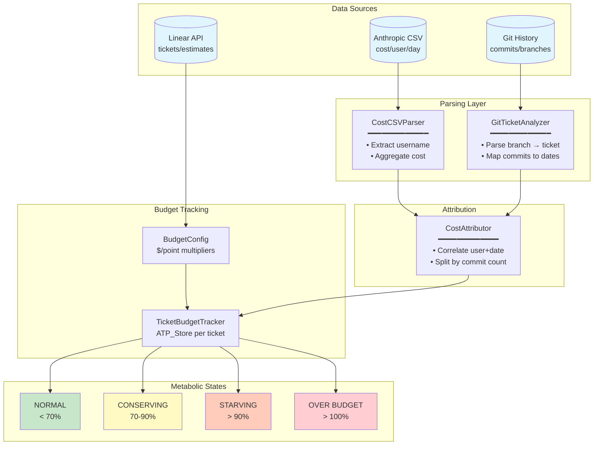

# Example 38: Linear Budget Tracking

Tracks Claude Code token costs against Linear ticket estimates using git commit
correlation and ATP_Store for metabolic budget management.



## ASCII Wiring

```
[csv] --cost(U)--> [csv_parser] --cost(V)--+
                                           +--> [attributor] --ticket_cost(V)--> [tracker] --> [metabolic_state]
[git] --commits(U)--> [git_analyzer] --commits(V)--+                              ^
                                                                                   |
[linear] --estimates(T)------------------------------------------------------------+
```

## Key Concepts

- **Cost Attribution**: Maps API costs to Linear tickets via git commit correlation
- **Metabolic States**: NORMAL → CONSERVING → STARVING → OVER_BUDGET
- **Ischemia Detection**: Predictive alerts before budget exhaustion

Legend: U = UNTRUSTED, V = VALIDATED, T = TRUSTED.
