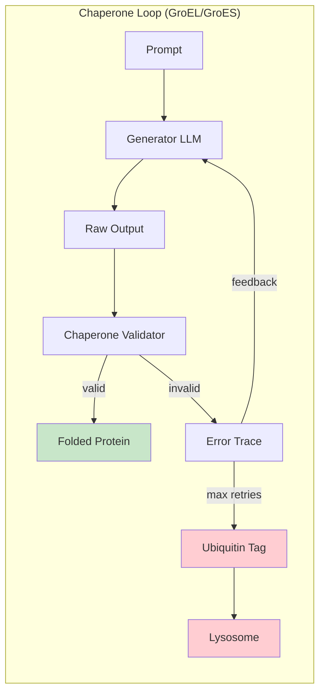
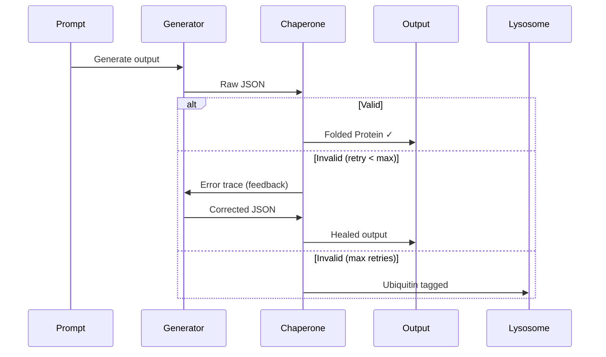

# Example 39: Chaperone Healing Loop

Demonstrates the biological Chaperone Loop pattern where validation failures
are fed back to the generator for context-aware refolding.



## Sequence Diagram



## ASCII Wiring

```
                    +---------------------------+
                    |                           |
                    v                           |
[prompt] --text(U)--> [generator] --json(U)--> [chaperone] --json(V)--> [output]
                           ^                        |
                           |                        |
                           +---error(V)---[healing_feedback]
                                                    |
                                          [max_retries?]--ubiquitin(V)--> [lysosome]

Confidence: 1.0 → 0.85 → 0.70 → ... (decay per retry)
```

## Key Concepts

- **Feedback-driven repair**: Error traces guide regeneration
- **Confidence decay**: Each retry reduces output confidence (0.15 per attempt)
- **Ubiquitin tagging**: Mark unfixable outputs for degradation

## Biological Parallel

- **GroEL/GroES**: Isolation chamber giving proteins a second chance to fold
- **Unfolded Protein Response**: Stress pathway when folding repeatedly fails

Legend: U = UNTRUSTED, V = VALIDATED, T = TRUSTED.
