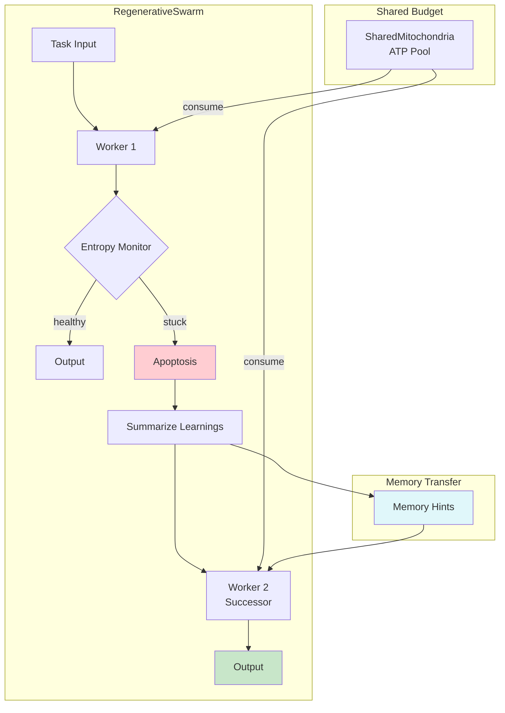

# Example 40: Regenerative Swarm (Metabolic Self-Healing)

## Wiring Diagram



```
[Task] --task(U)--> [RegenerativeSwarm]
                         |
                    [Worker 1] <--consume-- [SharedMitochondria]
                         |
                    [Entropy Monitor]
                         |
              +---healthy---> [output]
              |
              +---stuck-----> [Apoptosis]
                                   |
                              [Summarize Learnings]
                                   |
                              [Memory Hints]
                                   |
                                   v
                              [Worker 2] <--consume-- [SharedMitochondria]
                                   |
                              [output]
```

## Key Patterns

### Apoptosis + Regeneration
When a worker gets stuck (detected via output repetition / entropy collapse),
it undergoes clean apoptosis — preserving useful state before termination.
A successor worker is spawned with summarized learnings from the predecessor.

### Memory Inheritance
The dying worker's experience becomes a lesson for its successor. This is
analogous to cellular debris signaling: dying cells inform neighbors about threats.

## Data Flow

```
SimpleWorker
  ├─ id: str
  ├─ work_function(task, memory) -> str
  └─ WorkerMemory
       ├─ output_history: list[str]
       └─ hints: list[str]  (from predecessor)
       ↓
SwarmResult
  ├─ success: bool
  ├─ output: str
  ├─ total_workers_spawned: int
  └─ worker_history: list[WorkerRecord]
```

## Worker Lifecycle

| Phase | Action | Condition |
|-------|--------|-----------|
| Spawn | Create worker with hints from predecessor | — |
| Work | Execute work function, accumulate outputs | — |
| Monitor | Check entropy (output repetition) | Each step |
| Stuck | Identical outputs detected | Entropy collapse |
| Summarize | Extract useful state via summarizer | Before death |
| Apoptosis | Clean termination | — |
| Regenerate | Spawn successor with summary hints | If regenerations remain |
