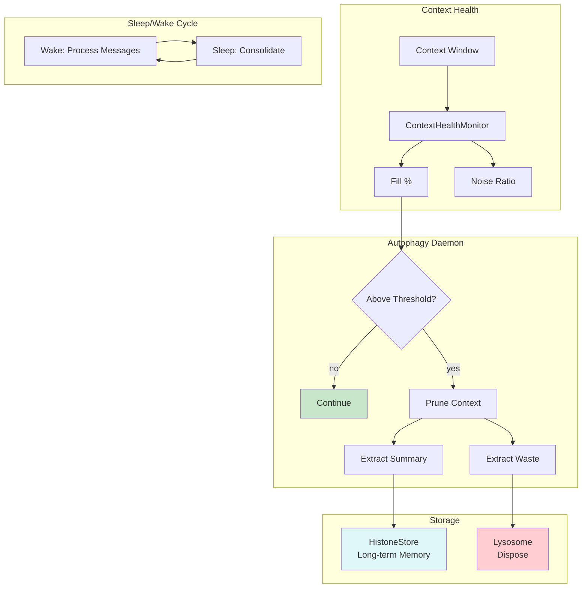

# Example 41: Autophagy Context Pruning (Cognitive Self-Healing)

## Wiring Diagram



```
[Context Window] --text--> [ContextHealthMonitor]
                                |
                           fill_pct, noise_ratio
                                |
                    +--below_threshold--> [continue]
                    |
                    +--above_threshold--> [AutophagyDaemon]
                                              |
                              +--summary--> [HistoneStore] (long-term memory)
                              |
                              +--waste----> [Lysosome] (dispose)
                              |
                              +--pruned_context--> [Agent] (cleaner window)
```

## Key Patterns

### Proactive Context Pruning
Context pollution degrades performance gradually. The AutophagyDaemon monitors
context health and proactively prunes stale/noisy content before it causes
catastrophic degradation — analogous to cells digesting accumulated waste.

### Sleep/Wake Consolidation
During "sleep" phases, the agent consolidates important information into
long-term memory (HistoneStore) and flushes raw context via the Lysosome.
This mirrors the brain's glymphatic system clearing metabolic waste during sleep.

## Data Flow

```
ContextHealthStatus
  ├─ fill_pct: float        (0.0 - 1.0)
  ├─ noise_ratio: float     (0.0 - 1.0)
  ├─ total_tokens: int
  └─ noise_tokens: int
       ↓
AutophagyDaemon.check_and_prune()
  ├─ input: context (str or list)
  ├─ max_tokens: int
  └─ returns: (pruned_context, PruneResult)
       ↓
PruneResult
  ├─ tokens_freed: int
  ├─ messages_digested: int
  └─ summary_stored: bool
```

## Health Thresholds

| Metric | Healthy | Warning | Critical |
|--------|---------|---------|----------|
| Fill % | < 60% | 60-80% | > 80% |
| Noise Ratio | < 0.2 | 0.2-0.4 | > 0.4 |
| Action | Continue | Monitor | Prune |
