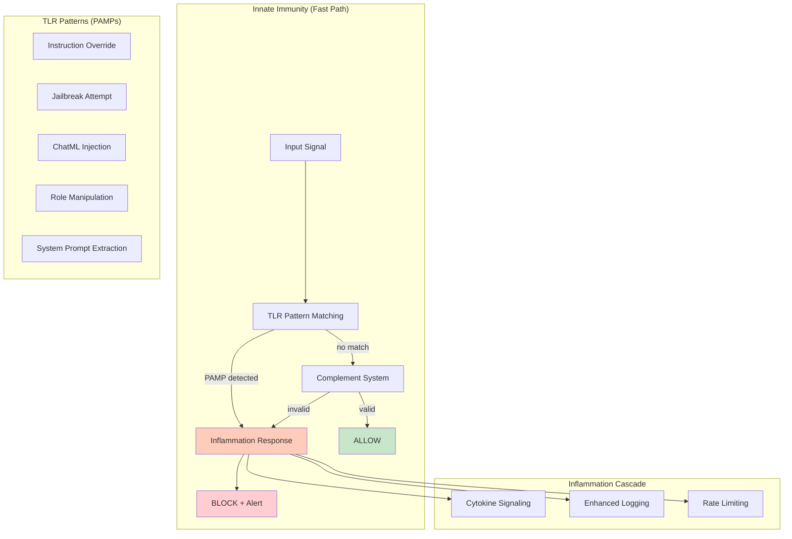
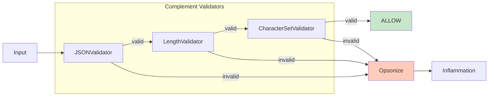

# Example 41: Innate Immunity

Fast, pattern-based defense against prompt injection. Complements the adaptive
Membrane with immediate, non-specific threat detection.



## Complement System (Structural Validation)



## ASCII Wiring

```
[input] --text(U)--> [tlr_scanner] --+--no_match--> [complement_validators] --valid--> [ALLOW]
                                     |                        |
                                     |                    invalid
                                     |                        |
                                     +--PAMP_detected--> [inflammation] --> [BLOCK]
                                                              |
                                              +---------------+---------------+
                                              |               |               |
                                         [cytokines]    [log_level++]    [rate_limit]
```

## PAMP Categories

| Category | Examples | Severity |
|----------|----------|----------|
| INSTRUCTION_OVERRIDE | "Ignore previous", "New instructions" | CRITICAL |
| JAILBREAK | "DAN mode", "Developer mode" | CRITICAL |
| INJECTION | ChatML tags, role markers | HIGH |
| MANIPULATION | "Pretend", "Act as" | MEDIUM |
| EXTRACTION | "System prompt", "Instructions" | MEDIUM |

## Inflammation Levels

- **NONE**: No threat detected
- **LOW**: Minor pattern match, allow with logging
- **MEDIUM**: Suspicious pattern, enhanced monitoring
- **HIGH**: Likely threat, rate limiting active
- **CRITICAL**: Clear attack, immediate block

Legend: U = UNTRUSTED, V = VALIDATED, T = TRUSTED.
