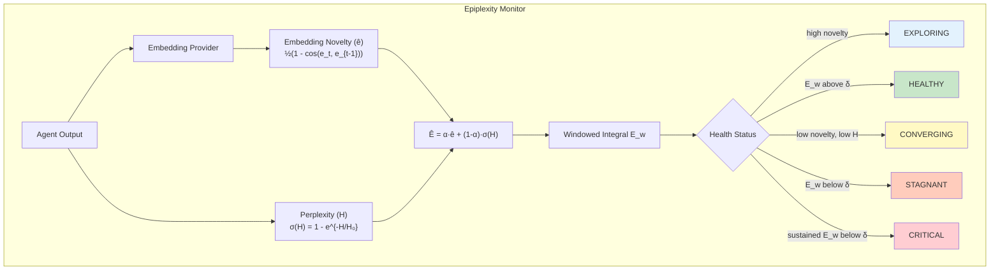
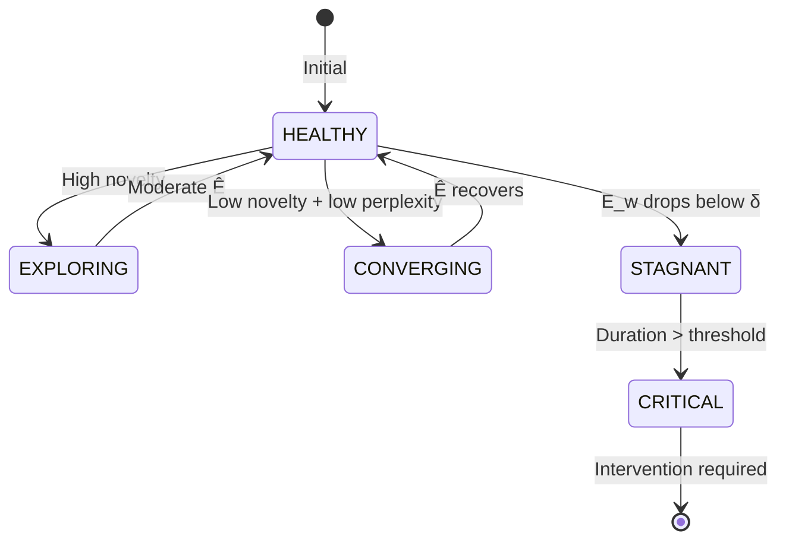

# Example 42: Epiplexity Monitoring

Detects epistemic stagnation in agents through Bayesian Surprise monitoring.
Based on the Free Energy Principle: healthy agents minimize surprise through
learning or effective action; stagnant agents do neither.



## Health Status Flow



## ASCII Wiring

```
[agent_output] --text(U)--> [embedding_provider] --embedding(V)--+
                                                                 +--> [epiplexity_calc] --> [health_status]
[agent_output] --text(U)--> [perplexity_calc] --perplexity(V)----+
                                                                         |
                                                    +--------------------+--------------------+
                                                    |                    |                    |
                                               [HEALTHY]            [STAGNANT]           [CRITICAL]
                                               (Ê above δ)          (Ê below δ)          (sustained)
```

## Key Insight

If an agent's outputs stabilize (low embedding novelty ê) while its perplexity
remains high (model is uncertain H), it's in a pathological loop—not converging
to a solution. Low Epiplexity = low Bayesian surprise = stagnation.

## Formula

```
Ê_t = α·½(1 - cos(e_t, e_{t-1})) + (1-α)·σ(H(m_t|m_{<t}))
```

Where:
- `e_t`: Embedding of message at time t
- `H`: Perplexity (model uncertainty)
- `α`: Balance parameter (default 0.5)
- `σ(H)`: Exponential saturation (1 - e^{-H/H₀})

Legend: U = UNTRUSTED, V = VALIDATED, T = TRUSTED.
