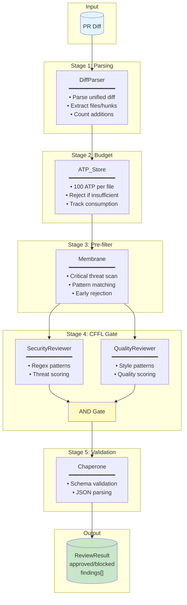

# Example 43: Code Review Pipeline

## Wiring Diagram



## Key Patterns

### CFFL (Coherent Feed-Forward Loop)
Both Security and Quality reviewers must approve for the review to pass.
This is the biological "two-key" pattern - a safety interlock.

### ATP Budgeting
Each file costs 100 ATP. Large PRs (>20 files) require explicit override.
Prevents runaway costs on massive PRs.

### Membrane Pre-filter
Fast pattern matching catches critical threats before expensive analysis.
Rejects obvious dangerous patterns immediately.

## Data Flow

```
ParsedDiff
  +-- files: list[str]
  +-- hunks: list[DiffHunk]
  +-- additions: int
  +-- deletions: int
       |
       v
ReviewerResult
  +-- approved: bool
  +-- score: float
  +-- findings: list[ReviewFinding]
       |
       v
ReviewResult
  +-- approved: bool
  +-- summary: str
  +-- security_score: float
  +-- quality_score: float
  +-- findings: list[ReviewFinding]
```
