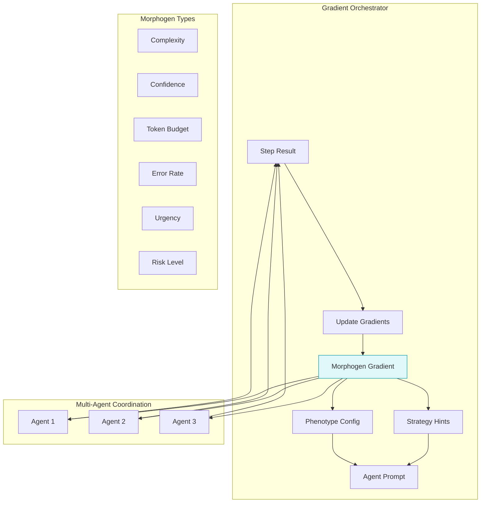
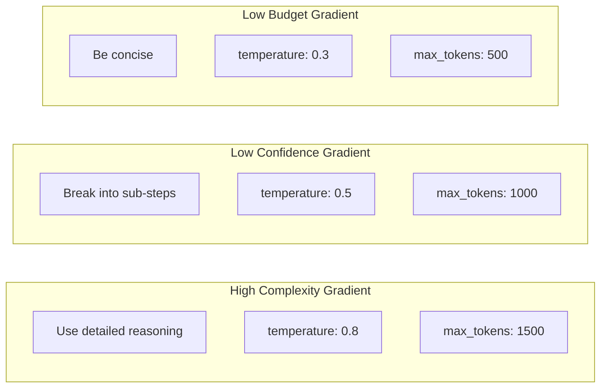

# Example 44: Morphogen Gradients

Multi-cellular coordination through shared context variables. Inspired by
embryonic development where cells coordinate via diffusible morphogens.



## Gradient-Based Phenotype Adaptation



## ASCII Wiring

```
                              [GradientOrchestrator]
                                       |
              +------------------------+------------------------+
              |                        |                        |
         [complexity]             [confidence]              [budget]
              |                        |                        |
              v                        v                        v
[agent_1] <--hints-- [gradient] --hints--> [agent_2] <--hints-- [agent_3]
    |                     ^                     |                    |
    |                     |                     |                    |
    +-----step_result-----+-----step_result-----+----step_result-----+

Coordination without central control: agents read local gradient concentrations
```

## Morphogen Levels

Each morphogen has three levels based on concentration:

| Morphogen | LOW (< 0.3) | MEDIUM (0.3-0.7) | HIGH (> 0.7) |
|-----------|-------------|------------------|--------------|
| Complexity | Simple task | Moderate | Break down needed |
| Confidence | Uncertain | Stable | Proceed confidently |
| Budget | Abundant | Normal | Conserve tokens |
| Error Rate | Healthy | Concerning | Retry/simplify |
| Urgency | Relaxed | Normal | Expedite |
| Risk | Safe | Caution | Extra validation |

## Key Insight

Agents can coordinate through shared context variables (the "gradient") without
explicit communication between them. Each agent reads its local concentration
and adapts its behavior accordingly—just like cells in an embryo.

## Quorum Trigger

When `should_recruit_help()` returns True (low confidence + high error rate),
it signals that the task should escalate to Quorum Sensing for multi-agent
consensus.

Legend: U = UNTRUSTED, V = VALIDATED, T = TRUSTED.
