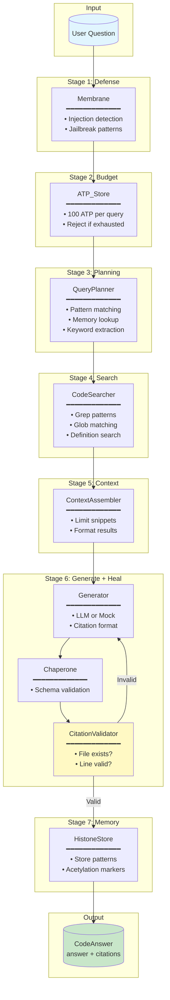

# Example 46: Codebase Q&A with RAG

## Wiring Diagram



## Key Patterns

### Chaperone Healing Loop
If the generator produces hallucinated file citations (e.g., `nonexistent.py:42`),
the validator rejects and retries with error feedback. This is the GroEL/GroES
pattern - giving outputs a chance to refold correctly.

### Histone Memory
Successful search patterns are stored as acetylation markers with 1-week decay.
Future queries check memory first, boosting patterns that worked before.

### Query Planning
Detects question types:
- "Where is X defined?" → definition search
- "What files contain X?" → grep search
- Generic → keyword extraction

## Data Flow

```
SearchResult
  ├─ file_path: str
  ├─ line_number: int
  └─ line_content: str
       ↓
CodeAnswer
  ├─ answer: str
  ├─ citations: list[Citation]
  ├─ confidence: float
  └─ search_patterns_used: list[str]
       ↓
QueryResult
  ├─ success: bool
  ├─ answer: CodeAnswer
  ├─ healing_attempts: int
  └─ search_results_count: int
```
