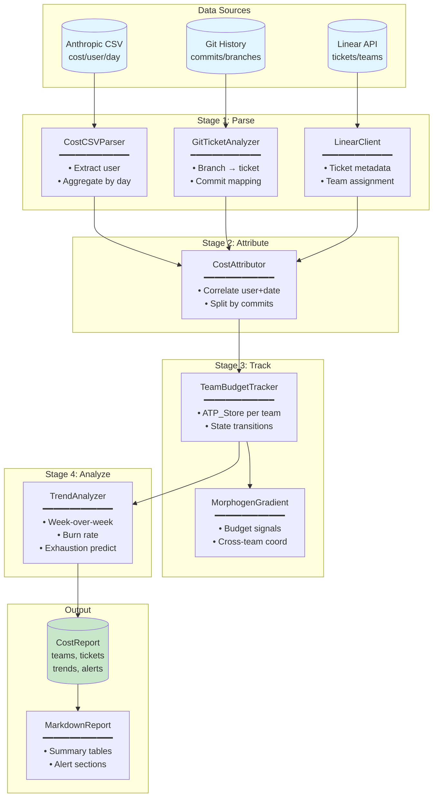

# Example 47: Enhanced Cost Attribution

## Wiring Diagram



## Key Patterns

### Morphogen Gradients
Each team's budget status is broadcast as a morphogen signal.
Other teams can sense "metabolic scarcity" and adjust behavior.
This enables coordination without central control.

### ATP Budget per Team
Each team has an ATP_Store representing their monthly budget.
State transitions (NORMAL → CONSERVING → STARVING) trigger alerts.

### Trend Analysis
- Week-over-week comparison detects acceleration
- Daily burn rate predicts exhaustion date
- Alerts trigger when projection < 14 days

## Data Flow

```
TicketCost
  ├─ ticket_id: str
  ├─ team_id: str
  ├─ estimate_points: int
  ├─ budget_usd: float
  ├─ spent_usd: float
  └─ state: MetabolicState
       ↓
TeamSummary
  ├─ team_id: str
  ├─ budget_usd: float
  ├─ spent_usd: float
  ├─ utilization: float
  └─ over_budget_tickets: int
       ↓
CostReport
  ├─ org_total_budget: float
  ├─ org_total_spent: float
  ├─ teams: list[TeamSummary]
  ├─ tickets: list[TicketCost]
  ├─ trend: TrendData
  └─ alerts: list[tuple[AlertLevel, str]]
```

## Budget States

| State | Utilization | Behavior |
|-------|-------------|----------|
| NORMAL | < 70% | Full operation |
| CONSERVING | 70-90% | Warning alerts |
| STARVING | > 90% | Critical alerts |
| FEASTING | Recent large decrease | (transient) |
