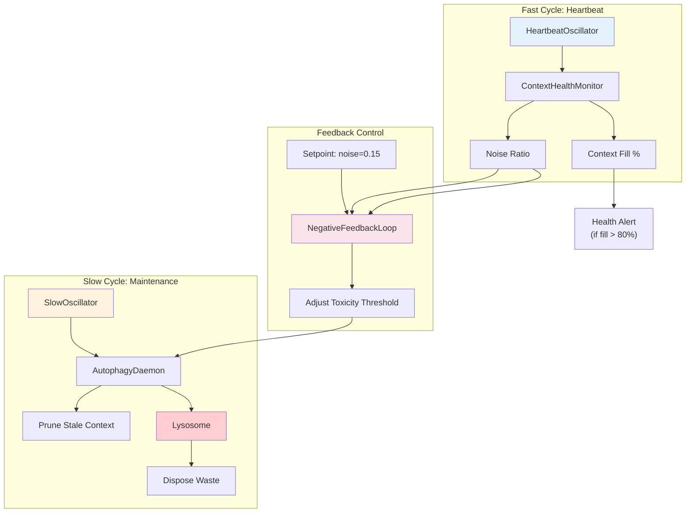

# Example 48: Oscillator-Scheduled Maintenance

## Wiring Diagram



```
[HeartbeatOscillator] ──fast──> [ContextHealthMonitor]
       |                            ├── context_fill_pct
       |                            └── noise_ratio ──────────────┐
       |                                                          │
[SlowOscillator] ──slow──> [AutophagyDaemon] ──waste──> [Lysosome]
       |                         ^                                │
       |                         │ adjust_threshold               │
       |                         │                                │
[NegativeFeedbackLoop] ──────────┘                                │
       ├── setpoint: 0.15   <─── measured noise ──────────────────┘
       └── output: toxicity_threshold
```

## Key Patterns

### Dual-Frequency Oscillation
Two oscillators at different frequencies provide both rapid monitoring (heartbeat)
and periodic deep cleanup (maintenance). The fast cycle detects problems; the slow
cycle fixes them.

### Feedback-Controlled Autophagy
The NegativeFeedbackLoop adjusts the autophagy toxicity threshold to maintain a
target noise ratio. If noise is too high, the threshold drops (more aggressive
pruning); if noise is too low, the threshold rises (less pruning).

## Data Flow

```
ContextHealthMonitor
  ├─ context_fill_pct: float    (0.0 - 1.0)
  ├─ noise_ratio: float         (0.0 - 1.0)
  ├─ total_chars: int
  └─ noise_chars: int
       ↓
MaintenanceScheduler
  ├─ heartbeat_interval: float  (seconds)
  ├─ maintenance_interval: float
  ├─ noise_setpoint: float      (target ratio)
  └─ feedback_gain: float
       ↓
MaintenanceResult
  ├─ cycles_run: int
  ├─ tokens_freed: int
  ├─ noise_ratio_history: list[float]
  └─ threshold_adjustments: list[float]
```

## Feedback Loop Parameters

| Parameter | Value | Description |
|-----------|-------|-------------|
| Setpoint | 0.15 | Target noise ratio |
| Gain | 0.1 | Proportional correction strength |
| Toxicity range | 0.3 - 0.9 | Min/max autophagy threshold |
