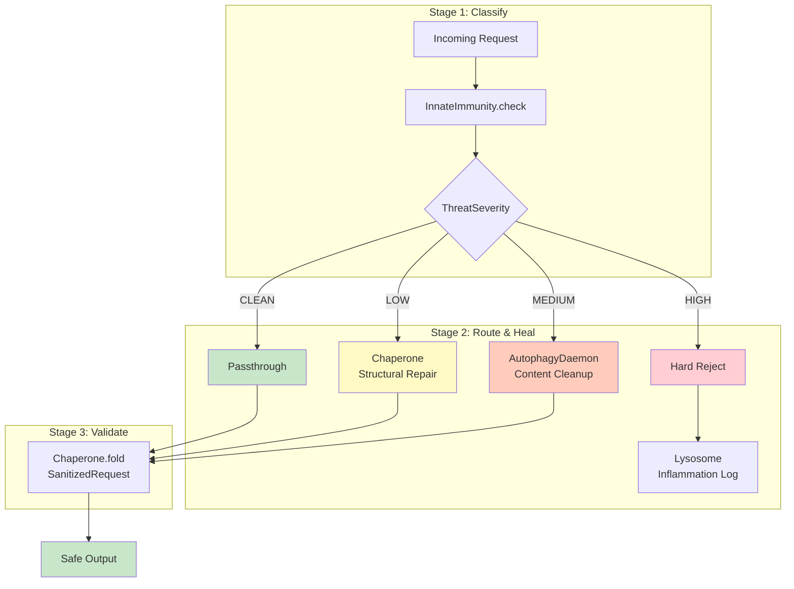

# Example 49: Immunity Healing Router

## Wiring Diagram



```
[input] --text(U)--> [InnateImmunity.check()] --classification--> [Router]
                                                                      |
                          +---CLEAN----> [passthrough] ──────────────────────> [output]
                          |
                          +---LOW------> [Chaperone.fold(SanitizedRequest)] -> [output]
                          |
                          +---MEDIUM---> [AutophagyDaemon.check_and_prune()] -> [output]
                          |                     └──waste──> [Lysosome]
                          |
                          +---HIGH-----> [REJECT] ──waste──> [Lysosome]
```

## Key Patterns

### Graduated Response
Instead of binary allow/deny, threats are classified into four severity levels,
each mapped to a different healing mechanism. Most inputs contain a legitimate
intent mixed with injection attempts—healing preserves the intent.

### Escalation Chain
If structural repair (LOW) fails, the request escalates to content cleanup (MEDIUM).
If cleanup produces empty output, it escalates to hard reject (HIGH).

## Data Flow

```
ThreatClassification
  ├─ severity: ThreatSeverity     (CLEAN|LOW|MEDIUM|HIGH)
  ├─ pattern_count: int
  ├─ max_pattern_severity: int
  ├─ inflammation_level: InflammationLevel
  └─ details: list[str]
       ↓
RoutingResult
  ├─ original_input: str
  ├─ classification: ThreatClassification
  ├─ action: HealingAction
  ├─ output: str | None
  ├─ healed: bool
  ├─ validation_passed: bool
  └─ details: str
```

## Threat Routing Table

| Severity | Action | Mechanism | Outcome |
|----------|--------|-----------|---------|
| CLEAN | Passthrough | None | Input unchanged |
| LOW | Structural Repair | Chaperone | Strip patterns, validate schema |
| MEDIUM | Content Cleanup | AutophagyDaemon | Prune dangerous content |
| HIGH | Hard Reject | Lysosome | Block + inflammation log |
