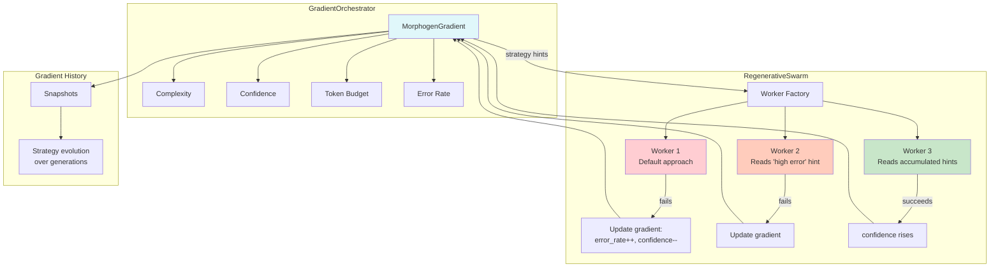

# Example 50: Morphogen-Guided Swarm

## Wiring Diagram



```
                         [GradientOrchestrator]
                                  |
             +--------------------+--------------------+
             |                    |                    |
        [complexity]         [confidence]          [budget]
             |                    |                    |
             v                    v                    v
[Worker 1] <--hints-- [gradient] --hints--> [Worker 2] --hints--> [Worker 3]
    |                      ^                     |                     |
    | fail                 |                     | fail                | success
    +----step_result-------+-----step_result-----+-----step_result----+
```

## Key Patterns

### Gradient-Based Coordination
Workers don't communicate directly. Instead, each worker's outcome updates shared
morphogen gradients. Successor workers read these gradients and adapt strategy.
This is coordination without central control—analogous to embryonic cell fate
determination.

### Strategy Hints
The GradientOrchestrator translates gradient values into natural-language strategy
hints (e.g., "High error rate detected—try a different approach"). These hints are
injected into worker context by the factory.

## Data Flow

```
GradientOrchestrator
  ├─ gradient: MorphogenGradient
  │     ├─ COMPLEXITY: float
  │     ├─ CONFIDENCE: float
  │     ├─ TOKEN_BUDGET: float
  │     └─ ERROR_RATE: float
  ├─ report_step_result(success, tokens, budget)
  └─ get_strategy_hints() -> list[str]
       ↓
WorkerFactory
  ├─ Reads gradient hints
  ├─ Injects into worker context
  └─ Creates SimpleWorker
       ↓
SwarmResult
  ├─ success: bool
  ├─ output: str
  ├─ total_workers_spawned: int
  └─ gradient_history: list[dict]
```

## Gradient Evolution

| Generation | Confidence | Error Rate | Strategy Hint |
|------------|-----------|------------|---------------|
| Worker 1 | 1.0 | 0.0 | "Use detailed reasoning" |
| Worker 2 | 0.5 | 0.5 | "High error rate—try different approach" |
| Worker 3 | 0.7 | 0.3 | "Building on previous attempts" |
