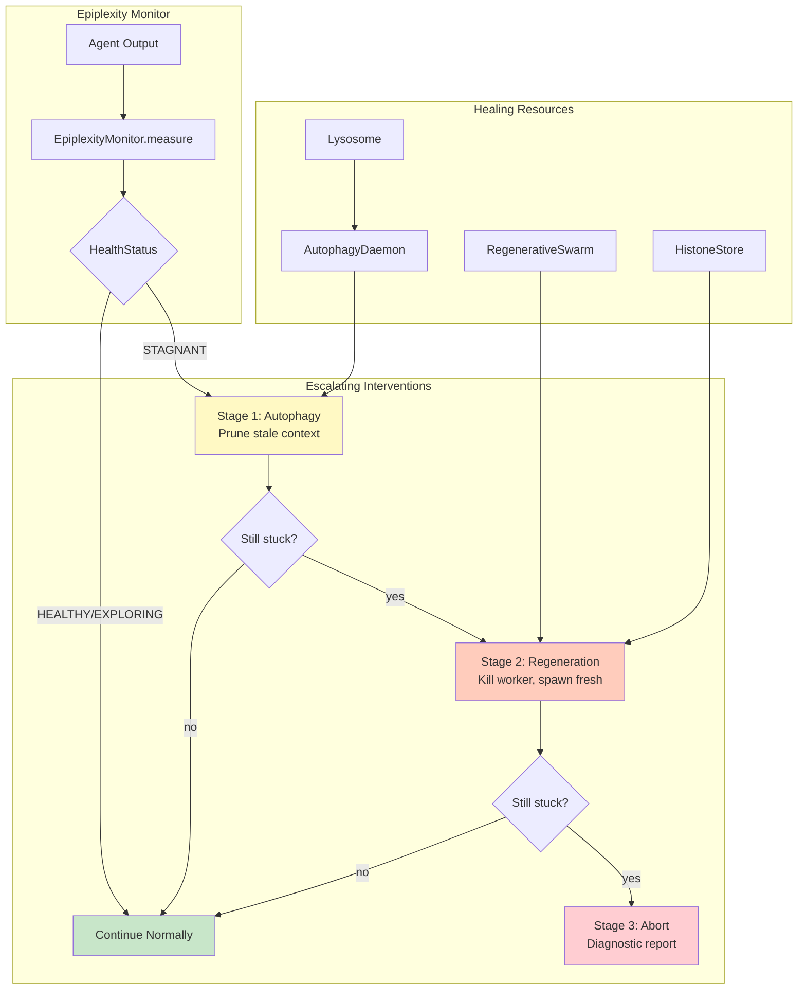

# Example 51: Epiplexity Healing Cascade

## Wiring Diagram



```
[Agent Output] --text--> [EpiplexityMonitor]
                              |
           +--HEALTHY-------> [continue]
           |
           +--STAGNANT------> [AutophagyDaemon] --prune--> [Lysosome]
           |                       |
           |                  still stuck?
           |                       |
           +--CRITICAL-------> [RegenerativeSwarm]
           |                       ├── kill worker
           |                       ├── summary -> [HistoneStore]
           |                       └── spawn fresh worker
           |                       |
           |                  still stuck?
           |                       |
           +--ABORT----------> [Diagnostic Report]
```

## Key Patterns

### Escalating Interventions
The cascade mirrors biological immune response escalation:
1. **Mild** (Autophagy): Prune stale context — minimal disruption
2. **Moderate** (Regeneration): Kill and replace worker — fresh start with summary
3. **Severe** (Abort): Give up with full diagnostic data

### Epiplexity as Health Signal
Low Bayesian surprise (embedding novelty) combined with high perplexity indicates
the agent is in a pathological loop — not converging to a solution but repeating
itself with slight variations.

## Data Flow

```
EpiplexityMonitor
  ├─ measure(text) -> EpiplexityResult
  │     ├─ status: HealthStatus
  │     ├─ epiplexity: float
  │     └─ trend: str
       ↓
StagnationDetector
  ├─ consecutive_stagnant: int
  ├─ intervention_history: list[str]
  └─ should_escalate() -> InterventionLevel
       ↓
HealingCascade
  ├─ stage_1_autophagy() -> bool (resolved?)
  ├─ stage_2_regeneration() -> bool
  └─ stage_3_abort() -> DiagnosticReport
```

## Health Status Thresholds

| Status | Epiplexity | Duration | Action |
|--------|-----------|----------|--------|
| HEALTHY | Low | — | Continue |
| EXPLORING | Moderate | — | Continue |
| STAGNANT | High | Short | Autophagy |
| CRITICAL | High | Sustained | Regeneration |
| — | High | Extended | Abort |
