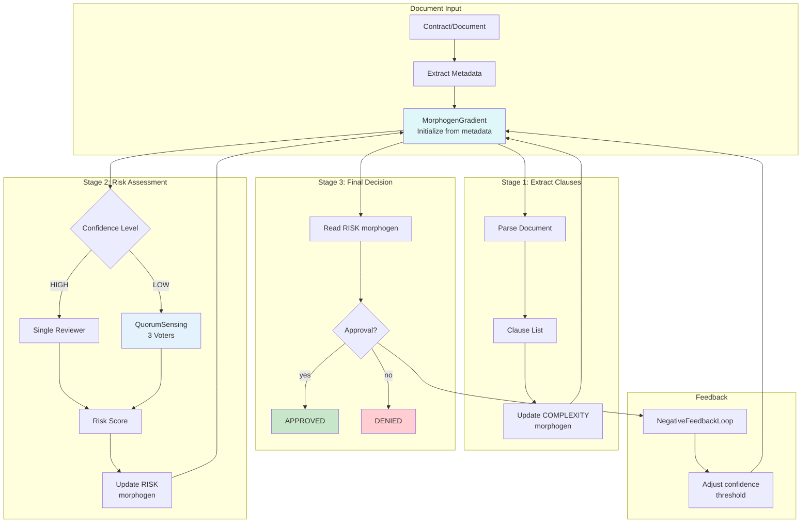

# Example 52: Morphogen Cascade with Quorum

## Wiring Diagram



```
[Document] --metadata--> [MorphogenGradient]
                               |
[Stage 1: Extract Clauses] <---+---> update COMPLEXITY
                               |
[Stage 2: Risk Assessment] <---+
    ├── confidence HIGH --> [Single Reviewer] --risk--> update RISK
    └── confidence LOW  --> [QuorumSensing(3)] --risk--> update RISK
                               |
[Stage 3: Decision] <---------+---> read RISK --> verdict
                               |
[NegativeFeedbackLoop] <-------+---> adjust confidence threshold
```

## Key Patterns

### Dynamic Quorum Activation
Quorum voting is not always-on — it activates only when the morphogen gradient
indicates low confidence. Simple documents get a single reviewer; complex or
ambiguous ones trigger multi-voter consensus.

### Morphogen-Linked Cascade
Each cascade stage both reads and writes morphogen signals. Stage 1 sets
COMPLEXITY, Stage 2 reads CONFIDENCE and writes RISK, Stage 3 reads RISK
for the final threshold comparison.

### Feedback-Adjusted Confidence
The NegativeFeedbackLoop adjusts confidence thresholds based on voting outcomes.
If quorum frequently disagrees, confidence drops (more quorum activations).

## Data Flow

```
ComplianceDocument
  ├─ title: str
  ├─ content: str
  ├─ complexity: float
  └─ risk_level: float
       ↓
ClauseExtraction
  ├─ clauses: list[str]
  ├─ clause_count: int
  └─ complexity_score: float
       ↓
RiskAssessment
  ├─ risk_score: float
  ├─ quorum_used: bool
  ├─ voter_count: int
  └─ consensus: float
       ↓
ReviewVerdict
  ├─ approved: bool
  ├─ risk_score: float
  ├─ confidence: float
  └─ reasoning: str
```

## Morphogen Signals

| Morphogen | Set By | Read By | Range |
|-----------|--------|---------|-------|
| COMPLEXITY | Stage 1 | Stage 2 | 0.0 - 1.0 |
| CONFIDENCE | Feedback Loop | Stage 2 | 0.0 - 1.0 |
| RISK | Stage 2 | Stage 3 | 0.0 - 1.0 |
| ERROR_RATE | Feedback Loop | Stage 2 | 0.0 - 1.0 |
