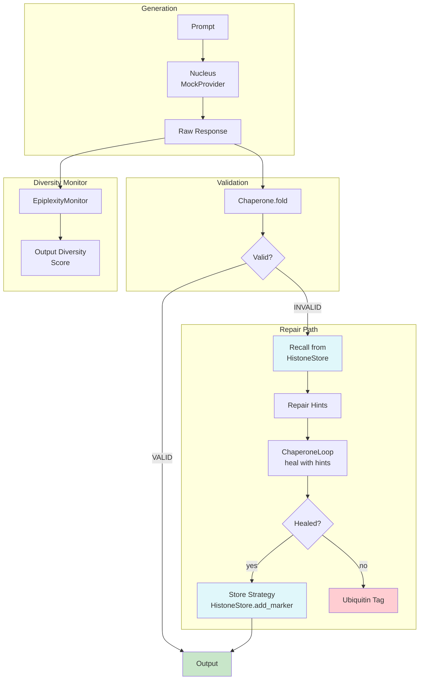

# Example 53: LLM Epigenetic Repair Memory

## Wiring Diagram



```
[Prompt] --text--> [Nucleus(MockProvider)] --json(U)--> [Chaperone.fold(Schema)]
                                                              |
                        +--VALID---------------------------------> [output]
                        |
                        +--INVALID--> [HistoneStore.recall()] --hints--> [ChaperoneLoop.heal()]
                        |                                                      |
                        |                  +--HEALED--> [HistoneStore.add_marker()] --> [output]
                        |                  |
                        |                  +--FAILED--> [ubiquitin_tag]
                        |
[EpiplexityMonitor] <-- raw output (diversity tracking)
```

## Key Patterns

### Epigenetic Repair Memory
When a repair strategy succeeds, it's stored as an epigenetic marker in the
HistoneStore. Future failures consult the store first, finding applicable repair
hints before attempting blind healing. This mirrors how cells "remember" which
gene expression patterns solved past challenges.

### Recall → Repair → Store Cycle
1. **Recall**: Query HistoneStore for repair strategies matching the error type
2. **Repair**: Inject recalled hints into the ChaperoneLoop healing context
3. **Store**: If repair succeeds, save the new strategy as a marker

### Diversity Monitoring
EpiplexityMonitor watches output diversity. Repetitive repair failures (low
novelty) indicate the agent is stuck in a repair loop and needs escalation.

## Data Flow

```
RepairMemoryAgent
  ├─ nucleus: Nucleus (MockProvider)
  ├─ chaperone: Chaperone
  ├─ histone_store: HistoneStore
  └─ epiplexity: EpiplexityMonitor
       ↓
ProcessResult
  ├─ success: bool
  ├─ output: BaseModel | None
  ├─ repair_used: bool
  ├─ repair_strategy: str | None
  └─ diversity_score: float
```

## Repair Strategy Storage

| Marker Type | Content | Tags | Purpose |
|-------------|---------|------|---------|
| METHYLATION | Repair strategy description | ["repair", schema_name] | Long-term memory |
| ACETYLATION | Error pattern | ["error", error_type] | Short-term context |
