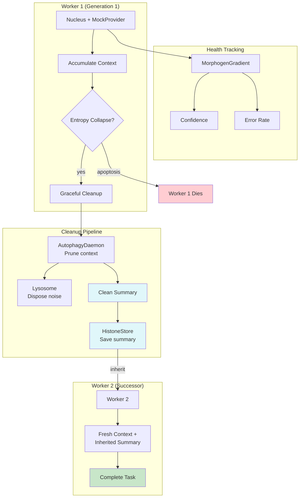

# Example 54: LLM Swarm with Graceful Cleanup

## Wiring Diagram



```
[MorphogenGradient] <-- tracks swarm health
        |
[RegenerativeSwarm]
    ├── Worker 1 (Nucleus + MockProvider)
    │     ├── Accumulates context (responses)
    │     ├── Gets stuck (entropy collapse)
    │     ├── BEFORE death:
    │     │     ├── [AutophagyDaemon] prunes context
    │     │     ├── [Lysosome] disposes noise
    │     │     └── [HistoneStore] saves clean summary
    │     └── Apoptosis (worker dies)
    │
    └── Worker 2 (successor)
          ├── Reads clean summary from [HistoneStore]
          ├── No accumulated noise
          └── Fresh context → completes task
```

## Key Patterns

### Graceful Cleanup Before Death
Unlike abrupt worker termination, dying workers run a cleanup pipeline before
apoptosis. This extracts useful state (summary) from noisy accumulated context,
ensuring successors inherit signal, not noise.

### Clean State Transfer
The biological parallel: when cells undergo apoptosis, they release clean
signaling molecules (not their entire cytoplasm) to inform neighboring cells.
Similarly, dying workers extract and transmit only the useful parts of their
accumulated context.

## Data Flow

```
LLMSwarmWorkerFactory
  ├─ nucleus: Nucleus (MockProvider)
  ├─ histone_store: HistoneStore
  ├─ lysosome: Lysosome
  ├─ autophagy: AutophagyDaemon
  └─ gradient: MorphogenGradient
       ↓
CleanupRecord
  ├─ worker_id: str
  ├─ context_before: int      (chars)
  ├─ context_after: int       (chars)
  ├─ tokens_freed: int
  ├─ summary_stored: str
  └─ noise_disposed: int
```

## Worker Lifecycle

| Phase | Action | State |
|-------|--------|-------|
| Spawn | Read HistoneStore for inherited context | Fresh |
| Work | Accumulate context from Nucleus responses | Active |
| Stuck | Entropy collapse (identical outputs) | Dying |
| Cleanup | Autophagy → Lysosome → HistoneStore | Cleaning |
| Death | Apoptosis, successor spawned | Dead |
