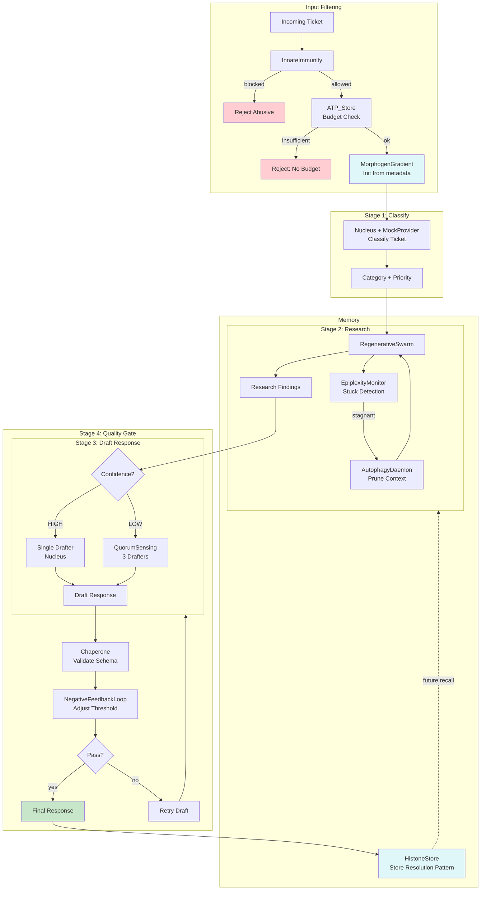

# Example 55: Adaptive Multi-Agent Orchestrator (Capstone)

## Wiring Diagram



```
[Ticket] --> [InnateImmunity] --allowed--> [ATP_Store] --budget_ok--> [MorphogenGradient]
                  |                             |                           |
              [REJECT]                      [REJECT]                        |
                                                                            v
        +-- Stage 1: [Nucleus] classify -----> category + priority
        |
        +-- Stage 2: [RegenerativeSwarm] + [EpiplexityMonitor]
        |                  └── stuck? -> [AutophagyDaemon] -> retry
        |
        +-- Stage 3: confidence HIGH -> [Nucleus] draft
        |             confidence LOW  -> [QuorumSensing(3)] draft
        |
        +-- Stage 4: [Chaperone] validate + [NegativeFeedbackLoop] adjust
        |
        +--> [HistoneStore] remember resolution pattern
```

## Key Patterns

### 11 Motifs Combined
This capstone example integrates all major operon_ai mechanisms into a single
coherent pipeline:

| # | Motif | Role in Pipeline |
|---|-------|-----------------|
| 1 | InnateImmunity | Filter injection/abuse at input |
| 2 | ATP_Store | Budget management per ticket |
| 3 | MorphogenGradient | Coordination signals across stages |
| 4 | Nucleus + MockProvider | LLM calls for classification and drafting |
| 5 | RegenerativeSwarm | Research with worker regeneration |
| 6 | EpiplexityMonitor | Detect stuck workers during research |
| 7 | AutophagyDaemon | Clean context when stuck |
| 8 | QuorumSensing | Multi-drafter voting on low confidence |
| 9 | Chaperone | Output schema validation |
| 10 | NegativeFeedbackLoop | Quality threshold adjustment |
| 11 | HistoneStore | Remember resolution patterns |

### Adaptive Confidence Routing
The drafting stage adapts based on morphogen confidence signals. High-confidence
tickets get a single drafter (fast, cheap). Low-confidence tickets trigger quorum
voting among 3 independent drafters (slower, more reliable).

### Resolution Memory
Successful resolution patterns are stored in HistoneStore. Future similar tickets
can recall these patterns during the research phase, improving resolution speed.

## Data Flow

```
SupportTicket
  ├─ id: str
  ├─ content: str
  ├─ priority: str
  └─ metadata: dict
       ↓
TicketReport
  ├─ ticket_id: str
  ├─ accepted: bool
  ├─ category: str
  ├─ research_summary: str
  ├─ response: str
  ├─ quality_score: float
  ├─ atp_consumed: int
  ├─ quorum_used: bool
  └─ resolution_stored: bool
```

## Pipeline Stages

| Stage | Mechanism | Input | Output | Fallback |
|-------|-----------|-------|--------|----------|
| Filter | InnateImmunity | Raw ticket | Allow/Reject | Reject abusive |
| Budget | ATP_Store | Ticket | Budget check | Reject if insufficient |
| Classify | Nucleus | Ticket content | Category + Priority | Default category |
| Research | RegenerativeSwarm | Category | Findings | Autophagy + regenerate |
| Draft | Nucleus/Quorum | Findings | Response draft | Multi-drafter quorum |
| Quality | Chaperone+Feedback | Draft | Validated response | Retry with adjusted threshold |
| Memory | HistoneStore | Resolution | Stored pattern | — |
