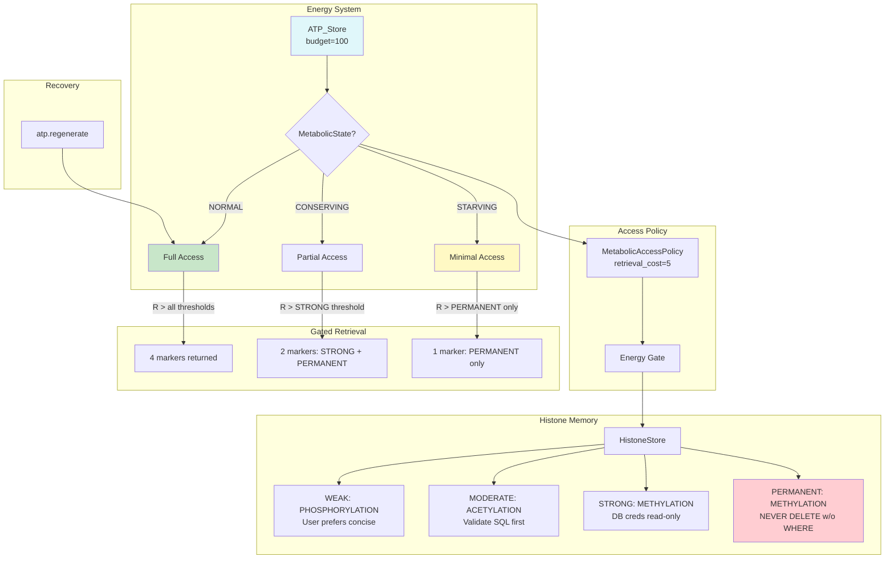

# Example 56: Metabolic-Epigenetic Coupling — Cost-Gated Retrieval

## Wiring Diagram



```
[ATP_Store(100)] ---state---> [MetabolicAccessPolicy(cost=5)]
       |                                  |
       v                                  v
  MetabolicState                    [HistoneStore]
       |                            /    |    \      \
  NORMAL ──────> Access(WEAK)   ──>  P   A    M(S)   M(P)     (4 markers)
  CONSERVING ──> Access(STRONG) ──>           M(S)   M(P)     (2 markers)
  STARVING ───> Access(PERM)   ──>                   M(P)     (1 marker)
       |
  regenerate(80)
       |
  NORMAL ──────> Access(WEAK)   ──>  P   A    M(S)   M(P)     (4 markers restored)

Marker Types: P=PHOSPHORYLATION, A=ACETYLATION, M=METHYLATION
Strengths:    (S)=STRONG, (P)=PERMANENT
```

## Key Patterns

### Cost-Gated Retrieval (Section 6.1.1)
Memory retrieval is not free. ATP budget determines which markers are accessible.
Under metabolic stress, only deeply embedded (permanent) memories remain, creating
emergent graceful degradation.

| # | Motif | Role in Pipeline |
|---|-------|-----------------|
| 1 | ATP_Store | Tracks energy budget, exposes MetabolicState |
| 2 | MetabolicAccessPolicy | Maps metabolic state to retrieval thresholds |
| 3 | HistoneStore | Stores markers with typed strength levels |
| 4 | Energy Gate coupling | Tuple (atp, policy) passed to HistoneStore constructor |
| 5 | MarkerStrength hierarchy | WEAK < MODERATE < STRONG < PERMANENT |

### Biological Parallel
- Chromatin remodeling requires ATP in real cells
- Under metabolic stress, cells silence non-essential genes
- Only constitutively active (housekeeping) genes remain expressed
- This is how biology achieves graceful degradation under stress

## Data Flow

```
ATP_Store
  ├─ budget: int (100)
  ├─ atp: int (current level)
  └─ state: MetabolicState {NORMAL, CONSERVING, STARVING}
       ↓
MetabolicAccessPolicy
  ├─ retrieval_cost: int (5)
  └─ threshold_map: state → minimum MarkerStrength
       ↓
HistoneStore
  ├─ markers: list[Marker]
  │   ├─ content: str
  │   ├─ marker_type: MarkerType {PHOSPHORYLATION, ACETYLATION, METHYLATION}
  │   ├─ strength: MarkerStrength {WEAK, MODERATE, STRONG, PERMANENT}
  │   └─ tags: list[str]
  └─ energy_gate: (ATP_Store, MetabolicAccessPolicy)
       ↓
RetrievalResult
  └─ markers: list[Marker] (filtered by current metabolic state)
```

## Pipeline Stages

| Stage | Mechanism | Input | Output | Fallback |
|-------|-----------|-------|--------|----------|
| Store | HistoneStore.add_marker | content + type + strength | Stored marker | — |
| Gate check | MetabolicAccessPolicy | MetabolicState | Access threshold | — |
| Retrieve (NORMAL) | HistoneStore.retrieve_context | — | All 4 markers | — |
| Retrieve (CONSERVING) | HistoneStore.retrieve_context | — | STRONG+ markers (2) | Weak/Moderate silenced |
| Retrieve (STARVING) | HistoneStore.retrieve_context | — | PERMANENT only (1) | All non-permanent silenced |
| Recovery | ATP_Store.regenerate | ATP amount | Restored state | — |

Legend: U = UNTRUSTED, V = VALIDATED, T = TRUSTED.
