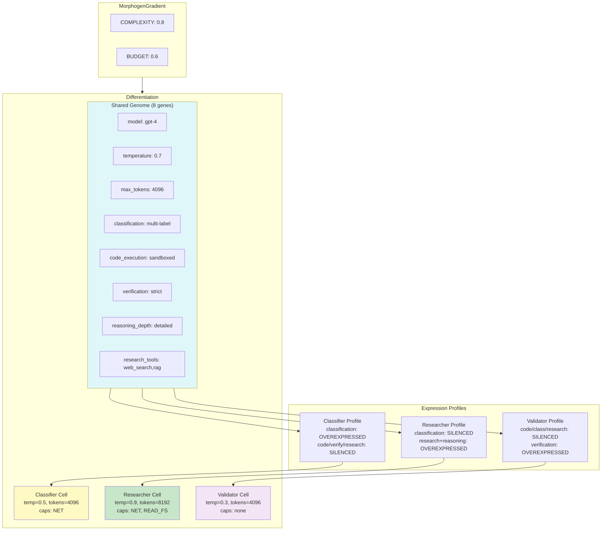

# Example 57: Cell Type Specialization — Differential Gene Expression

## Wiring Diagram



```
                         [Genome] (8 genes, shared by all)
                              |
            +-----------------+-----------------+
            |                 |                 |
   [ExpressionProfile]  [ExpressionProfile]  [ExpressionProfile]
     Classifier            Researcher           Validator
   class: OVER           research: OVER       verify: OVER
   code: SILENCED        reasoning: OVER      code: SILENCED
   verify: SILENCED      class: SILENCED      class: SILENCED
   research: SILENCED                         research: SILENCED
            |                 |                 |
            v                 v                 v
   [MorphogenGradient] [MorphogenGradient] [MorphogenGradient]
   (COMPLEXITY, BUDGET)  (COMPLEXITY, BUDGET)  (COMPLEXITY, BUDGET)
            |                 |                 |
            v                 v                 v
   [DifferentiatedCell]  [DifferentiatedCell]  [DifferentiatedCell]
     temp=0.5              temp=0.9              temp=0.3
     tokens=4096           tokens=8192           tokens=4096
     caps={NET}            caps={NET,READ_FS}    caps={}

Genome unchanged after differentiation — same DNA, different phenotypes
```

## Key Patterns

### Differential Gene Expression (Section 6.5.1)
A single shared Genome produces different agent phenotypes through ExpressionProfiles.
What makes a Classifier different from a Validator is which genes are expressed,
not which genes exist.

| # | Motif | Role in Pipeline |
|---|-------|-----------------|
| 1 | Genome | Shared DNA: 8 genes (model, tools, config) |
| 2 | Gene / GeneType | STRUCTURAL (tools), REGULATORY (behavior modifiers) |
| 3 | ExpressionProfile | Per-role overrides: OVEREXPRESSED, SILENCED, BASELINE |
| 4 | CellType | Template combining profile + capabilities + prompt |
| 5 | MorphogenGradient | Environmental signals (complexity, budget) |
| 6 | PhenotypeConfig | Maps gradient levels to temperature/token settings |
| 7 | DifferentiatedCell | Mature cell with resolved config and phenotype |

### Biological Parallel
- Genome = DNA shared by all cells (same model, same tool access)
- ExpressionProfile = transcription factor program (role-specific)
- CellType = cell lineage template (Classifier, Researcher, Validator)
- DifferentiatedCell = mature cell ready to function
- Gradient = extracellular chemical environment affecting gene expression

## Data Flow

```
Genome
  ├─ genes: list[Gene]
  │   ├─ name: str
  │   ├─ value: Any
  │   ├─ gene_type: GeneType {STRUCTURAL, REGULATORY}
  │   └─ required: bool
  └─ express() → dict (all genes)
       ↓
ExpressionProfile
  └─ overrides: dict[str, ExpressionLevel]
       ↓
CellType
  ├─ name: str
  ├─ expression_profile: ExpressionProfile
  ├─ required_capabilities: set[Capability]
  ├─ phenotype_config: PhenotypeConfig
  └─ system_prompt_template: str
       ↓
DifferentiatedCell
  ├─ cell_type: str
  ├─ config: dict (filtered genes)
  ├─ phenotype: dict (temperature, max_tokens)
  ├─ capabilities: set[Capability]
  └─ system_prompt_fragment: str
```

## Pipeline Stages

| Stage | Mechanism | Input | Output | Fallback |
|-------|-----------|-------|--------|----------|
| Define genome | Genome(genes=[...]) | Gene list | Shared genome | — |
| Define profiles | ExpressionProfile(overrides) | Override map | Per-role expression | BASELINE for unset genes |
| Define cell types | CellType(...) | Profile + caps + prompt | Cell type template | — |
| Set environment | MorphogenGradient.set | Morphogen values | Gradient state | Default 0.0 |
| Differentiate | ct.differentiate(genome, gradient) | Genome + gradient | DifferentiatedCell | — |
| Adapt to env | PhenotypeConfig | Low/high complexity | Temperature + tokens | Normal defaults |

Legend: U = UNTRUSTED, V = VALIDATED, T = TRUSTED.
