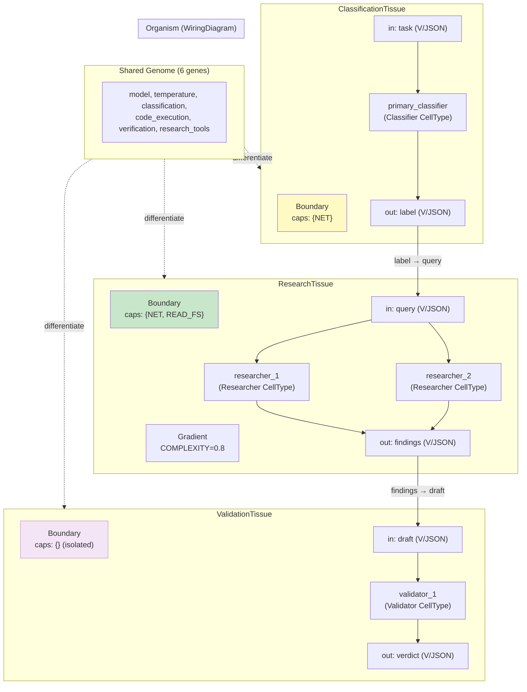

# Example 58: Tissue Architecture — Hierarchical Multi-Agent Organization

## Wiring Diagram



```
                              [Shared Genome]
                      /            |              \
                     v             v               v
  [ClassificationTissue]   [ResearchTissue]    [ValidationTissue]
  Boundary: {NET}          Boundary: {NET,FS}  Boundary: {} (isolated)
  ┌─────────────────┐      ┌──────────────────┐ ┌─────────────────┐
  │ task (V/JSON)   │      │ query (V/JSON)   │ │ draft (V/JSON)  │
  │   ↓             │      │   ↓         ↓    │ │   ↓             │
  │ [classifier]    │      │ [researcher_1]   │ │ [validator_1]   │
  │   ↓             │      │ [researcher_2]   │ │   ↓             │
  │ label (V/JSON)  │      │   ↓              │ │ verdict (V/JSON)│
  └────────┬────────┘      │ findings (V/JSON)│ └─────────────────┘
           │               └────────┬─────────┘          ▲
           └───── label → query ────┘                    │
                                    └── findings → draft ─┘

  Organism-level WiringDiagram: Classification → Research → Validation
  Capability enforcement: Researcher BLOCKED from ValidationTissue (needs NET+FS, allows {})
```

## Key Patterns

### Tissue Architecture (Section 6.5.3)
Cells are grouped into Tissues with shared gradients and security boundaries.
Tissues expose typed boundary ports for inter-tissue composition via WiringDiagram.

| # | Motif | Role in Pipeline |
|---|-------|-----------------|
| 1 | Genome | Shared DNA for all cell types |
| 2 | CellType | Classifier, Researcher, Validator templates |
| 3 | Tissue | Groups cells with shared gradient + boundary |
| 4 | TissueBoundary | Typed input/output ports + capability set |
| 5 | MorphogenGradient | Per-tissue chemical environment |
| 6 | WiringDiagram | Organism-level composition of tissues |
| 7 | Capability enforcement | Researcher blocked from Validation (needs NET+READ_FS) |

### Biological Parallel
- Tissue = group of cells sharing extracellular environment
- Tissue boundary = basement membrane (physical security barrier)
- Inter-tissue signaling = boundary ports (typed channels)
- Organism = coordinated tissue system
- Gradient isolation = different tissues have independent chemical environments

### 4-Level Hierarchy
```
Cell → Tissue → Organ → Organism
(this example covers Cell → Tissue → Organism)
```

## Data Flow

```
Tissue
  ├─ name: str
  ├─ boundary: TissueBoundary
  │   ├─ inputs: dict[str, PortType]
  │   ├─ outputs: dict[str, PortType]
  │   └─ allowed_capabilities: set[Capability]
  ├─ gradient: MorphogenGradient (per-tissue)
  ├─ cells: dict[str, DifferentiatedCell]
  └─ as_module() → ModuleSpec (for WiringDiagram)
       ↓
WiringDiagram (Organism)
  ├─ modules: {ClassificationTissue, ResearchTissue, ValidationTissue}
  ├─ wires: [label→query, findings→draft]
  └─ capabilities isolated per tissue
```

## Pipeline Stages

| Stage | Mechanism | Input | Output | Fallback |
|-------|-----------|-------|--------|----------|
| Define genome | Genome(genes=[...]) | 6 genes | Shared genome | — |
| Define cell types | CellType with ExpressionProfile | Genome + overrides | 3 cell types | — |
| Create tissues | Tissue(boundary, gradient) | CellTypes + genome | Bounded cell groups | — |
| Register cells | tissue.add_cell | CellType + genome | Differentiated cells | — |
| Capability check | tissue.register_cell_type | CellType caps | Allow/TissueError | Block incompatible |
| Compose organism | WiringDiagram.connect | Tissue modules | Inter-tissue wiring | — |
| Gradient isolation | Per-tissue MorphogenGradient | Morphogen values | Independent environments | Default 0.0 |

Legend: U = UNTRUSTED, V = VALIDATED, T = TRUSTED.
