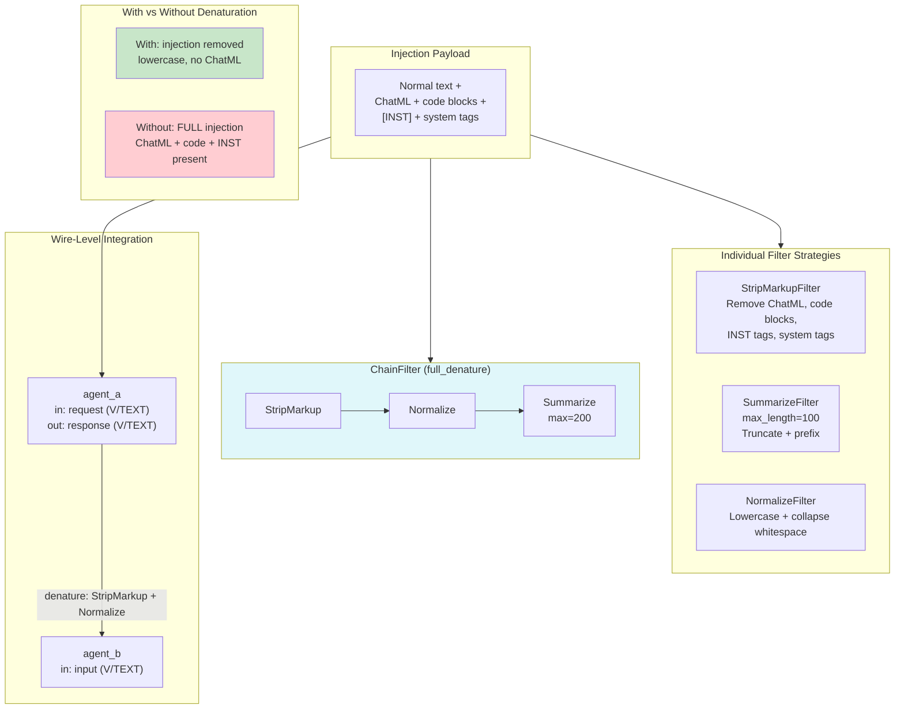

# Example 60: Denaturation Layers — Anti-Prion Wire Defense

## Wiring Diagram



```
[Injection Payload]
  │  "Normal text" + <|im_start|>system... + ```python...``` + [INST]... + <system>...
  │
  ├──> [StripMarkupFilter] ──> ChatML removed, code blocks removed, [INST] removed
  ├──> [SummarizeFilter(100)] ──> Truncated to 100 chars with prefix
  ├──> [NormalizeFilter] ──> All lowercase, collapsed whitespace
  │
  └──> [ChainFilter: Strip → Normalize → Summarize(200)]
           ──> All injection syntax removed, lowercased, truncated

Wire-Level Integration:
  [agent_a] ──response (V/TEXT)──> [ChainFilter: Strip+Normalize] ──> [agent_b] input (V/TEXT)
      │                                                                    │
      │  Raw output: 300+ chars with injection                            │  Denatured: safe text
      │                                                                    │
  Without denaturation:
  [agent_a] ──response (V/TEXT)──> [agent_b] input (V/TEXT)  ← DANGEROUS: full injection passes!
```

## Key Patterns

### Anti-Prion Wire Defense (Section 5.3)
Wire-level filters that transform data between modules to disrupt prompt injection
cascading. Prion disease = misfolded protein cascading to neighbors; prompt injection
= adversarial syntax cascading between agents.

| # | Motif | Role in Pipeline |
|---|-------|-----------------|
| 1 | StripMarkupFilter | Removes ChatML, code blocks, [INST], system tags |
| 2 | SummarizeFilter | Truncates to max_length with content prefix |
| 3 | NormalizeFilter | Lowercase + whitespace normalization |
| 4 | ChainFilter | Composes multiple filters sequentially |
| 5 | Wire denature param | Applied at WiringDiagram.connect level |
| 6 | DiagramExecutor | Executes diagram, applies denaturation on wire transit |
| 7 | Backward compatibility | Wires without filters work unchanged |

### Biological Parallel
- Prion disease = misfolded protein cascades to neighbors
- Prompt injection = adversarial syntax cascades between agents
- Denaturation = unfolding protein structure (destroying function)
- Wire filter = denaturation applied to data in transit

## Data Flow

```
Payload (raw string)
  ├─ contains: ChatML (<|im_start|>, <|im_end|>)
  ├─ contains: code blocks (```)
  ├─ contains: [INST] tags
  └─ contains: <system> tags
       ↓
StripMarkupFilter.denature(payload)
  └─ stripped: str (markup removed)
       ↓
NormalizeFilter.denature(stripped)
  └─ normalized: str (lowercase, collapsed whitespace)
       ↓
SummarizeFilter.denature(normalized)
  └─ summarized: str (truncated with prefix)

Wire-level:
  agent_a output (V/TEXT) → denature filter → agent_b input (V/TEXT)
```

## Pipeline Stages

| Stage | Mechanism | Input | Output | Fallback |
|-------|-----------|-------|--------|----------|
| Strip | StripMarkupFilter | Raw payload | Markup removed | — |
| Summarize | SummarizeFilter(max_length) | Any text | Truncated text | — |
| Normalize | NormalizeFilter | Any text | Lowercase text | — |
| Chain | ChainFilter(filters) | Raw payload | Fully denatured | — |
| Wire filter | diagram.connect(denature=...) | agent_a output | Denatured input for agent_b | No filter = raw pass-through |
| Execute | DiagramExecutor.execute | External inputs | Module report | — |

Legend: U = UNTRUSTED, V = VALIDATED, T = TRUSTED.
