# Example 61: Coalgebraic State Machines — Composable Observation & Evolution

## Wiring Diagram

```mermaid
flowchart TB
    subgraph coalgebra["FunctionalCoalgebra (S, I → O)"]
        readout["readout(state) → output"]
        update["update(state, input) → new_state"]
    end

    subgraph counter["Counter Coalgebra"]
        c_read["readout(s) = s"]
        c_update["update(s, i) = s + i"]
    end

    subgraph sm["StateMachine"]
        sm_state["state: S"] --> sm_step["step(input)"]
        sm_step --> sm_readout["readout → output"]
        sm_step --> sm_update["update → new state"]
        sm_update --> sm_trace["trace: list[TraceRecord]"]
    end

    subgraph parallel["ParallelCoalgebra (A || B)"]
        p_in["input i"] --> p_a["Coalgebra A<br/>(adder)"]
        p_in --> p_b["Coalgebra B<br/>(multiplier)"]
        p_a --> p_out_a["output_a"]
        p_b --> p_out_b["output_b"]
        p_out_a --> p_pair["(output_a, output_b)"]
        p_out_b --> p_pair
    end

    subgraph sequential["SequentialCoalgebra (A >> B)"]
        s_in["input i"] --> s_a["Coalgebra A<br/>(adder)"]
        s_a -->|"readout_a"| s_b["Coalgebra B<br/>(multiplier)"]
        s_b --> s_out["output_b"]
    end

    subgraph bisim["Finite-Trace Equivalence"]
        machine_a["Machine A<br/>state=0, counter"] --> check["check_bisimulation<br/>inputs=[1,2,3,4,5]"]
        machine_b["Machine B<br/>state=0, counter"] --> check
        check --> equiv["equivalent=True"]
        machine_c["Machine C<br/>state=0"] --> check2["check_bisimulation<br/>inputs=[1,2,3]"]
        machine_d["Machine D<br/>state=10"] --> check2
        check2 --> not_equiv["equivalent=False<br/>witness at step 0"]
    end

    style equiv fill:#c8e6c9
    style not_equiv fill:#ffcdd2
    style parallel fill:#e0f7fa
    style sequential fill:#fff9c4
```



```
FunctionalCoalgebra:
  readout: S → O        (observe current state)
  update:  S × I → S    (evolve state on input)

Counter: readout(s) = s,  update(s, i) = s + i

StateMachine:
  state=0 ──step(1)──> state=1 ──step(2)──> state=3 ──step(3)──> state=6 ...
                 │                    │                    │
              out=0               out=1               out=3    (readout before update)
              trace[0]            trace[1]            trace[2]

Parallel Composition (A || B):
  state = (s_a, s_b)
  input i ──> A.readout(s_a) ──> out_a ──┐
  input i ──> B.readout(s_b) ──> out_b ──┤──> (out_a, out_b)
  A.update(s_a, i) → new_s_a             │
  B.update(s_b, i) → new_s_b             │

Sequential Composition (A >> B):
  input i ──> A.update(s_a, i) → new_s_a
              A.readout(s_a) ──> intermediate
              intermediate ──> B.update(s_b, intermediate) → new_s_b
              B.readout(s_b) ──> final output

Bisimulation Check:
  Machine(0, counter) vs Machine(0, counter) on [1,2,3,4,5] → EQUIVALENT
  Machine(0, counter) vs Machine(10, counter) on [1,2,3]    → NOT EQUIVALENT (witness at step 0)
```

## Key Patterns

### Coalgebraic State Machines (Section 3.5)
The coalgebraic interface separates observation (readout) from evolution (update).
State is never directly accessible -- only observed through readout, making machines
composable via parallel and sequential operators.

| # | Motif | Role in Pipeline |
|---|-------|-----------------|
| 1 | FunctionalCoalgebra | Wraps readout + update functions into coalgebra |
| 2 | StateMachine | Tracks state, records trace of transitions |
| 3 | ParallelCoalgebra | Two machines on same input, paired output |
| 4 | SequentialCoalgebra | Pipe first machine's readout into second's input |
| 5 | check_bisimulation | Bounded observational equivalence on input trace |
| 6 | counter_coalgebra | Built-in: readout=identity, update=addition |

### Biological Parallel
- Cell state = internal biochemistry (never directly accessible)
- Readout = surface markers / secreted proteins (observable output)
- Update = signal transduction (state evolution on stimulus)
- Bisimulation = two cells that respond identically on tested stimuli

### Conceptual Mapping to Operon Components
```
HistoneStore as coalgebra:
  State S  = dict of epigenetic markers
  Input I  = (key, MarkerType, MarkerStrength)
  Output O = RetrievalResult
  readout  = retrieve(key)
  update   = store(key, marker_type, strength)

ATP_Store as coalgebra:
  State S  = energy balances {ATP: x, GTP: y, ...}
  Input I  = EnergyTransaction(type, amount)
  Output O = MetabolicReport
  readout  = report()
  update   = consume() / deposit()
```

## Data Flow

```
FunctionalCoalgebra
  ├─ readout_fn: S → O
  └─ update_fn: S × I → S
       ↓
StateMachine
  ├─ state: S
  ├─ coalgebra: FunctionalCoalgebra
  ├─ trace: list[TraceRecord]
  │   ├─ step: int
  │   ├─ state_before: S
  │   ├─ input: I
  │   ├─ state_after: S
  │   └─ output: O
  └─ run(inputs) → list[O]
       ↓
BisimulationResult
  ├─ equivalent: bool
  ├─ states_explored: int
  ├─ witness: Optional[int] (step where divergence found)
  └─ message: str
```

## Pipeline Stages

| Stage | Mechanism | Input | Output | Fallback |
|-------|-----------|-------|--------|----------|
| Define coalgebra | FunctionalCoalgebra(readout, update) | Two functions | Coalgebra object | — |
| Create machine | StateMachine(state, coalgebra) | Initial state + coalgebra | Machine with trace | — |
| Step | sm.step(input) | Single input | Single output + state update | — |
| Run | sm.run(inputs) | Input sequence | Output sequence + full trace | — |
| Parallel compose | ParallelCoalgebra(A, B) | Two coalgebras | Paired machine | — |
| Sequential compose | SequentialCoalgebra(A, B) | Two coalgebras | Piped machine | — |
| Bisimulation check | check_bisimulation(a, b, inputs) | Two machines + trace | Equivalence result | Witness on divergence |

Legend: U = UNTRUSTED, V = VALIDATED, T = TRUSTED.
