# Example 62: Morphogen Diffusion — Spatially Varying Gradients

## Wiring Diagram

```mermaid
flowchart TB
    subgraph linear["Linear Chain (A - B - C - D - E)"]
        source_a["Source at A<br/>COMPLEXITY emission=0.5"]
        A["A"] --- B["B"] --- C["C"] --- D["D"] --- E["E"]
        source_a --> A
    end

    subgraph diffusion["Diffusion Process"]
        emit["emit: source adds concentration"] --> diff["diffuse: spread along edges"]
        diff --> decay["decay: reduce by decay_rate"]
        decay --> clamp["clamp: bound to [0, 1]"]
        clamp -->|repeat| emit
    end

    subgraph star["Star Topology"]
        center["center<br/>Source: URGENCY=0.3"]
        N["N"] --- center --- S["S"]
        EE["E"] --- center --- W["W"]
    end

    subgraph competing["Competing Sources"]
        Left["Left<br/>Source: COMPLEXITY=0.4"]
        Mid["Mid<br/>(receives both)"]
        Right["Right<br/>Source: CONFIDENCE=0.4"]
        Left --- Mid --- Right
    end

    subgraph bridge["Local Gradient API"]
        field["DiffusionField"] --> get_local["get_local_gradient(node)"]
        get_local --> mg["MorphogenGradient<br/>(existing API)"]
        mg --> level["get_level() → LOW/MEDIUM/HIGH"]
    end

    style source_a fill:#e0f7fa
    style center fill:#fff9c4
    style Left fill:#e0f7fa
    style Right fill:#f3e5f5
```



```
Linear Chain with Source at A:
  [A]====[B]====[C]====[D]====[E]
   ↑
  Source(COMPLEXITY, rate=0.5)

  After 50 steps:
  A=HIGH ──> B=HIGH ──> C=MEDIUM ──> D=LOW ──> E=LOW
  (Gradient forms: concentration decreases with graph distance from source)

Star Topology:
           [N]
            |
  [W] ── [center] ── [E]
            |
           [S]
   Source(URGENCY, rate=0.3) at center
   → Equal diffusion to all arms

Competing Sources:
  [Left] ──── [Mid] ──── [Right]
    ↑                       ↑
  COMPLEXITY=0.4        CONFIDENCE=0.4
  → Mid receives both morphogens

Diffusion cycle per step:
  emit(sources) → diffuse(edges) → decay(rate) → clamp([0,1])

DiffusionParams: diffusion_rate=0.15, decay_rate=0.05 (configurable)
```

## Key Patterns

### Graph-Based Morphogen Diffusion (Section 6.5.2 / 6.5.3)
Since Operon agents lack physical coordinates, graph adjacency from wiring
topology serves as the spatial model. Morphogens diffuse along edges, forming
concentration gradients that drive spatially patterned behavior without any
central controller.

| # | Motif | Role in Pipeline |
|---|-------|-----------------|
| 1 | DiffusionField | Graph of nodes and edges managing concentrations |
| 2 | MorphogenSource | Emits morphogen at a specific node |
| 3 | DiffusionParams | Configurable diffusion_rate and decay_rate |
| 4 | Emit-Diffuse-Decay-Clamp | Per-step cycle forming gradients |
| 5 | get_local_gradient | Bridges to MorphogenGradient API |
| 6 | from_adjacency | Convenience constructor from adjacency dict |
| 7 | Competing sources | Multiple morphogen types coexist on same field |

### Biological Parallel
- Morphogens (e.g., Bicoid in Drosophila) are secreted from localized sources
- Diffuse through tissue: cells near source see high concentration
- Drives spatially patterned gene expression without central controller
- Multiple morphogens can compete/overlay (e.g., Bicoid vs Nanos)

## Data Flow

```
DiffusionField
  ├─ nodes: set[str]
  ├─ edges: set[(str, str)]
  ├─ sources: list[MorphogenSource]
  │   ├─ node: str
  │   ├─ morphogen_type: MorphogenType
  │   └─ emission_rate: float
  ├─ params: DiffusionParams
  │   ├─ diffusion_rate: float (default 0.15)
  │   └─ decay_rate: float (default 0.05)
  └─ concentrations: dict[node, dict[MorphogenType, float]]
       ↓
field.run(steps)
  └─ Per step: emit → diffuse → decay → clamp
       ↓
field.get_local_gradient(node)
  └─ MorphogenGradient
       ├─ get(MorphogenType) → float
       └─ get_level(MorphogenType) → LOW/MEDIUM/HIGH
```

## Topologies Demonstrated

| Topology | Nodes | Source | Key Observation |
|----------|-------|--------|-----------------|
| Linear chain | A-B-C-D-E | A: COMPLEXITY=0.5 | Gradient falls with distance |
| Star | center+N/S/E/W | center: URGENCY=0.3 | Equal diffusion to all arms |
| Competing | Left-Mid-Right | Left: COMPLEXITY, Right: CONFIDENCE | Mid receives both morphogens |
| Ring | X-Y-Z (fully connected) | X: ERROR_RATE=0.3 | Fast equalization |

## Pipeline Stages

| Stage | Mechanism | Input | Output | Fallback |
|-------|-----------|-------|--------|----------|
| Build graph | add_node, add_edge | Node/edge definitions | DiffusionField | from_adjacency shortcut |
| Add sources | add_source(MorphogenSource) | Node + type + rate | Source registered | — |
| Run diffusion | field.run(steps) | Step count | Updated concentrations | — |
| Read concentration | get_concentration(node, type) | Node + type | Float value | 0.0 default |
| Get gradient | get_local_gradient(node) | Node name | MorphogenGradient | — |
| Snapshot | field.snapshot() | — | dict[node, dict[type, float]] | — |

Legend: U = UNTRUSTED, V = VALIDATED, T = TRUSTED.
