# Example 63: Optic-Based Wiring — Lens, Prism, Traversal

## Wiring Diagram

```mermaid
flowchart TB
    subgraph lens["LensOptic (Pass-Through)"]
        l_in["any data"] --> l_optic["LensOptic"] --> l_out["same data"]
    end

    subgraph prism["PrismOptic (Conditional Routing)"]
        router["Router<br/>out: V/JSON"]
        router -->|"PrismOptic(JSON)"| json_handler["JSONHandler<br/>in: V/JSON"]
        router -->|"PrismOptic(ERROR)"| error_handler["ErrorHandler<br/>in: V/ERROR"]
    end

    subgraph traversal["TraversalOptic (Collection Processing)"]
        t_in["[1, 2, 3]"] --> doubler["TraversalOptic<br/>transform=x*2"] --> t_out["[2, 4, 6]"]
        t_in2["['a', 'b']"] --> upper["TraversalOptic<br/>transform=upper"] --> t_out2["['A', 'B']"]
    end

    subgraph composed["ComposedOptic (Sequential)"]
        c_in["[1, 2, 3]<br/>DataType.JSON"] --> c_prism["PrismOptic(JSON)<br/>gate check"] --> c_trav["TraversalOptic<br/>x*10"] --> c_out["[10, 20, 30]"]
    end

    subgraph coexist["Optic + DenatureFilter"]
        src["Source"] -->|"1. SummarizeFilter(20)<br/>2. TraversalOptic(upper)"| sink["Sink"]
    end

    subgraph compat["Backward Compatibility"]
        a_mod["Module A"] -->|"no optic<br/>(plain wire)"| b_mod["Module B"]
    end

    style json_handler fill:#c8e6c9
    style error_handler fill:#ffcdd2
    style composed fill:#e0f7fa
    style coexist fill:#fff9c4
```



```
LensOptic: constitutive expression — always active
  data ──> [LensOptic] ──> data (unchanged)

PrismOptic: receptor specificity — routes by DataType
  [Router] ──out (V/JSON)──┐
                            ├──> [PrismOptic(JSON)]  ──> [JSONHandler]  ✓ receives data
                            └──> [PrismOptic(ERROR)] ──> [ErrorHandler] ✗ blocked (type mismatch)

TraversalOptic: polymerase processivity — maps over elements
  [1, 2, 3] ──> [TraversalOptic(x*2)] ──> [2, 4, 6]
  scalar 5  ──> [TraversalOptic(x*2)] ──> 10  (wraps scalar automatically)

ComposedOptic: chains optics sequentially
  [PrismOptic(JSON)] → [TraversalOptic(x*10)]
  can_transmit(JSON)  = True   (prism allows)
  can_transmit(ERROR) = False  (prism blocks)
  transmit([1,2,3])   = [10, 20, 30]

Optic + DenatureFilter coexistence on same wire:
  [Source] ──out──> SummarizeFilter(20) ──> TraversalOptic(upper) ──> [Sink] in
  "This is a long input..." → truncated(20 chars) → UPPERCASED

Backward compatibility: wires without optics work unchanged
  [A] ──out──> [B] in  (no optic, plain data pass-through)
```

## Key Patterns

### Optic-Based Wire Routing (Section 3.4)
Optics provide typed transformations on wires: pass-through (Lens), conditional
routing (Prism), collection mapping (Traversal), and sequential composition.

| # | Motif | Role in Pipeline |
|---|-------|-----------------|
| 1 | LensOptic | Pass-through: always transmits, no transformation |
| 2 | PrismOptic | Conditional routing: only transmits matching DataTypes |
| 3 | TraversalOptic | Collection processing: maps transform over list elements |
| 4 | ComposedOptic | Chains optics sequentially (gate then transform) |
| 5 | Optic protocol | can_transmit(DataType, IntegrityLabel) + transmit(value) |
| 6 | Wire-level integration | optic= param on WiringDiagram.connect |
| 7 | Coexistence | Optics compose with DenatureFilters on same wire |

### Biological Parallel
- Lens = constitutive expression: always active, data passes through
- Prism = receptor specificity: only responds to matching ligand type
- Traversal = polymerase processivity: walks a sequence, transforms each element
- Composed = multi-step signal transduction cascade

## Data Flow

```
Optic (Protocol)
  ├─ can_transmit(dtype: DataType, label: IntegrityLabel) → bool
  └─ transmit(value, dtype, label) → transformed value
       ↓
LensOptic
  └─ always True, returns value unchanged
       ↓
PrismOptic(accept={DataType.JSON})
  ├─ can_transmit(JSON) → True
  └─ can_transmit(ERROR) → False (data blocked)
       ↓
TraversalOptic(transform=fn)
  ├─ list input → [fn(x) for x in list]
  └─ scalar input → fn(scalar)
       ↓
ComposedOptic(optics=(prism, traversal))
  ├─ can_transmit: all optics must agree
  └─ transmit: apply in sequence
       ↓
Wire execution order:
  DenatureFilter first (security) → Optic second (routing/transform)
```

## Pipeline Stages

| Stage | Mechanism | Input | Output | Fallback |
|-------|-----------|-------|--------|----------|
| Pass-through | LensOptic | Any value | Same value | — |
| Route by type | PrismOptic(accept) | TypedValue | Pass or block | Blocked if type not in accept set |
| Map collection | TraversalOptic(transform) | List or scalar | Transformed elements | Wraps scalar in list |
| Compose optics | ComposedOptic(optics) | Value | Sequentially transformed | First failing gate blocks all |
| Wire connect | diagram.connect(optic=...) | Module output | Filtered input for next module | No optic = plain wire |
| Coexist | denature + optic on same wire | Module output | Denatured then optic-transformed | — |

Legend: U = UNTRUSTED, V = VALIDATED, T = TRUSTED.
