# Example 64: Diagram Optimization via Categorical Rewriting

## Wiring Diagram

```mermaid
flowchart TB
    subgraph diagram["Cost-Annotated Wiring Diagram"]
        parser["Parser<br/>ATP=5, 10ms"]
        validator["Validator<br/>ATP=10, 20ms<br/>essential=True"]
        enricher["Enricher<br/>ATP=30, 50ms<br/>essential=False"]
        logger["Logger<br/>ATP=2, 5ms<br/>essential=False"]
        output["Output<br/>ATP=3, 2ms"]
        error_sink["ErrorSink<br/>ATP=1"]

        parser -->|parsed| validator
        parser -->|parsed| enricher
        parser -->|parsed| logger
        parser -->|"parsed (PrismOptic ERROR)"| error_sink
        validator -->|valid| output
        enricher -->|enriched| output
        logger -->|logged| output
    end

    subgraph analysis["Static Analysis"]
        parallel_groups["Parallel Groups:<br/>[Validator, Enricher, Logger]"]
        dead_wires["Dead Wires:<br/>Parser→ErrorSink<br/>(ERROR prism on JSON source)"]
        crit_path["Critical Path:<br/>Parser→Enricher→Output<br/>ATP=38, 62ms"]
        total["Total Cost:<br/>51 ATP, 87ms"]
    end

    subgraph optimized["After Optimization"]
        o_parser["Parser<br/>ATP=5"] --> o_validator["Validator<br/>ATP=10<br/>essential"]
        o_parser --> o_enricher["Enricher<br/>ATP=30"]
        o_parser --> o_logger["Logger<br/>ATP=2"]
        o_validator --> o_output["Output"]
        o_enricher --> o_output
        o_logger --> o_output
    end

    subgraph execution["Resource-Aware Execution"]
        normal["NORMAL ATP (200)"] -->|all modules run| full_exec["Full execution<br/>parallel groups"]
        starving["STARVING ATP (8)"] -->|non-essential skipped| partial_exec["Essential only<br/>Enricher+Logger skipped"]
    end

    subgraph budget_optic["BudgetOptic"]
        bo["BudgetOptic(max=10)"]
        bo -->|"add_cost(8)"| remaining2["remaining=2"]
        remaining2 -->|"add_cost(5)"| exhausted["remaining=0<br/>can_transmit=False"]
    end

    style dead_wires fill:#ffcdd2
    style error_sink fill:#ffcdd2
    style partial_exec fill:#fff9c4
    style full_exec fill:#c8e6c9
```



```
Before Optimization:
  [Parser] ──parsed (V/JSON)──┬──> [Validator]  (essential, ATP=10)  ──valid──┐
            ATP=5, 10ms       ├──> [Enricher]   (non-essential, ATP=30)──enriched──┤──> [Output]
                              ├──> [Logger]     (non-essential, ATP=2) ──logged──┘    ATP=3
                              └──> [ErrorSink]  (PrismOptic ERROR on JSON = DEAD WIRE)

Static Analysis:
  Parallel groups: {Validator, Enricher, Logger}  (independent after Parser)
  Dead wires: Parser→ErrorSink (ERROR prism never matches JSON source)
  Critical path: Parser → Enricher → Output = 38 ATP, 62ms
  Total: 51 ATP, 87ms

After Optimization:
  - Dead wire eliminated (Parser→ErrorSink removed)
  - Parallel groups identified for concurrent execution

Resource-Aware Execution:
  NORMAL (ATP=200):   Parser → [Validator || Enricher || Logger] → Output (all run)
  STARVING (ATP=8):   Parser → [Validator] → Output (Enricher+Logger SKIPPED)

BudgetOptic:
  max_cost=10 → add_cost(8) → remaining=2 → add_cost(5) → EXHAUSTED (can_transmit=False)
```

## Key Patterns

### Diagram Optimization (Section 7)
Cost-annotated wiring diagrams enable static analysis, optimization passes,
and resource-aware execution. Like metabolic pathway optimization in cells.

| # | Motif | Role in Pipeline |
|---|-------|-----------------|
| 1 | ResourceCost | ATP, latency_ms, memory_mb annotations on modules |
| 2 | find_independent_groups | Identifies parallelizable module sets |
| 3 | find_dead_wires | Detects unreachable wires (PrismOptic mismatch) |
| 4 | critical_path | Longest cost path through diagram |
| 5 | total_cost | Aggregate resource requirements |
| 6 | suggest_optimizations | Automated improvement recommendations |
| 7 | optimize | Applies rewriting passes (dead wire elimination, parallel grouping) |
| 8 | ResourceAwareExecutor | Respects metabolic state, skips non-essential under stress |
| 9 | BudgetOptic | Caps cumulative wire cost, blocks when exhausted |
| 10 | essential flag | Marks modules that must run regardless of metabolic state |

### Biological Parallel
- Metabolic pathway optimization: cells analyze flux, prune dead-end reactions
- Parallelize independent branches for throughput
- Under ATP depletion, non-essential pathways are downregulated
- Essential genes always expressed (housekeeping)

## Data Flow

```
WiringDiagram (cost-annotated)
  ├─ modules: dict[str, ModuleSpec]
  │   ├─ cost: ResourceCost(atp, latency_ms, memory_mb)
  │   └─ essential: bool
  └─ wires: list[Wire] (with optional optics)
       ↓
Analyzer
  ├─ find_independent_groups → list[set[str]]
  ├─ find_dead_wires → list[Wire]
  ├─ critical_path → (path, ResourceCost)
  ├─ total_cost → ResourceCost
  └─ suggest_optimizations → list[Suggestion]
       ↓
Optimizer
  ├─ passes_applied: list[str]
  ├─ eliminated_wires: list[Wire]
  ├─ parallel_groups: list[set[str]]
  └─ schedule: list[str] (execution order)
       ↓
ResourceAwareExecutor
  ├─ ATP_Store → MetabolicState
  ├─ NORMAL → run all modules
  └─ STARVING → skip non-essential modules
```

## Pipeline Stages

| Stage | Mechanism | Input | Output | Fallback |
|-------|-----------|-------|--------|----------|
| Annotate | ResourceCost on ModuleSpec | ATP/latency/memory | Cost-annotated diagram | Zero cost default |
| Analyze parallelism | find_independent_groups | Diagram | Parallel module sets | — |
| Find dead wires | find_dead_wires | Diagram + optics | Unreachable wires | — |
| Critical path | critical_path | Diagram | Longest cost path | — |
| Optimize | optimize(diagram) | Diagram | Optimized diagram + schedule | — |
| Naive execute | DiagramExecutor | Diagram + inputs | Sequential execution | — |
| Aware execute (NORMAL) | ResourceAwareExecutor | Diagram + ATP_Store | Full parallel execution | — |
| Aware execute (STARVING) | ResourceAwareExecutor | Diagram + low ATP | Essential-only execution | Non-essential skipped |
| Budget wire | BudgetOptic(max_cost) | Cumulative cost | Transmit or block | Block when exhausted |

Legend: U = UNTRUSTED, V = VALIDATED, T = TRUSTED.
