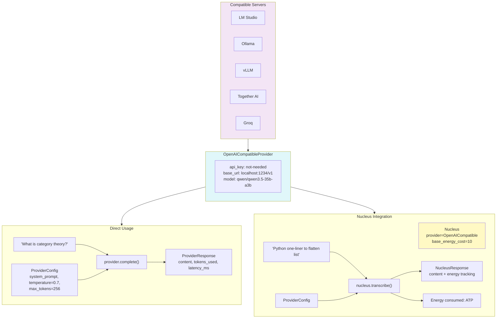

# Example 65: OpenAI-Compatible Provider with LM Studio

## Wiring Diagram



```
[OpenAI-Compatible Server]         [OpenAICompatibleProvider]
  LM Studio / Ollama / vLLM            api_key: "not-needed"
  http://localhost:1234/v1              base_url: localhost:1234/v1
         │                              model: qwen/qwen3.5-35b-a3b
         │                                    │
         │                    ┌───────────────┼───────────────┐
         │                    │               │               │
         │              [Direct Path]   [Nucleus Path]        │
         │                    │               │               │
         │              ProviderConfig   ProviderConfig        │
         │              system_prompt    system_prompt         │
         │              temp=0.7         temp=0.7             │
         │              max_tokens=256   max_tokens=256       │
         │                    │               │               │
         ◄────────── provider.complete()  nucleus.transcribe() │
         │                    │               │               │
         ├──────────── ProviderResponse  NucleusResponse      │
         │              content           content             │
         │              tokens_used       + energy tracking   │
         │              latency_ms        + audit trail       │
         │                                    │               │
         │                              get_total_energy()    │
         │                              → ATP consumed        │
         └────────────────────────────────────────────────────┘
```

## Key Patterns

### OpenAI-Compatible Provider
Enables use of any local or remote LLM server that implements the OpenAI
chat completions API. Plugs directly into Operon's provider abstraction
and Nucleus organelle for energy tracking and audit trails.

| # | Motif | Role in Pipeline |
|---|-------|-----------------|
| 1 | OpenAICompatibleProvider | Wraps any OpenAI-compatible endpoint |
| 2 | ProviderConfig | System prompt, temperature, max_tokens |
| 3 | provider.complete() | Direct LLM call returning response + metrics |
| 4 | Nucleus | Adds energy tracking and audit trails on top of provider |
| 5 | nucleus.transcribe() | LLM call with ATP accounting |
| 6 | base_energy_cost | ATP cost per Nucleus call |

### Compatible Servers
Works with any server exposing the OpenAI chat completions API:
- **LM Studio** -- Local GUI-based model server
- **Ollama** -- Local CLI-based model runner
- **vLLM** -- High-performance inference server
- **Together AI** -- Cloud inference API
- **Groq** -- Ultra-fast cloud inference

## Data Flow

```
OpenAICompatibleProvider
  ├─ api_key: str
  ├─ base_url: str (e.g., http://localhost:1234/v1)
  ├─ model: str (e.g., qwen/qwen3.5-35b-a3b)
  └─ name: str (provider identifier)
       ↓
ProviderConfig
  ├─ system_prompt: str
  ├─ temperature: float
  └─ max_tokens: int
       ↓
provider.complete(prompt, config)
  └─ ProviderResponse
       ├─ content: str
       ├─ tokens_used: int
       └─ latency_ms: float
       ↓
Nucleus(provider, base_energy_cost=10)
  └─ nucleus.transcribe(prompt, config)
       ├─ NucleusResponse (content + metadata)
       └─ get_total_energy_consumed() → int (ATP)
```

## Pipeline Stages

| Stage | Mechanism | Input | Output | Fallback |
|-------|-----------|-------|--------|----------|
| Configure provider | OpenAICompatibleProvider(...) | URL + model + key | Provider instance | — |
| Configure call | ProviderConfig(...) | Prompt params | Config object | Defaults |
| Direct call | provider.complete(prompt, config) | Prompt string | ProviderResponse | Connection error |
| Nucleus call | nucleus.transcribe(prompt, config) | Prompt string | NucleusResponse + ATP | — |
| Energy tracking | nucleus.get_total_energy_consumed() | — | Cumulative ATP | 0 if no calls |

Legend: U = UNTRUSTED, V = VALIDATED, T = TRUSTED.
