# Example 66: Epistemic Topology of Multi-Cellular Agents

## Wiring Diagram

```mermaid
flowchart TB
    subgraph independent["Independent Topology"]
        S[Summarizer<br/>READ_FS] ~~~ T[Translator<br/>NET] ~~~ F[Formatter]
    end

    subgraph sequential["Sequential Topology"]
        Ing[Ingestor] -->|raw| Par[Parser]
        Par -->|parsed| Val[Validator<br/>READ_FS]
        Val -->|valid| Wr[Writer<br/>WRITE_FS]
    end

    subgraph centralized["Centralized Topology"]
        W1[Worker1<br/>READ_FS] -->|out| Agg[Aggregator]
        W2[Worker2<br/>NET] -->|out| Agg
        W3[Worker3<br/>EXEC_CODE] -->|out| Agg
    end

    subgraph diamond["Diamond / Hybrid Topology"]
        Disp[Dispatcher] -->|o1 + PrismOptic| Ana[Analyzer<br/>READ_FS, EXEC_CODE]
        Disp -->|o2 + SummarizeFilter| Enr[Enricher<br/>NET]
        Ana -->|out| Syn[Synthesizer]
        Enr -->|out| Syn
    end

    subgraph analysis["Epistemic Analysis"]
        OP[ObservationProfiles] --> EP[EpistemicPartition]
        EP --> TC[TopologyClassification]
        TC --> TH[Theorems 1-4]
        TH --> REC[TopologyRecommendation]
    end

    style Agg fill:#e0f7fa
    style Syn fill:#e0f7fa
    style REC fill:#c8e6c9
    style diamond fill:#fff9c4
```



```
Independent:  [Summarizer]   [Translator]   [Formatter]     (no wires, full parallel)
                 V=JSON          V=JSON         V=JSON

Sequential:   [Ingestor] --raw(V)--> [Parser] --parsed(V)--> [Validator] --valid(V)--> [Writer]

Centralized:  [Worker1] --out(V)--+
              [Worker2] --out(V)--+--> [Aggregator]
              [Worker3] --out(V)--+

Diamond:      [Dispatcher] --o1(V)+PrismOptic----> [Analyzer] --out(V)--+
                           --o2(V)+DenatureFilter-> [Enricher] --out(V)--+--> [Synthesizer]

Analysis pipeline:
  ObservationProfiles -> EpistemicPartition -> TopologyClassification -> Theorems 1-4 -> Recommendation
```

## Key Patterns

### Kripke-Style Observation Profiles
Each module's "knowledge" of the diagram is computed from its direct sources (immediate
upstream wires) and transitive sources (all reachable ancestors). Optic and denature
filters restrict a module's epistemic reach, analogous to receptor specificity in cells.

| # | Motif | Role in Pipeline |
|---|-------|-----------------|
| 1 | WiringDiagram + ModuleSpec | Define four canonical topologies with typed ports |
| 2 | PrismOptic | Prism routing on Analyzer wire (accept JSON/ERROR only) |
| 3 | SummarizeFilter (denature) | Anti-injection filter on Enricher wire |
| 4 | ObservationProfiles | Per-module epistemic reach (direct + transitive) |
| 5 | EpistemicPartition | Equivalence classes by shared observation |
| 6 | TopologyClassification | Classify as INDEPENDENT / SEQUENTIAL / CENTRALIZED / HYBRID |
| 7 | Theorem 1 | Error amplification bounds (independent vs centralized) |
| 8 | Theorem 2 | Sequential communication overhead |
| 9 | Theorem 3 | Parallel speedup from topology width |
| 10 | Theorem 4 | Tool density scaling and planning cost |

### Biological Analogy
Cells in a tissue don't all see the same signals. Each cell's knowledge depends on
which receptors it expresses and which morphogen gradients reach it. Cells with
identical receptor profiles form functional equivalence classes. Tissue architecture
(epithelial sheets, digestive tracts, nervous system hubs) determines error propagation,
coordination overhead, parallelism bounds, and enzyme distribution costs.

## Data Flow

```
WiringDiagram
  ├─ modules: list[ModuleSpec]
  │     ├─ name: str
  │     ├─ inputs/outputs: dict[str, PortType]
  │     ├─ cost: ResourceCost(atp, latency_ms)
  │     └─ capabilities: set[Capability]
  └─ wires: list[Wire]
        ├─ optic: Optional[PrismOptic]
        └─ denature: Optional[SummarizeFilter]
       ↓
ObservationProfile
  ├─ direct_sources: set[str]
  ├─ transitive_sources: set[str]
  ├─ observation_width: int
  ├─ has_optic_filter: bool
  └─ has_denature_filter: bool
       ↓
EpistemicPartition
  └─ equivalence_classes: list[set[str]]
       ↓
TopologyClassification
  ├─ topology_class: INDEPENDENT | SEQUENTIAL | CENTRALIZED | HYBRID
  ├─ hub_module: Optional[str]
  ├─ chain_length: int
  ├─ parallelism_width: int
  └─ num_sources: int
       ↓
Theorem Results
  ├─ ErrorAmplificationBound(independent_bound, centralized_bound, amplification_ratio)
  ├─ SequentialPenalty(chain_length, num_handoffs, overhead_ratio)
  ├─ ParallelSpeedup(num_subtasks, speedup, total_cost, max_layer_cost)
  └─ ToolDensity(total_tools, num_modules, tools_per_module, remote_fraction, planning_cost_ratio)
```

## Four Canonical Topologies

| Topology | Modules | Wires | Classification | Parallelism | Key Property |
|----------|---------|-------|----------------|-------------|--------------|
| Independent | 3 | 0 | INDEPENDENT | Full | Minimal error amplification |
| Sequential | 4 | 3 | SEQUENTIAL | None | Communication overhead grows with chain |
| Centralized | 4 | 3 | CENTRALIZED | Width=3 | Hub is single point of failure |
| Diamond | 4 | 4 | HYBRID | Width=2 | Mixed epistemic filtering (optic + denature) |
