# Example 67: Pattern-First API

## Wiring Diagram

```mermaid
flowchart TB
    subgraph advice["1. advise_topology()"]
        TS[TaskShape + ToolCount<br/>+ SubtaskCount + ErrorTol] --> ADV[advise_topology]
        ADV --> REC[TopologyAdvice<br/>recommended_pattern + rationale]
    end

    subgraph gate["2. reviewer_gate()"]
        Prompt[Prompt] --> EX[Executor Lambda]
        EX --> Candidate[Candidate Output]
        Candidate --> REV[Reviewer Lambda]
        REV --> DEC{Decision}
        DEC -->|allowed| OUT[Output]
        DEC -->|rejected| BLOCK[Blocked]
        REV -.-> ANA[EpistemicAnalysis<br/>topology_class]
    end

    subgraph swarm["3. specialist_swarm()"]
        Task[Task] --> Legal[Legal Worker]
        Task --> Sec[Security Worker]
        Task --> Fin[Finance Worker]
        Legal --> AGG[Aggregator Lambda]
        Sec --> AGG
        Fin --> AGG
        AGG --> RESULT[SwarmResult<br/>outputs + aggregate]
        AGG -.-> SANA[EpistemicAnalysis<br/>topology_class + error_bound]
    end

    style REC fill:#c8e6c9
    style OUT fill:#c8e6c9
    style BLOCK fill:#ffcdd2
    style RESULT fill:#c8e6c9
```



```
1. advise_topology:
   TaskShape(sequential/parallel) + tool_count + subtask_count + error_tolerance
     --> TopologyAdvice(recommended_pattern, rationale)

2. reviewer_gate:
   [Prompt] --> [Executor(U)] --> candidate --> [Reviewer(V)] --> allowed/rejected
                                                     |
                                              EpistemicAnalysis (SEQUENTIAL topology)

3. specialist_swarm:
   [Task(U)] --+--> [Legal Worker(V)]    --+
               +--> [Security Worker(V)] --+--> [Aggregator(T)] --> SwarmResult
               +--> [Finance Worker(V)]  --+
                                                     |
                                              EpistemicAnalysis (CENTRALIZED topology)
                                              amplification_ratio
```

## Key Patterns

### Thin Coordination Wrappers
The pattern-first API provides three high-level functions that wrap the epistemic
topology machinery (from example 66) into immediately usable patterns. Each wrapper
internally builds a WiringDiagram, runs epistemic analysis, and returns both the
execution result and the analysis.

| # | Motif | Role in Pipeline |
|---|-------|-----------------|
| 1 | advise_topology() | Quick architecture guidance from task shape parameters |
| 2 | reviewer_gate() | Sequential executor + reviewer with allow/reject decision |
| 3 | specialist_swarm() | Centralized fan-in with role-based workers + aggregator |
| 4 | EpistemicAnalysis | Automatic topology classification and error bound analysis |

### Reviewer Gate (Sequential Pattern)
A two-stage pipeline: an executor produces a candidate output, then a reviewer
decides whether to allow or reject it. The topology is classified as SEQUENTIAL
and the analysis is attached to the decision.

### Specialist Swarm (Centralized Pattern)
Multiple role-specific workers execute in parallel, then an aggregator merges their
outputs. The topology is classified as CENTRALIZED and the error amplification
ratio quantifies how hub failure would propagate.

## Data Flow

```
advise_topology inputs:
  ├─ task_shape: "sequential" | "parallel"
  ├─ tool_count: int
  ├─ subtask_count: int
  └─ error_tolerance: float
       ↓
TopologyAdvice
  ├─ recommended_pattern: str
  └─ rationale: str

reviewer_gate inputs:
  ├─ executor: Callable[[str], str]
  └─ reviewer: Callable[[str, str], bool]
       ↓
GateDecision
  ├─ allowed: bool
  ├─ status: str
  ├─ output: str
  └─ analysis: EpistemicAnalysis

specialist_swarm inputs:
  ├─ roles: list[str]
  ├─ workers: dict[str, Callable]
  └─ aggregator: Callable
       ↓
SwarmResult
  ├─ outputs: dict[str, str]
  ├─ aggregate: str
  └─ analysis: EpistemicAnalysis
       ├─ classification.topology_class
       └─ error_bound.amplification_ratio
```
