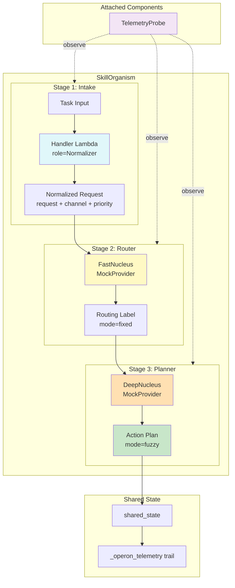

# Example 68: Skill Organism Runtime

## Wiring Diagram



```
[Task(U)] --> [intake: Handler(deterministic)]
                  |
            normalized request(V)
                  |
              --> [router: FastNucleus(mode=fixed)] --> routing_label(V)
                  |
              --> [planner: DeepNucleus(mode=fuzzy)] --> action_plan(T)

Components (non-invasive):
  [TelemetryProbe] -.observes.-> each stage (start/end/tokens)
                         |
                   shared_state["_operon_telemetry"] = event trail
```

## Key Patterns

### Provider-Bound Multi-Stage Organism
The skill_organism() factory builds a runtime from SkillStage definitions, binding
each stage to either a fast or deep Nucleus based on its mode. Deterministic
stages use handler lambdas directly, bypassing the LLM entirely.

| # | Motif | Role in Pipeline |
|---|-------|-----------------|
| 1 | skill_organism() | Factory that composes stages into a runnable organism |
| 2 | SkillStage(handler=) | Deterministic intake with no LLM call |
| 3 | SkillStage(mode="fixed") | Fast/cheap nucleus for classification |
| 4 | SkillStage(mode="fuzzy") | Deep nucleus for reasoning tasks |
| 5 | Nucleus + MockProvider | Provider abstraction with canned responses |
| 6 | TelemetryProbe | Non-invasive observation component |
| 7 | shared_state | Cross-stage state accumulation |

### Biological Analogy
Like a cell's signal transduction cascade where early receptors perform fast,
deterministic filtering (intake), intermediate kinases route signals to specific
pathways (router), and nuclear transcription factors do the deep reasoning work
(planner). Telemetry probes are like fluorescent markers that observe without
altering the cascade.

### Model Selection by Stage
The runtime routes each stage to the appropriate model tier:
- **intake**: No model (deterministic handler)
- **router**: Fast model (cheap, low-latency classification)
- **planner**: Deep model (expensive, high-quality reasoning)

## Data Flow

```
Task: str ("Customer says an invoice refund was never applied.")
       ↓
StageResult[intake]
  ├─ stage_name: "intake"
  ├─ role: "Normalizer"
  ├─ model_alias: None (deterministic)
  ├─ action_type: "HANDLER"
  └─ output: {request, channel, priority}
       ↓
StageResult[router]
  ├─ stage_name: "router"
  ├─ role: "Classifier"
  ├─ model_alias: "fast"
  ├─ action_type: "EXECUTE"
  └─ output: "billing"
       ↓
StageResult[planner]
  ├─ stage_name: "planner"
  ├─ role: "Planner"
  ├─ model_alias: "deep"
  ├─ action_type: "EXECUTE"
  └─ output: "Ask the billing team for invoice context..."
       ↓
TelemetrySummary
  ├─ events: 8 (start + end per stage + token events)
  ├─ total_tokens: int
  └─ stages: ["intake", "router", "planner"]
```

## Pipeline Stages

| Stage | Mechanism | Input | Output | Model |
|-------|-----------|-------|--------|-------|
| intake | Handler lambda | Raw task string | {request, channel, priority} | None (deterministic) |
| router | FastNucleus (mode=fixed) | Normalized request | Routing label ("billing") | Fast/cheap |
| planner | DeepNucleus (mode=fuzzy) | Task + routing label + telemetry | Action plan | Deep/expensive |
