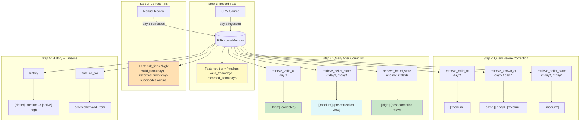

# Example 69: Bi-Temporal Memory

## Wiring Diagram



```
Time Axes:

Valid Time (world):   day1 -------- day2 -------- day3 -------- day4 -------- day5
                       |                                                        |
                  risk_tier = "medium"                                 correction to "high"
                  (real-world event)                                  (retroactive to day1)

Record Time (system): day1 -------- day2 -------- day3 -------- day4 -------- day5
                                                    |                           |
                                              system ingests                 system records
                                              "medium"                       correction "high"

Belief Matrix:
                       record_at=day2    record_at=day4    record_at=day6
  valid_at=day2:         []              ["medium"]         ["high"]
                     (not yet known)   (before correction) (after correction)
```

## Key Patterns

### Two-Axis Temporal Model
Bi-temporal memory separates **valid time** (when a fact is true in the world)
from **record time** (when the system learned about it). This enables belief-state
reconstruction: "What did the system believe at time T about state at time S?"

| # | Motif | Role in Pipeline |
|---|-------|-----------------|
| 1 | BiTemporalMemory | In-memory store with dual time axes |
| 2 | record_fact() | Insert a fact with valid_from and recorded_from |
| 3 | correct_fact() | Supersede an existing fact with a new value |
| 4 | retrieve_valid_at() | Query current active facts valid at a point in time |
| 5 | retrieve_known_at() | Query facts the system knew at a record-time point |
| 6 | retrieve_belief_state() | Cross-axis query: what was believed about valid_at at record_at |
| 7 | history() | Full audit trail for a subject (all versions, open and closed) |
| 8 | timeline_for() | Ordered world-time view of all facts for a subject |

### Biological Analogy
A cell does not erase old synaptic weights when new evidence arrives. It forms new
connections while the old ones decay. Bi-temporal memory keeps every version of every
fact. The relative "active" status of each record determines which version the system
acts on at any given point in time.

## Data Flow

```
record_fact() inputs:
  ├─ subject: "client:42"
  ├─ predicate: "risk_tier"
  ├─ value: "medium"
  ├─ valid_from: datetime (day 1)
  ├─ recorded_from: datetime (day 3)
  └─ source: "crm"
       ↓
TemporalFact
  ├─ fact_id: str (UUID)
  ├─ subject: str
  ├─ predicate: str
  ├─ value: Any
  ├─ valid_from: datetime
  ├─ valid_to: Optional[datetime]
  ├─ recorded_from: datetime
  ├─ recorded_to: Optional[datetime]
  ├─ source: str
  └─ supersedes: Optional[str]
       ↓
correct_fact() → CorrectionResult
  ├─ new_fact: TemporalFact (supersedes original)
  └─ old_fact: TemporalFact (recorded_to set, now closed)
```

## Query Semantics

| Query | Valid Axis | Record Axis | Returns |
|-------|-----------|-------------|---------|
| retrieve_valid_at(day2) | Facts valid at day 2 | Latest record time | Currently active facts |
| retrieve_known_at(day2) | Any valid time | Facts recorded by day 2 | What system knew then |
| retrieve_belief_state(v=2, r=4) | Facts valid at day 2 | Facts recorded by day 4 | Cross-axis belief |
| history(subject) | All | All | Full audit trail (open + closed) |
| timeline_for(subject) | Ordered | All | World-time ordered view |
