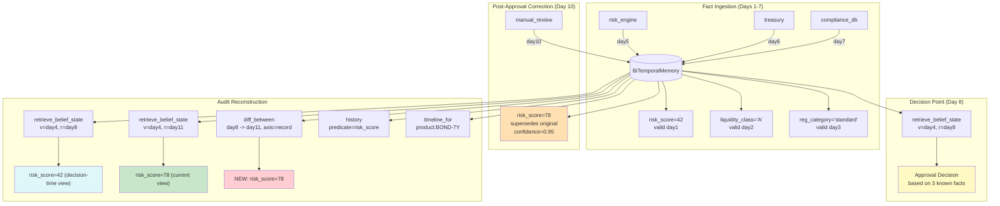

# Example 70: Bi-Temporal Compliance Audit

## Wiring Diagram



```
World-time (valid):
  day1: risk_score assessed (42)
  day2: liquidity_class assessed (A)
  day3: regulatory_category assigned (standard)

Record-time (system):
  day5: risk_score ingested
  day6: liquidity_class ingested
  day7: regulatory_category ingested
  day8: APPROVAL DECISION (all 3 facts known)
  day10: CORRECTION — risk_score was actually 78

Audit question: "Was the decision justified given what the system knew at day 8?"

  belief(v=day4, r=day8):   risk_score=42, liquidity_class=A, reg_category=standard
  belief(v=day4, r=day11):  risk_score=78, liquidity_class=A, reg_category=standard
                                  ^^^^
                            correction visible only after day 10

  diff(day8 -> day11, axis=record): [NEW risk_score=78 from manual_review]
  history(risk_score): [closed] 42 -> [active] 78 (supersedes original)
```

## Key Patterns

### Regulatory Audit via Belief-State Reconstruction
The core question in compliance auditing is: "Given what the system knew when the
decision was made, was it justified?" Bi-temporal memory answers this by
reconstructing the exact belief state at any (valid_time, record_time) coordinate.

| # | Motif | Role in Pipeline |
|---|-------|-----------------|
| 1 | BiTemporalMemory | Multi-subject, multi-predicate temporal store |
| 2 | record_fact() | Ingest facts from multiple sources with tags |
| 3 | correct_fact() | Post-decision correction with confidence and tags |
| 4 | retrieve_belief_state() | Reconstruct what was known at decision time |
| 5 | diff_between(axis="record") | Show what changed on the record axis between two points |
| 6 | history(predicate=) | Filtered audit trail for a specific predicate |
| 7 | timeline_for() | Full world-time ordered view of all product facts |

### Biological Analogy
In an immune response, a cell commits to an action (producing antibodies) based on
partial, time-delayed signals. If a later signal contradicts an earlier one, the cell
does not pretend it always knew. It records the correction alongside the original.
Bi-temporal memory gives AI agents the same ability.

### Multi-Source Fact Convergence
Three independent sources (risk_engine, treasury, compliance_db) each contribute
facts about the same product. The audit must track provenance per fact and handle
corrections from yet another source (manual_review).

## Data Flow

```
Product: "product:BOND-7Y"
  ├─ risk_score: 42 (source: risk_engine, valid day1, recorded day5)
  ├─ liquidity_class: "A" (source: treasury, valid day2, recorded day6)
  └─ regulatory_category: "standard" (source: compliance_db, valid day3, recorded day7)
       ↓
Decision at day 8: approved based on all 3 facts
       ↓
Correction at day 10:
  risk_score: 42 -> 78 (source: manual_review, confidence: 0.95)
  tags: ("audit", "correction")
       ↓
Audit outputs:
  ├─ belief_at_decision: {risk=42, liquidity=A, reg=standard}
  ├─ belief_current: {risk=78, liquidity=A, reg=standard}
  ├─ diff: [risk_score=78 from manual_review]
  ├─ history: [closed: 42] -> [active: 78, supersedes original]
  └─ timeline: 4 entries ordered by valid_from
```

## Audit Timeline

| Day | Event | Axis | Details |
|-----|-------|------|---------|
| 1 | Risk assessed | Valid | risk_score = 42 |
| 2 | Liquidity assessed | Valid | liquidity_class = A |
| 3 | Category assigned | Valid | regulatory_category = standard |
| 5 | Risk ingested | Record | System learns risk_score |
| 6 | Liquidity ingested | Record | System learns liquidity_class |
| 7 | Category ingested | Record | System learns reg_category |
| 8 | Decision made | Record | Approval based on belief state |
| 10 | Correction recorded | Record | risk_score corrected to 78 |
