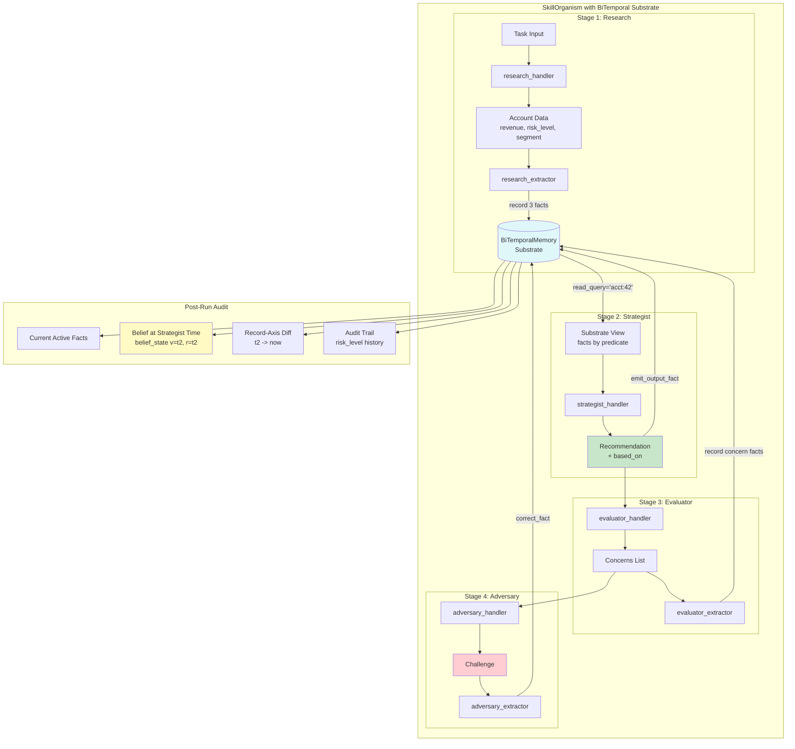

# Example 71: Bi-Temporal Substrate in a SkillOrganism

## Wiring Diagram



```
[Task(U)] --> [Research Handler] --> account data
                                       |
                              research_extractor records 3 facts:
                              acct:42.revenue = 2500000
                              acct:42.risk_level = "low"
                              acct:42.segment = "enterprise"
                                       |
                                       v
                              [BiTemporalMemory Substrate]
                                       |
                              read_query("acct:42") --> substrate view
                                       |
                                       v
                              [Strategist Handler] reads facts --> "approve premium partnership"
                              (emit_output_fact --> records recommendation)
                                       |
                                       v
                              [Evaluator Handler] --> concerns list
                              evaluator_extractor records concern:0, concern:1
                                       |
                                       v
                              [Adversary Handler] --> "risk_level should be high"
                              adversary_extractor calls correct_fact:
                                risk_level: "low" -> "high" (supersedes original)

Post-run audit:
  belief(v=t2, r=t2): risk=low, revenue=2.5M, segment=enterprise  (what strategist knew)
  diff(t2 -> now):    concern:0, concern:1, risk_level=high [corrects original]
  history(risk_level): [CLOSED] low -> [ACTIVE] high
```

## Key Patterns

### Phase 2: Substrate-Backed Organism
This integrates bi-temporal memory as a substrate beneath a multi-stage
SkillOrganism. Each stage can record facts, read the substrate, and correct
prior facts. The result is a full audit trail showing what each stage knew
and how later stages changed the system's beliefs.

| # | Motif | Role in Pipeline |
|---|-------|-----------------|
| 1 | skill_organism(substrate=) | Organism factory with bi-temporal substrate binding |
| 2 | SkillStage(fact_extractor=) | Stage emits structured facts into substrate |
| 3 | SkillStage(read_query=) | Stage reads substrate before executing |
| 4 | SkillStage(emit_output_fact=) | Auto-record stage output as a fact |
| 5 | correct_fact via extractor | Adversary stage corrects prior research |
| 6 | retrieve_belief_state() | Reconstruct what strategist knew at decision time |
| 7 | diff_between(axis="record") | Show changes after evaluator and adversary |
| 8 | history(predicate=) | Full audit trail for corrected fact |

### Biological Analogy
An enterprise review workflow mirrors immune surveillance: a researcher gathers
evidence (antigen presentation), a strategist commits to a response (effector
decision), an evaluator flags concerns (quality control checkpoint), and an
adversary challenges assumptions (negative selection). The bi-temporal substrate
ensures that even overturned assessments remain in the audit trail.

### Four-Stage Enterprise Review
The pipeline demonstrates a realistic multi-stakeholder review where each stage
has a distinct epistemic role and different levels of trust in the substrate.

## Data Flow

```
Task: "Review account acct:42 for partnership eligibility"
       ↓
Stage 1 - Research:
  output: {account: "acct:42", revenue: 2500000, risk_level: "low", segment: "enterprise"}
  facts recorded: 3 (revenue, risk_level, segment)
       ↓
Stage 2 - Strategist:
  substrate view: [revenue=2500000, risk_level=low, segment=enterprise]
  output: {recommendation: "approve premium partnership", based_on: {...}}
  fact recorded: 1 (recommendation output)
       ↓
Stage 3 - Evaluator:
  output: {concerns: ["revenue figure not verified", "single-source risk assessment"]}
  facts recorded: 2 (concern:0, concern:1)
       ↓
Stage 4 - Adversary:
  output: {challenge: "risk_level should be high based on sector volatility"}
  correction: risk_level "low" -> "high" (supersedes original, recorded_from=t4)
       ↓
Substrate state after run:
  ├─ acct:42.revenue = 2500000 [active]
  ├─ acct:42.risk_level = "low" [CLOSED]
  ├─ acct:42.risk_level = "high" [active, supersedes above]
  ├─ acct:42.segment = "enterprise" [active]
  ├─ acct:42.concern:0 = "revenue figure not verified" [active]
  └─ acct:42.concern:1 = "single-source risk assessment" [active]
```

## Pipeline Stages

| Stage | Role | Reads Substrate | Writes Substrate | Mechanism |
|-------|------|----------------|-----------------|-----------|
| Research | Researcher | No | Yes (3 facts via extractor) | Handler returns structured data |
| Strategist | Strategist | Yes (read_query="acct:42") | Yes (emit_output_fact) | Reads view, produces recommendation |
| Evaluator | Evaluator | No | Yes (2 facts via extractor) | Handler returns concerns list |
| Adversary | Adversary | Yes (via _substrate_ref) | Yes (correct_fact) | Challenges and corrects prior fact |
