# Example 72: Pattern Repository

## Wiring Diagram

```mermaid
flowchart TB
    subgraph library["PatternLibrary"]
        subgraph templates["Registered Templates"]
            T1[Sequential Review Pipeline<br/>topology=reviewer_gate<br/>roles: writer, reviewer]
            T2[Research Swarm<br/>topology=specialist_swarm<br/>roles: researcher, analyst, writer]
            T3[Enterprise Review Organism<br/>topology=skill_organism<br/>roles: router, researcher, strategist, critic]
        end

        subgraph matching["Template Matching"]
            FP[TaskFingerprint<br/>shape + tools + subtasks + roles + tags] --> MATCH[top_templates_for]
            MATCH --> RANK[Ranked Templates<br/>by similarity score]
        end

        subgraph feedback["Run Records & Feedback"]
            RUN[PatternRunRecord<br/>success + latency + tokens] --> REC[record_run]
            REC --> SR[success_rate]
            SR --> RERANK[Re-ranked Templates<br/>score boosted by success rate]
        end
    end

    T1 --> MATCH
    T2 --> MATCH
    T3 --> MATCH
    RANK --> RUN
    SR --> MATCH

    style RANK fill:#c8e6c9
    style RERANK fill:#c8e6c9
    style T3 fill:#e0f7fa
```



```
PatternLibrary
  ├── register_template(PatternTemplate)
  │     ├── Sequential Review Pipeline (reviewer_gate)
  │     ├── Research Swarm (specialist_swarm)
  │     └── Enterprise Review Organism (skill_organism)
  │
  ├── TaskFingerprint(shape=sequential, tools=3, subtasks=4, roles=[researcher, strategist, critic])
  │     |
  │     v
  │   top_templates_for(fingerprint) --> ranked list:
  │     1. Enterprise Review Organism  (highest similarity)
  │     2. Sequential Review Pipeline
  │     3. Research Swarm
  │
  ├── record_run(PatternRunRecord)  --> updates success rates
  │     Enterprise: 3 successes (100%)
  │     Sequential: 1 failure (0%)
  │
  └── Re-rank after runs:
        Enterprise score boosted by 100% success rate
        Sequential score penalized by 0% success rate
```

## Key Patterns

### Reusable Collaboration Templates
The PatternLibrary stores parameterized templates that encode proven collaboration
patterns (topologies, stage specs, intervention policies). New tasks are fingerprinted
and matched against the library to find the best-fit template.

| # | Motif | Role in Pipeline |
|---|-------|-----------------|
| 1 | PatternLibrary | Central registry of collaboration templates |
| 2 | PatternTemplate | Reusable template with topology, stages, intervention policy |
| 3 | TaskFingerprint | Structured task description for matching |
| 4 | top_templates_for() | Similarity-ranked template retrieval |
| 5 | PatternRunRecord | Outcome record (success, latency, tokens) |
| 6 | record_run() | Feed execution outcomes back into the library |
| 7 | success_rate() | Per-template success ratio |
| 8 | Score boosting | Success rate improves future ranking |

### Biological Analogy
Like the adaptive immune system's memory B-cells: the library stores templates
(antibody patterns) that worked in the past. When a new antigen (task) arrives,
the system selects the best-matching antibody and refines its affinity based on
whether the response succeeds or fails.

### Feedback-Driven Selection
After execution, run records are stored. Templates with higher success rates
receive boosted similarity scores in future rankings, creating a self-improving
selection loop.

## Data Flow

```
PatternTemplate
  ├─ template_id: str
  ├─ name: str
  ├─ topology: "reviewer_gate" | "specialist_swarm" | "skill_organism"
  ├─ stage_specs: tuple[dict, ...]
  ├─ intervention_policy: dict
  ├─ fingerprint: TaskFingerprint
  └─ tags: tuple[str, ...]
       ↓
TaskFingerprint (query)
  ├─ task_shape: "sequential" | "parallel"
  ├─ tool_count: int
  ├─ subtask_count: int
  ├─ required_roles: tuple[str, ...]
  └─ tags: tuple[str, ...]
       ↓
top_templates_for() → list[(PatternTemplate, float)]
       ↓
PatternRunRecord
  ├─ record_id: str
  ├─ template_id: str
  ├─ fingerprint: TaskFingerprint
  ├─ success: bool
  ├─ latency_ms: float
  └─ tokens_used: int
       ↓
success_rate(template_id) → Optional[float]
```

## Template Comparison

| Template | Topology | Stages | Roles | Tags |
|----------|----------|--------|-------|------|
| Sequential Review Pipeline | reviewer_gate | draft, review | writer, reviewer | content, review |
| Research Swarm | specialist_swarm | research, analysis, synthesis | researcher, analyst, writer | research, analysis |
| Enterprise Review Organism | skill_organism | intake, research, strategy, critique | router, researcher, strategist, critic | enterprise, review |
