# Example 73: Watcher Component

## Wiring Diagram

```mermaid
flowchart TB
    subgraph run1["Run 1: Clean Execution"]
        T1[Task] --> S1_INT[intake<br/>Normalizer]
        S1_INT --> S1_RTR[router<br/>FastNucleus]
        S1_RTR --> S1_ANL[analyst<br/>DeepNucleus]
        S1_ANL --> OUT1[Final Output]
        W1[WatcherComponent<br/>max_intervention_rate=0.5] -.->|observe| S1_INT
        W1 -.->|observe| S1_RTR
        W1 -.->|observe| S1_ANL
        W1 --> SUM1[Summary:<br/>3 stages, 0 interventions]
    end

    subgraph run2["Run 2: Failure Triggers RETRY"]
        T2[Task] --> S2_FLK[flaky<br/>unreliable_handler]
        S2_FLK -->|failure| W2{WatcherComponent<br/>max_retries=2}
        W2 -->|RETRY| S2_FLK
        S2_FLK -->|success| S2_FIN[final<br/>Summarizer]
        S2_FIN --> OUT2[Final Output]
    end

    subgraph run3["Run 3: Signal Taxonomy"]
        T3[Task] --> S3_1[s1: Worker]
        S3_1 --> S3_2[s2: Worker]
        S3_2 --> S3_3[s3: Worker]
        W3[WatcherComponent] -.->|classify signals| S3_1
        W3 -.->|classify signals| S3_2
        W3 -.->|classify signals| S3_3
        W3 --> SUM3[Summary:<br/>signals_by_category<br/>convergent=true]
    end

    style W1 fill:#f3e5f5
    style W2 fill:#f3e5f5
    style W3 fill:#f3e5f5
    style OUT1 fill:#c8e6c9
    style OUT2 fill:#c8e6c9
    style SUM3 fill:#e0f7fa
```



```
Run 1 (clean):
  [Task(U)] --> [intake(V)] --> [router(V)] --> [analyst(V)] --> Output(T)
                    |                |               |
              WatcherComponent observes each stage: signals classified, no intervention

Run 2 (retry):
  [Task(U)] --> [flaky(U)] --failure--> WatcherComponent --RETRY--> [flaky(V)] --> [final(V)] --> Output(T)
                                            |
                                  max_retries_per_stage=2

Run 3 (taxonomy):
  [Task(U)] --> [s1(V)] --> [s2(V)] --> [s3(V)]
                  |           |           |
            WatcherComponent classifies all signals
            summary: total_signals, signals_by_category, convergent=true
```

## Key Patterns

### Non-Invasive Runtime Observer
The WatcherComponent attaches to a SkillOrganism and observes each stage's
execution without modifying the pipeline. It classifies signals, tracks
interventions, and determines convergence.

| # | Motif | Role in Pipeline |
|---|-------|-----------------|
| 1 | WatcherComponent | Attached observer that monitors all stages |
| 2 | WatcherConfig | Configuration: max_intervention_rate, max_retries_per_stage |
| 3 | Signal Classification | Categorize stage outputs into signal taxonomy |
| 4 | Intervention Decisions | RETRY on failure, ESCALATE on stagnation |
| 5 | Convergence Detection | Determine if pipeline is converging or diverging |
| 6 | summary() | Post-run report: stages, signals, interventions, convergence |
| 7 | TelemetryProbe | Parallel component for token/event tracking |

### Biological Analogy
Like a tissue's sentinel cells (macrophages, dendritic cells) that patrol and
monitor without directly participating in the tissue's function. They observe
signals, classify threats, and intervene (retry, escalate) only when necessary.
Convergence detection is analogous to homeostasis monitoring.

### Three Demonstration Runs
1. **Clean execution**: No interventions needed, watcher passively observes
2. **Failure recovery**: Unreliable handler triggers RETRY intervention
3. **Signal taxonomy**: All signals classified by category, convergence assessed

## Data Flow

```
WatcherConfig
  ├─ max_intervention_rate: float (default varies)
  └─ max_retries_per_stage: int (default varies)
       ↓
WatcherComponent (attached to organism)
  ├─ observes: each SkillStage execution
  ├─ classifies: signals by category
  └─ intervenes: RETRY / ESCALATE when thresholds met
       ↓
WatcherSummary (via summary())
  ├─ total_stages_observed: int
  ├─ total_signals: int
  ├─ signals_by_category: dict[str, int]
  ├─ total_interventions: int
  └─ convergent: bool
```

## Pipeline Stages (Run 1)

| Stage | Role | Nucleus | Input | Output | Watcher Action |
|-------|------|---------|-------|--------|----------------|
| intake | Normalizer | None (handler) | Raw task string | {request: task} | Observe + classify |
| router | Router | FastNucleus | Normalized request | "billing" | Observe + classify |
| analyst | Analyst | DeepNucleus | Routing result | Analysis text | Observe + classify |
