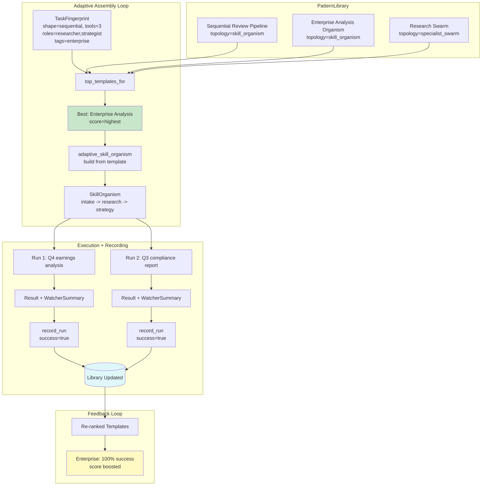

# Example 74: Adaptive Assembly

## Wiring Diagram



```
Adaptive Assembly Loop:

  TaskFingerprint(sequential, tools=3, roles=[researcher, strategist], tags=[enterprise])
       |
       v
  PatternLibrary.top_templates_for() --> ranked:
       1. Enterprise Analysis Organism  (best match)
       2. Sequential Review Pipeline
       3. Research Swarm
       |
       v
  adaptive_skill_organism() builds organism from template:
       [intake: Normalizer] --> [research: Researcher(fuzzy)] --> [strategy: Strategist(deep)]
       + WatcherComponent (auto-attached)
       + handlers bound from user-provided dict
       |
       v
  Run 1 --> success --> record_run(template_id="enterprise", success=True)
  Run 2 --> success --> record_run(template_id="enterprise", success=True)
       |
       v
  Re-rank: Enterprise success_rate=100% --> score boosted in future selections
```

## Key Patterns

### Closed-Loop Adaptive Assembly
The full assembly cycle: fingerprint a task, select the best template from the
library, build an organism from it, execute with a watcher, record the outcome,
and let success rates influence future selections.

| # | Motif | Role in Pipeline |
|---|-------|-----------------|
| 1 | TaskFingerprint | Structured task description for matching |
| 2 | PatternLibrary | Template registry with similarity ranking |
| 3 | adaptive_skill_organism() | Factory that selects template + builds organism |
| 4 | Template-to-organism mapping | stage_specs -> SkillStage instances with handlers |
| 5 | WatcherComponent (auto) | Automatically attached for monitoring |
| 6 | AdaptiveResult | Run result + record + watcher summary |
| 7 | record_run() (auto) | Outcome automatically fed back to library |
| 8 | Success rate feedback | Future rankings boosted by past success |

### Biological Analogy
Like the adaptive immune system's clonal selection: when a pathogen (task) arrives,
the system selects the best-matching B-cell clone (template), amplifies it
(builds organism), tests the response (execution), and records whether it
succeeded (memory cell formation). Successful clones are preferentially selected
for future challenges.

### Handler Binding
The user provides a dict mapping stage names to handler functions. The
adaptive_skill_organism() factory binds these to the stages from the selected
template, bridging the gap between abstract templates and concrete execution.

## Data Flow

```
adaptive_skill_organism() inputs:
  ├─ task: str
  ├─ fingerprint: TaskFingerprint
  ├─ library: PatternLibrary
  ├─ fast_nucleus: Nucleus
  ├─ deep_nucleus: Nucleus
  └─ handlers: dict[str, Callable]
       ↓
AdaptiveOrganism
  ├─ template: PatternTemplate (selected)
  ├─ template_score: float
  └─ organism: SkillOrganism (built from template)
       ↓
AdaptiveResult (from .run())
  ├─ run_result: OrganismResult
  │     ├─ stage_results: list[StageResult]
  │     └─ final_output: Any
  ├─ record: PatternRunRecord (auto-created)
  │     ├─ success: bool
  │     ├─ latency_ms: float
  │     └─ tokens_used: int
  └─ watcher_summary: dict
```

## Pipeline Stages (Enterprise Analysis Organism)

| Stage | Role | Mode | Handler | Input | Output |
|-------|------|------|---------|-------|--------|
| intake | Normalizer | deterministic | lambda task: {"parsed": task} | Raw task string | Parsed dict |
| research | Researcher | fuzzy | lambda with state/outputs | Parsed task | "Revenue up 12%..." |
| strategy | Strategist | deep | lambda with state/outputs | Research findings | "Recommend: hold..." |
