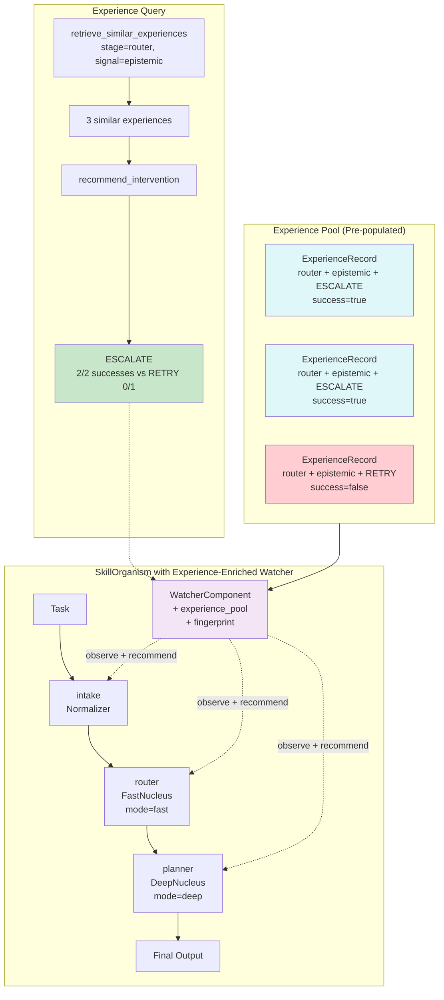

# Example 75: Experience-Driven Watcher

## Wiring Diagram



```
Experience Pool:
  [ESCALATE, router, epistemic, success=true]
  [ESCALATE, router, epistemic, success=true]
  [RETRY, router, epistemic, success=false]
       |
       v
  retrieve_similar_experiences(stage=router, signal=epistemic)
  --> 3 matches
       |
       v
  recommend_intervention(stage=router, signal=epistemic)
  --> ESCALATE (2/2 success vs RETRY 0/1 success)

Organism:
  [Task(U)] --> [intake(V)] --> [router(V)] --> [planner(V)] --> Output(T)
                    |                |               |
              WatcherComponent (experience-enriched)
                    |
              set_fingerprint(fp) binds task context
              experience_pool informs intervention decisions
```

## Key Patterns

### Experience-Informed Intervention
The watcher maintains a pool of past intervention outcomes. When a stage
produces a signal that matches prior experience, the watcher uses success
rates to recommend the best intervention kind (ESCALATE vs RETRY).

| # | Motif | Role in Pipeline |
|---|-------|-----------------|
| 1 | WatcherComponent | Observer with experience pool |
| 2 | ExperienceRecord | Past intervention outcome (stage, signal, kind, success) |
| 3 | record_experience() | Add outcomes to the experience pool |
| 4 | retrieve_similar_experiences() | Find matching past interventions |
| 5 | recommend_intervention() | Best intervention kind based on success rates |
| 6 | set_fingerprint() | Bind task context for experience matching |
| 7 | InterventionKind | Enum: RETRY, ESCALATE, etc. |
| 8 | TaskFingerprint | Task context for experience similarity matching |

### Biological Analogy
Like trained immunity (innate immune memory): macrophages that have previously
encountered a pathogen develop epigenetic modifications that allow them to respond
more effectively to similar future challenges. The experience pool is the watcher's
epigenetic memory -- it does not change the pipeline structure, but it changes how
the watcher responds to familiar signals.

### Experience-Driven Decision Flow
1. Pre-populate: record_experience() with known outcomes
2. Query: retrieve_similar_experiences() finds matching records
3. Recommend: recommend_intervention() picks the kind with highest success rate
4. Execute: organism runs with watcher using experience-informed decisions

## Data Flow

```
record_experience() inputs:
  ├─ fingerprint: TaskFingerprint
  ├─ stage_name: str ("router")
  ├─ signal_category: str ("epistemic")
  ├─ signal_detail: dict
  ├─ intervention_kind: str ("escalate" | "retry")
  ├─ intervention_reason: str
  └─ outcome_success: bool
       ↓
ExperienceRecord (stored in pool)
  ├─ fingerprint: TaskFingerprint
  ├─ stage_name: str
  ├─ signal_category: str
  ├─ signal_detail: dict
  ├─ intervention_kind: str
  ├─ intervention_reason: str
  └─ outcome_success: bool
       ↓
retrieve_similar_experiences(stage, signal, fingerprint)
  → list[ExperienceRecord]  (filtered by stage + signal + fingerprint similarity)
       ↓
recommend_intervention(stage, signal, fingerprint)
  → InterventionKind  (ESCALATE, based on highest success rate)
```

## Experience Pool Statistics

| Intervention | Stage | Signal | Successes | Failures | Success Rate | Recommendation |
|-------------|-------|--------|-----------|----------|-------------|----------------|
| ESCALATE | router | epistemic | 2 | 0 | 100% | Recommended |
| RETRY | router | epistemic | 0 | 1 | 0% | Not recommended |

## Pipeline Stages

| Stage | Role | Nucleus | Input | Output | Watcher Behavior |
|-------|------|---------|-------|--------|-----------------|
| intake | Normalizer | None (handler) | Raw task string | {req: task} | Observe |
| router | Router | FastNucleus | Normalized request | "billing" | Observe + recommend from experience |
| planner | Planner | DeepNucleus | Routing result | "solution planned" | Observe |
