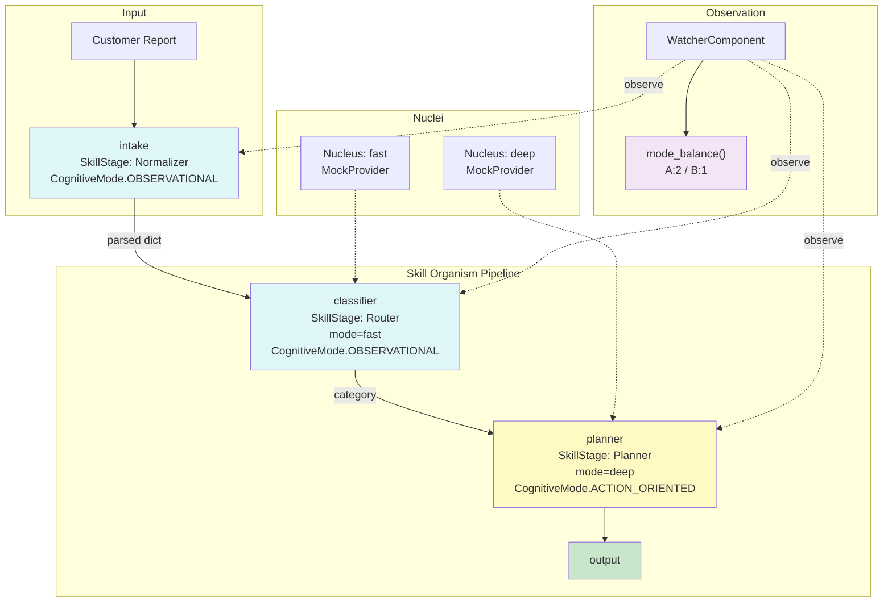

# Example 76: Cognitive Modes

## Wiring Diagram



```
[Task: "Customer reports duplicate charge."]
       |
       v  (U=UNTRUSTED)
  [intake] handler=lambda  (System A: OBSERVATIONAL)
       |  {"parsed": task}
       v  (V=VALIDATED)
  [classifier] Nucleus=fast  (System A: OBSERVATIONAL)
       |  "EXECUTE: billing"
       v  (T=TRUSTED)
  [planner] Nucleus=deep  (System B: ACTION_ORIENTED)
       |  "EXECUTE: escalate to supervisor"
       v
  [final_output]

  WatcherComponent
    ├─ observational (System A): 2  (intake, classifier)
    ├─ action_oriented (System B): 1  (planner)
    ├─ balance_ratio: 0.67
    └─ mismatches: 0
```

## Key Patterns

### Dual-Process Cognitive Annotation
Stages are annotated with `CognitiveMode.OBSERVATIONAL` (System A) or
`CognitiveMode.ACTION_ORIENTED` (System B), reflecting Kahneman's dual-process
theory. The watcher tracks mode balance across the pipeline and detects
mismatches (e.g., an action stage running in a fast/observational nucleus).

| # | Motif | Role in Pipeline |
|---|-------|-----------------|
| 1 | SkillStage + CognitiveMode | Each stage declares whether it observes or acts |
| 2 | Nucleus (fast/deep) | Fast nucleus for observation, deep nucleus for action |
| 3 | WatcherComponent | Monitors mode balance, detects mismatches |
| 4 | resolve_cognitive_mode | Resolves mode from annotation or defaults from nucleus mode |

### Biological Parallel
System A / System B mirrors the fast-intuitive vs slow-deliberative split in
cognitive neuroscience. Observational stages gather and classify; action-oriented
stages plan and execute.

## Data Flow

```
str (raw task)
  └─ "Customer reports duplicate charge."
       ↓
intake handler (lambda)
  └─ {"parsed": task}
       ↓
classifier (Nucleus: fast)
  └─ "EXECUTE: billing"
       ↓
planner (Nucleus: deep)
  └─ "EXECUTE: escalate to supervisor"
       ↓
RunResult
  ├─ final_output: str
  ├─ stage_results: list[StageResult]
  └─ (watcher) mode_balance dict
       ├─ observational: int
       ├─ action_oriented: int
       ├─ balance_ratio: float
       └─ mismatches: int
```

## Pipeline Stages

| Stage | Mechanism | Input | Output | CognitiveMode |
|-------|-----------|-------|--------|---------------|
| intake | lambda handler | raw task str | {"parsed": task} | OBSERVATIONAL (A) |
| classifier | Nucleus (fast) | parsed dict | category string | OBSERVATIONAL (A) |
| planner | Nucleus (deep) | category | resolution plan | ACTION_ORIENTED (B) |
