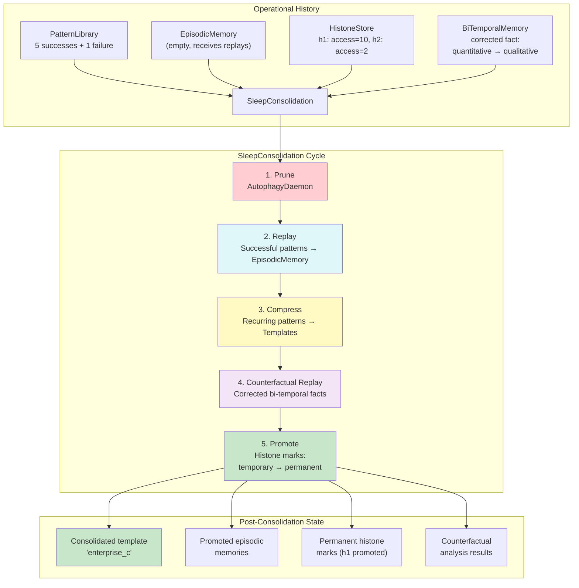

# Example 77: Sleep Consolidation

## Wiring Diagram



```
[PatternLibrary]  [EpisodicMemory]  [HistoneStore]  [BiTemporalMemory]
   6 records         (empty)         h1(10), h2(2)    corrected fact
       \                |                |                /
        \               |                |               /
         v              v                v              v
       +========= SleepConsolidation.consolidate() =========+
       |                                                     |
       |  1. PRUNE — AutophagyDaemon clears stale context    |
       |  2. REPLAY — successful patterns → episodic memory  |
       |  3. COMPRESS — recurring patterns → new templates   |
       |  4. COUNTERFACTUAL — replay corrected facts         |
       |  5. PROMOTE — histone marks temp → permanent        |
       |                                                     |
       +=====================================================+
                            |
                            v
                  ConsolidationResult
                   ├─ templates_created >= 1
                   ├─ memories_promoted >= 1
                   ├─ histone_promotions >= 1
                   └─ counterfactual_results[]
```

## Key Patterns

### Five-Phase Sleep Cycle
Mirrors biological sleep consolidation where the brain prunes, replays, and
strengthens memories during sleep. Each phase operates on a different memory
subsystem.

| # | Motif | Role in Pipeline |
|---|-------|-----------------|
| 1 | AutophagyDaemon | Prunes stale context (phase 1) |
| 2 | PatternLibrary | Source of run records for replay and compression |
| 3 | EpisodicMemory | Receives replayed successful patterns (phase 2) |
| 4 | PatternTemplate compression | Recurring patterns compressed into templates (phase 3) |
| 5 | BiTemporalMemory | Source of corrected facts for counterfactual replay (phase 4) |
| 6 | HistoneStore | Marks promoted from temporary to permanent (phase 5) |

### Biological Parallel
- **Phase 1 (Prune)**: Synaptic downscaling during NREM sleep
- **Phase 2 (Replay)**: Hippocampal sharp-wave ripples replaying experiences
- **Phase 3 (Compress)**: Schema consolidation in neocortex
- **Phase 4 (Counterfactual)**: Prefrontal "what-if" during REM sleep
- **Phase 5 (Promote)**: Epigenetic histone modifications for long-term memory

## Data Flow

```
PatternLibrary
  ├─ PatternTemplate("enterprise")
  └─ PatternRunRecord[] (5 success, 1 failure)
       ↓
SleepConsolidation
  ├─ daemon: AutophagyDaemon
  ├─ pattern_library: PatternLibrary
  ├─ episodic_memory: EpisodicMemory
  ├─ histone_store: HistoneStore
  └─ bitemporal_memory: BiTemporalMemory
       ↓
ConsolidationResult
  ├─ templates_created: int
  ├─ memories_promoted: int
  ├─ histone_promotions: int
  ├─ counterfactual_results: list
  └─ duration_ms: float
```

## Consolidation Phases

| Phase | Mechanism | Input | Output | Biological Analog |
|-------|-----------|-------|--------|-------------------|
| 1. Prune | AutophagyDaemon | Stale context | Cleaned state | Synaptic downscaling |
| 2. Replay | PatternLibrary scan | Successful runs | Episodic memories | Hippocampal replay |
| 3. Compress | Template extraction | Recurring patterns | New template ("enterprise_c") | Schema consolidation |
| 4. Counterfactual | BiTemporalMemory | Corrected facts | What-if analysis | REM counterfactuals |
| 5. Promote | HistoneStore | High-access marks | Permanent marks | Epigenetic stabilization |
