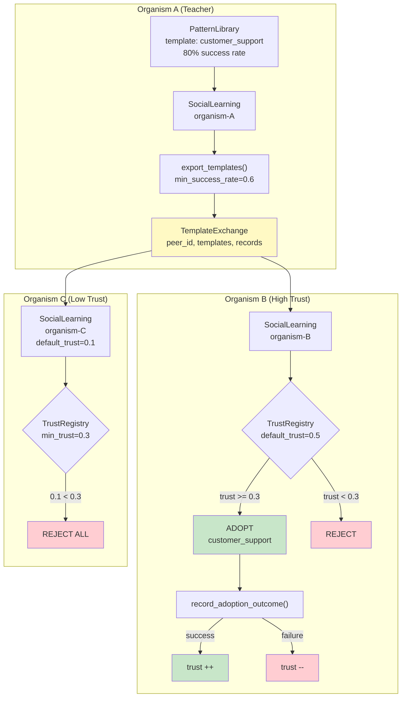

# Example 78: Social Learning

## Wiring Diagram



```
Organism A (teacher, 80% success)
  └─ SocialLearning.export_templates(min_success_rate=0.6)
       └─ TemplateExchange {peer_id, templates[], records[]}
                    |
          +---------+---------+
          |                   |
          v                   v
  Organism B               Organism C
  (trust=0.5)             (trust=0.1)
       |                       |
  [TrustRegistry]         [TrustRegistry]
  trust(0.5) >= 0.3       trust(0.1) < 0.3
       |                       |
  ADOPT template          REJECT ALL
       |
  record_adoption_outcome()
  success → trust ↑
  failure → trust ↓
```

## Key Patterns

### Cross-Organism Template Sharing with Epistemic Vigilance
Organisms export proven templates (above a success threshold) and import them
with trust-weighted filtering. The TrustRegistry enforces a minimum trust score
before adoption, and trust updates based on adoption outcomes.

| # | Motif | Role in Pipeline |
|---|-------|-----------------|
| 1 | PatternLibrary | Stores templates with run history and success rates |
| 2 | SocialLearning | Manages export/import of templates between organisms |
| 3 | TrustRegistry | Gates adoption by trust score, adjusts on outcomes |
| 4 | TemplateExchange | Serializable bundle of templates + records for transfer |
| 5 | Provenance tracking | Records which organism a template originated from |

### Biological Parallel
Mirrors cultural transmission in social species: successful behaviors are shared
(teaching), but learners apply epistemic vigilance (trust filtering) before
adopting new behaviors. Repeated successful adoption increases trust; failures
decrease it.

## Data Flow

```
PatternLibrary (Organism A)
  ├─ PatternTemplate("customer_support")
  │   ├─ stages: classify → resolve → verify
  │   └─ tags: ("support", "customer")
  └─ PatternRunRecord[] (4 success, 1 failure)
       ↓
SocialLearning.export_templates(min_success_rate=0.6)
       ↓
TemplateExchange
  ├─ peer_id: "organism-A"
  ├─ templates: [PatternTemplate]
  └─ records: [PatternRunRecord]
       ↓
SocialLearning.import_from_peer(exchange)
       ↓
ImportResult
  ├─ adopted_template_ids: list[str]
  ├─ rejected_template_ids: list[str]
  └─ trust_score_used: float
```

## Pipeline Stages

| Stage | Mechanism | Input | Output | Fallback |
|-------|-----------|-------|--------|----------|
| Export | SocialLearning.export_templates | PatternLibrary + threshold | TemplateExchange | Empty exchange if none qualify |
| Trust Gate | TrustRegistry | Exchange + peer trust | Allow/Reject per template | Reject if below min_trust |
| Adopt | SocialLearning.import_from_peer | Trusted exchange | ImportResult | Reject untrusted |
| Outcome | record_adoption_outcome | Success/failure signal | Updated trust score | Trust decays on failure |
