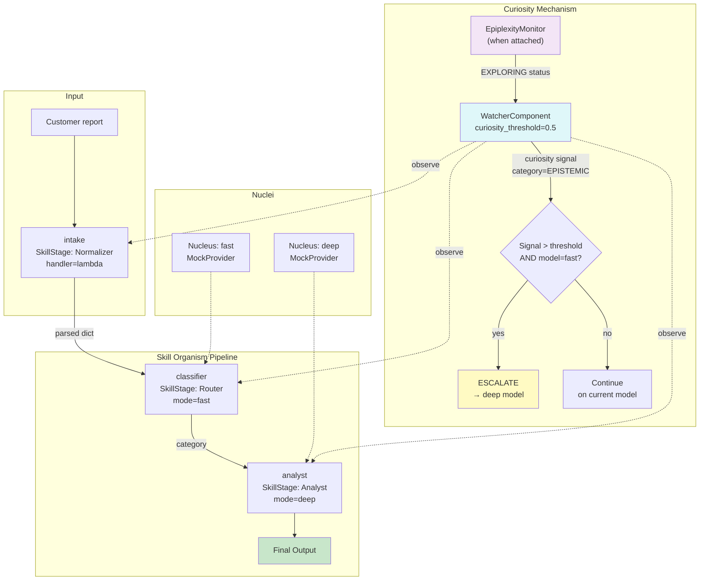

# Example 79: Curiosity-Driven Exploration

## Wiring Diagram



```
[Task: "Customer reports unexpected charge on account #1234."]
       |
       v  (U=UNTRUSTED)
  [intake] handler=lambda  →  {"parsed": task}
       |
       v  (V=VALIDATED)
  [classifier] Nucleus=fast  →  "EXECUTE: billing"
       |
       |  ← WatcherComponent observes
       |     └─ If EpiplexityMonitor attached:
       |        status=EXPLORING + curiosity > 0.5 + model=fast
       |        → ESCALATE to deep model
       |
       v  (T=TRUSTED)
  [analyst] Nucleus=deep  →  "EXECUTE: Comprehensive deep analysis."
       |
       v
  [final_output]
```

## Key Patterns

### Curiosity-Triggered Model Escalation
When the EpiplexityMonitor detects high novelty (EXPLORING status), the watcher
emits a curiosity signal. If the signal value exceeds the threshold and the
current stage is running on a fast model, the watcher triggers an ESCALATE
intervention to switch to the deep model for more thorough investigation.

| # | Motif | Role in Pipeline |
|---|-------|-----------------|
| 1 | WatcherComponent | Monitors stages, emits curiosity signals |
| 2 | WatcherConfig | Sets curiosity_escalation_threshold (0.5) |
| 3 | EpiplexityMonitor | Detects novelty/exploration status (when attached) |
| 4 | ESCALATE intervention | Promotes fast-model stage to deep-model execution |
| 5 | SignalCategory.EPISTEMIC | Curiosity signals are classified as epistemic |

### Biological Parallel
Mirrors dopaminergic curiosity in biological systems: novel stimuli trigger
increased attention and resource allocation. A fast "gut reaction" (System A)
is escalated to slow deliberation (System B) when the organism encounters
something genuinely new, similar to how surprising inputs engage the prefrontal
cortex.

## Data Flow

```
str (raw task)
  └─ "Customer reports unexpected charge on account #1234."
       ↓
intake handler (lambda)
  └─ {"parsed": task}
       ↓
classifier (Nucleus: fast)
  └─ "EXECUTE: billing"
       ↓
analyst (Nucleus: deep)
  └─ "EXECUTE: Comprehensive deep analysis."
       ↓
RunResult
  ├─ final_output: str
  ├─ stage_results: list[StageResult] (3 stages)
  └─ (watcher)
       ├─ curiosity signals: 0 (no monitor attached)
       └─ curiosity_escalation_threshold: 0.5
```

## Pipeline Stages

| Stage | Mechanism | Input | Output | Curiosity Behavior |
|-------|-----------|-------|--------|-------------------|
| intake | lambda handler | raw task str | {"parsed": task} | Observed by watcher |
| classifier | Nucleus (fast) | parsed dict | category string | Escalation candidate if curiosity fires |
| analyst | Nucleus (deep) | category | deep analysis | Already on deep model |
