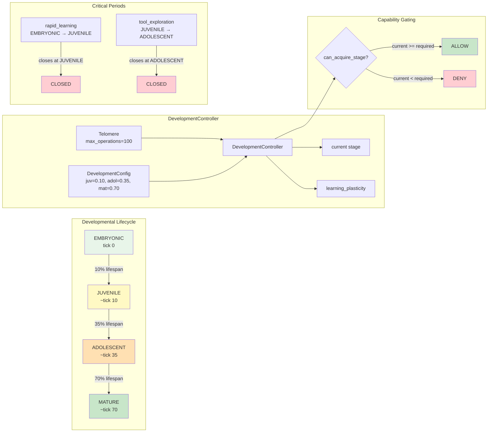

# Example 80: Developmental Staging

## Wiring Diagram



```
  Telomere (max_operations=100)
       |
       v
  DevelopmentController
       |
       +─── tick() ──→  stage transitions:
       |                   EMBRYONIC ──(10%)──→ JUVENILE
       |                   JUVENILE ──(35%)──→ ADOLESCENT
       |                   ADOLESCENT ─(70%)──→ MATURE
       |
       +─── critical_periods:
       |      "rapid_learning"    open: EMBRYONIC..JUVENILE    → CLOSED after JUVENILE
       |      "tool_exploration"  open: JUVENILE..ADOLESCENT   → CLOSED after ADOLESCENT
       |
       +─── capability_gating:
       |      can_acquire_stage(EMBRYONIC) → True  (always)
       |      can_acquire_stage(MATURE)    → True  (only when stage >= MATURE)
       |
       +─── learning_plasticity:  decreases as organism matures
```

## Key Patterns

### Telomere-Driven Maturation
The Telomere tracks total operations as a lifespan counter. The
DevelopmentController reads the telomere's consumption ratio and triggers stage
transitions at configured thresholds.

| # | Motif | Role in Pipeline |
|---|-------|-----------------|
| 1 | Telomere | Lifespan counter (max_operations=100) |
| 2 | DevelopmentController | Manages stage transitions based on telomere ratio |
| 3 | DevelopmentConfig | Thresholds for juvenile (0.10), adolescent (0.35), mature (0.70) |
| 4 | CriticalPeriod | Time-bounded windows that close permanently |
| 5 | DevelopmentalStage enum | EMBRYONIC, JUVENILE, ADOLESCENT, MATURE |
| 6 | Capability gating | Restricts tool/template access by maturity level |

### Biological Parallel
- **Telomere**: Biological telomeres shorten with each cell division, acting as a lifespan clock
- **Critical Periods**: In neuroscience, critical periods (e.g., language acquisition) close permanently after a developmental window
- **Plasticity decay**: Young brains have high synaptic plasticity that decreases with age
- **Capability gating**: Developmental milestones must be reached before certain abilities emerge

## Data Flow

```
Telomere(max_operations=100)
  └─ consumption_ratio: float (0.0 → 1.0)
       ↓
DevelopmentController
  ├─ stage: DevelopmentalStage
  ├─ learning_plasticity: float
  ├─ transitions: list[Transition]
  └─ critical_periods: tuple[CriticalPeriod]
       ↓
DevelopmentStatus
  ├─ stage: DevelopmentalStage
  ├─ transitions: list
  └─ closed_periods: list[str]
```

## Stage Transitions

| Threshold | Stage | Plasticity | Critical Periods Open |
|-----------|-------|------------|----------------------|
| 0.00 - 0.10 | EMBRYONIC | High | rapid_learning, tool_exploration |
| 0.10 - 0.35 | JUVENILE | Medium-High | tool_exploration |
| 0.35 - 0.70 | ADOLESCENT | Medium | None |
| 0.70 - 1.00 | MATURE | Low | None |
