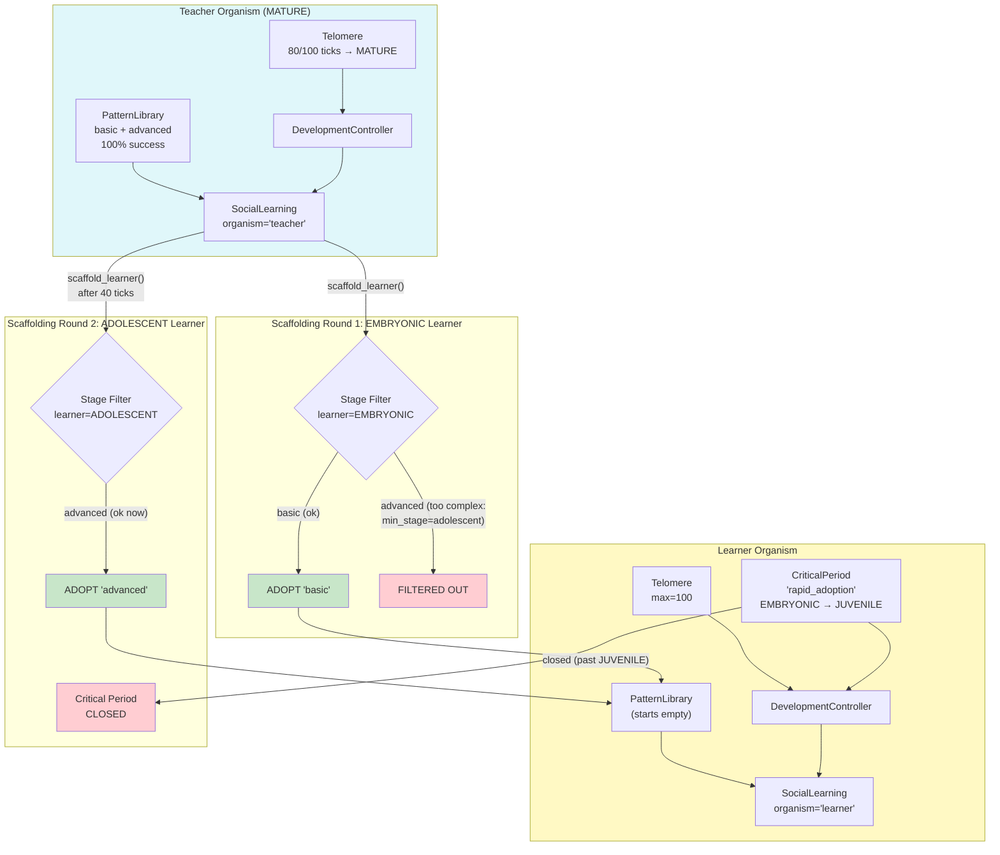

# Example 81: Critical Periods and Teacher-Learner Scaffolding

## Wiring Diagram



```
TEACHER (MATURE, 80 ticks)
  ├─ PatternLibrary: "basic" (no min_stage), "advanced" (min_stage=adolescent)
  └─ SocialLearning("teacher")
         |
         +── scaffold_learner(learner, teacher_stage=MATURE, learner_stage=EMBRYONIC)
         |       ├─ "basic"     → ADOPTED (no stage restriction)
         |       └─ "advanced"  → FILTERED OUT (requires adolescent+)
         |       └─ plasticity_bonus applied (high plasticity at EMBRYONIC)
         |
         +── scaffold_learner(learner, teacher_stage=MATURE, learner_stage=ADOLESCENT)
                 └─ "advanced"  → ADOPTED (learner now qualifies)

LEARNER (starts EMBRYONIC)
  ├─ CriticalPeriod("rapid_adoption", EMBRYONIC → JUVENILE)
  │     EMBRYONIC: OPEN  ←  free template adoption
  │     JUVENILE+: CLOSED ← period permanently shut
  └─ PatternLibrary: receives templates via scaffolding
```

## Key Patterns

### Teacher-Learner Scaffolding
A mature organism guides a younger one by exporting only templates appropriate
for the learner's developmental stage. Templates with `min_stage` requirements
are filtered out until the learner reaches that stage.

| # | Motif | Role in Pipeline |
|---|-------|-----------------|
| 1 | DevelopmentController (Teacher) | Tracks teacher maturity (MATURE after 80 ticks) |
| 2 | DevelopmentController (Learner) | Tracks learner maturity with critical periods |
| 3 | SocialLearning.scaffold_learner | Stage-aware template transfer with filtering |
| 4 | CriticalPeriod("rapid_adoption") | Open during EMBRYONIC, closes at JUVENILE |
| 5 | PatternTemplate.min_stage | Templates gated by learner developmental stage |
| 6 | Plasticity bonus | Higher adoption effectiveness during early stages |

### Biological Parallel
- **Teacher-learner scaffolding**: Parental teaching in social species where adults simplify tasks for juveniles
- **Critical periods**: Language acquisition windows, imprinting periods in birds
- **Stage-gated learning**: Developmental milestones before complex skill acquisition (crawl before walk)
- **Plasticity bonus**: Young organisms learn faster during critical periods

## Data Flow

```
Teacher
  ├─ PatternLibrary
  │   ├─ "basic": stage_specs=[{Worker}], tags=("beginner",)
  │   └─ "advanced": stage_specs=[{Researcher, min_stage=adolescent}, {Strategist}]
  └─ SocialLearning("teacher")
       ↓ scaffold_learner()
ScaffoldResult
  ├─ adoption: ImportResult
  │   ├─ adopted_template_ids: list[str]
  │   └─ rejected_template_ids: list[str]
  ├─ templates_filtered_out: list[str]
  └─ plasticity_bonus: float
       ↓
Learner PatternLibrary (updated)
```

## Scaffolding Stages

| Learner Stage | Templates Available | Critical Period | Plasticity |
|---------------|-------------------|-----------------|------------|
| EMBRYONIC | basic only | rapid_adoption: OPEN | High |
| JUVENILE | basic only | rapid_adoption: CLOSED | Medium-High |
| ADOLESCENT | basic + advanced | -- | Medium |
| MATURE | basic + advanced | -- | Low |
