# Example 83: CLI Stage Handler

## Wiring Diagram

```mermaid
flowchart TB
    subgraph basic["Basic CLI Pipeline"]
        task1["'hello world from CLI'"] --> echo["echo<br/>SkillStage: Echo<br/>cli_handler('echo')"]
        echo -->|stdout: text| count["wc -w<br/>SkillStage: Counter<br/>cli_handler('wc -w', stdin)"]
        count --> out1["word count"]
    end

    subgraph failure["Failure Detection Pipeline"]
        task2["'test failure handling'"] --> succeed["echo<br/>SkillStage: OK<br/>cli_handler('echo')"]
        succeed --> fail["false<br/>SkillStage: Fail<br/>cli_handler('false')"]
        fail -->|exit code != 0| block["FAILURE<br/>action_type"]
        block -->|halt_on_block=True| skip["unreachable<br/>(SKIPPED)"]
        watcher["WatcherComponent"] -.->|observe| succeed
        watcher -.->|observe| fail
        watcher -.->|intervention| block
    end

    subgraph json_pipe["JSON Parsing Pipeline"]
        task3["'generate data'"] --> json_gen["python3 -c 'json.dumps(...)'<br/>SkillStage: Generator<br/>cli_handler(cmd, none, json.loads)"]
        json_gen --> parsed["{'status': 'ok', 'count': 42}"]
    end

    style out1 fill:#c8e6c9
    style block fill:#ffcdd2
    style skip fill:#ffcdd2
    style parsed fill:#c8e6c9
    style echo fill:#e0f7fa
    style count fill:#e0f7fa
    style json_gen fill:#fff9c4
```



```
=== Basic CLI Pipeline ===
  "hello world from CLI"
       |  (U=UNTRUSTED)
       v
  [echo] cli_handler("echo")       → stdout: "hello world from CLI"
       |  (V=VALIDATED)
       v
  [wc -w] cli_handler("wc -w", stdin) → stdout: word count
       |  (T=TRUSTED)
       v
  [output]

=== Failure Detection ===
  "test failure handling"
       |
       v
  [echo] cli_handler("echo")       → OK (exit 0)
       |
       v
  [false] cli_handler("false")     → FAILURE (exit 1)
       |                                |
       |  halt_on_block=True           WatcherComponent
       v                               └─ intervention logged
  [unreachable] SKIPPED

=== JSON Parsing ===
  "generate data"
       |
       v
  [python3 -c ...] cli_handler(cmd, input_mode="none", parse_output=json.loads)
       |
       v
  {'status': 'ok', 'count': 42}
```

## Key Patterns

### External CLI Tools as Organism Stages
`cli_handler()` wraps shell commands as SkillStage handlers, enabling standard
Unix tools to participate in organism pipelines. The watcher, convergence
detection, and developmental gating all work unchanged on CLI-backed stages.

| # | Motif | Role in Pipeline |
|---|-------|-----------------|
| 1 | cli_handler(cmd) | Wraps shell command as a SkillStage handler |
| 2 | input_mode="stdin" | Pipes previous stage output to command stdin |
| 3 | input_mode="none" | Command takes no input from pipeline |
| 4 | parse_output=fn | Custom output parser (e.g., json.loads) |
| 5 | WatcherComponent | Monitors CLI stages for failures (non-zero exit) |
| 6 | halt_on_block=True | Stops pipeline on first FAILURE action |

### Three Input Modes
- **arg** (default): Previous output appended as command argument
- **stdin**: Previous output piped to command's standard input
- **none**: Command runs independently, no pipeline input

### Biological Parallel
Symbiotic integration: external tools are like symbiotic organisms incorporated
into the host's metabolic pipeline. The host organism monitors their health
(exit codes) and can halt the pipeline if a symbiont fails.

## Data Flow

```
str (raw task)
  └─ "hello world from CLI"
       ↓
cli_handler("echo")
  └─ subprocess: echo "hello world from CLI"
  └─ stdout: "hello world from CLI"
       ↓
cli_handler("wc -w", input_mode="stdin")
  └─ subprocess: echo output | wc -w
  └─ stdout: "4" (or similar)
       ↓
RunResult
  ├─ stage_results[0].output: echo stdout
  └─ stage_results[1].output: wc stdout
```

## Pipeline Stages

| Stage | Command | Input Mode | Output | Fallback |
|-------|---------|-----------|--------|----------|
| echo | `echo` | arg (default) | Raw stdout | -- |
| count | `wc -w` | stdin | Word count | -- |
| fail | `false` | arg | FAILURE (exit 1) | halt_on_block stops pipeline |
| json_gen | `python3 -c ...` | none | Parsed JSON dict | -- |
