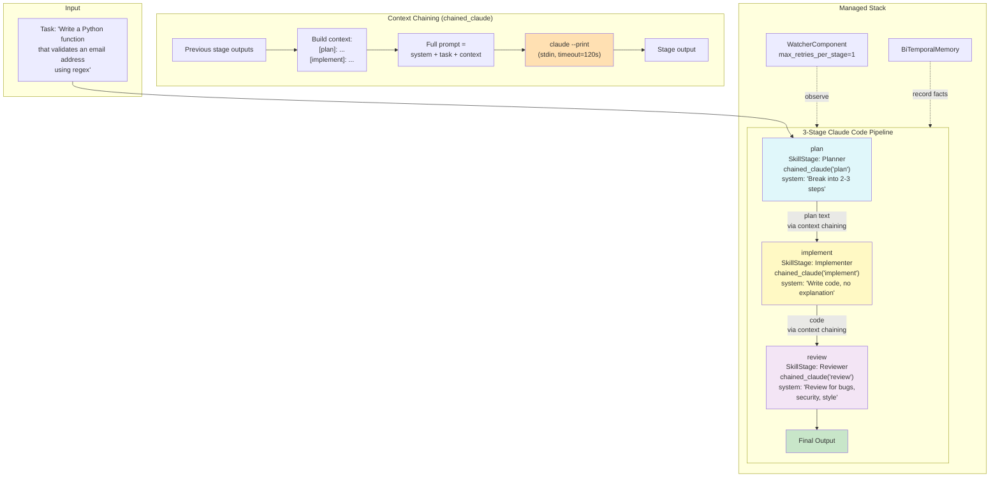

# Example 85: Claude Code Pipeline

## Wiring Diagram



```
Task: "Write a Python function that validates an email address using regex"
       |
       v  (U=UNTRUSTED)
  [plan] chained_claude("plan")
       |  system: "Break task into 2-3 steps. Be concise."
       |  → claude --print (stdin)
       |  → plan text
       |
       v  (V=VALIDATED, carries plan context)
  [implement] chained_claude("implement")
       |  system: "Write the implementation. Return only code."
       |  context: "[plan]: <plan output>"
       |  → claude --print (stdin)
       |  → Python code
       |
       v  (T=TRUSTED, carries plan + implementation context)
  [review] chained_claude("review")
       |  system: "Review for bugs, security, style. 3 bullets max."
       |  context: "[plan]: ...\n[implement]: ..."
       |  → claude --print (stdin)
       |  → review bullets
       |
       v
  [final_output]

  WatcherComponent (max_retries_per_stage=1)
    ├─ stages_observed: 3
    ├─ interventions: 0 (on success)
    └─ convergent: true/false
```

## Key Patterns

### Live LLM Pipeline with Context Chaining
Each stage calls `claude --print` via `cli_handler`, and the `chained_claude()`
helper accumulates all previous stage outputs into the prompt. This creates an
information-rich pipeline where later stages have full context from earlier ones.

| # | Motif | Role in Pipeline |
|---|-------|-----------------|
| 1 | chained_claude() | Handler factory: builds context from all previous outputs |
| 2 | cli_handler("claude --print") | Shells out to Claude Code CLI for each stage |
| 3 | managed_organism() | Wires full stack around the CLI-backed stages |
| 4 | WatcherComponent | Monitors for failures, max_retries_per_stage=1 |
| 5 | BiTemporalMemory | Substrate records stage outputs as facts |
| 6 | Context accumulation | Each stage sees [prev_name]: prev_output from all predecessors |

### Three-Role Architecture
- **Planner**: Decomposes the task into concrete steps
- **Implementer**: Writes code based on the plan
- **Reviewer**: Reviews the implementation for quality

### Biological Parallel
Sequential cortical processing: sensory input (task) passes through increasingly
specialized brain regions (plan, implement, review), each adding higher-order
interpretation. Like the visual cortex where V1 detects edges, V2 detects
shapes, and V4 integrates into object recognition -- each layer enriches the
representation.

## Data Flow

```
str (task)
  └─ "Write a Python function that validates an email address using regex"
       ↓
chained_claude("plan")
  ├─ system_prompt: "You are a senior engineer..."
  ├─ full_prompt: system + task (no context yet)
  └─ → claude --print (stdin, timeout=120s)
       ↓
plan output (str)
       ↓
chained_claude("implement")
  ├─ system_prompt: "You are a Python developer..."
  ├─ full_prompt: system + task + "[plan]: <plan_output>"
  └─ → claude --print (stdin, timeout=120s)
       ↓
implementation output (str, code)
       ↓
chained_claude("review")
  ├─ system_prompt: "You are a code reviewer..."
  ├─ full_prompt: system + task + "[plan]: ...\n[implement]: ..."
  └─ → claude --print (stdin, timeout=120s)
       ↓
review output (str, bullet points)
       ↓
ManagedResult
  ├─ run_result: RunResult (3 stage_results)
  ├─ watcher_summary: {stages_observed: 3, interventions: N}
  └─ substrate facts recorded
```

## Pipeline Stages

| Stage | Role | System Prompt | Context From | Live LLM Call |
|-------|------|---------------|-------------|---------------|
| plan | Planner | "Break into 2-3 steps, 3 sentences max" | (none) | claude --print |
| implement | Implementer | "Write implementation, code only, <30 lines" | plan | claude --print |
| review | Reviewer | "Review for bugs, security, style, 3 bullets" | plan + implement | claude --print |
